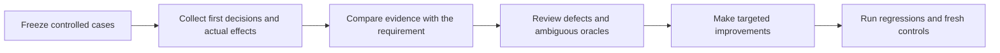

# Improve and until-loop: experiments, findings and changes



All seven proposed experiment families were executed. The useful changes are
more precise evidence collection and interpretation, plus a repaired test
checker. The trials did not justify another production state machine, numerical
completion scores, or a mandatory reviewer team.

This is a bounded screening study. It includes 60 fresh-context decision probes,
three initial real Git workflow trials, a final workflow smoke on frozen source,
and five generated runtime scenarios.
These are different kinds of evidence; their outcomes are not pooled into a
single reliability percentage. All model probes used the inherited host model settings; this was not a cross-model
or cross-host comparison. The initial source included the existing
uncommitted implementation and shared-policy extraction. That work was preserved.

## Plan, evidence and experimental boundaries

The [EXPERIMENT_PLAN.md - Work and acceptance matrix: planned scope](/Users/dadleet/src/until-loop-v2/EXPERIMENT_PLAN.md:33) defines scope and acceptance criteria.
Raw first responses, frozen inputs, actual runtime state, Git checkpoints,
oracles and review reports are retained under
`/Users/dadleet/src/until-loop-v2-validation/experiments-20260914/`.

The packet probes use actual v2 initialization output and controlled stipulated
observations. Their structured criteria are held fixed while request wording and
evidence vary. They test decision comprehension, not unconstrained natural
language to contract extraction. The live hosts do derive contracts from the
original Improve request. Static discovery and reviewer cases are read-only
review/plan exercises, not full repository improvement runs.

Every decision solver starts without previous conversation context and is
assigned only its input or case. Hidden discovery oracles are outside that
assignment. This is instruction-level separation, not an OS access-control
boundary. No model/tool/token cost telemetry is available; those values remain
null. One spawn-capacity rejection was retried after a slot became free; it did
not produce a solver response. No completed first response was discarded.

## What the experiments found

| Family | Execution and result | What it establishes and what it does not |
|---|---|---|
| Uncertainty and wording | 12 cases twice: 24/24 immediate decisions and criterion-status vectors matched; 3/4 dependency blocker records selected the correct resume mode | A real 1/4 resume-mode mistake existed despite correct immediate outcomes. Fixed criteria mean this is not a free-form contract compiler benchmark. |
| Resume clarification | Two original-case retests plus four held-out requests chose the intended dependency/explicit-stop resume distinction, 6/6 | The held-out status oracle required independent adjudication; see below. These are small examples, not a measured failure rate. |
| Predicate distinction | Six fresh paired probes distinguished unknown behavior, known unperformed work, known absent records, and incomplete searches, 6/6 | Precise criterion wording matters. No extra status enum or scripted semantic parser was necessary. |
| Commit before notes | Real repair commit, then controlled handoff before notes or assessment; successor reused that commit and completed two distinct later no-change reviews | Git recovery did not create a duplicate commit or invent an earlier review. The handoff is controlled orchestration, not a killed LLM process. |
| Overlapping user work | A staged header and unstaged footer were added to the same scoped source after planning; repair plus two later clean reviews completed | Both user hunks and staging distinctions survived, neither entered the repair commit, and the index contains no unintended repair reversion. Attribution was explicitly provided; unresolved ownership is a different case. |
| Blinded discovery | Three hidden behavior defects found, 3/3; zero incorrect behavior-defect claims on three correct implementations | All original correct implementations lacked worthwhile requirement coverage. Their valid test suggestions are not false behavior findings. |
| Stronger clean controls | Three further policy-bound correct implementations with adequate tests produced no findings and empty plans, 3/3 | These fixtures isolate unnecessary work more fairly. They remain tiny static examples. |
| Reviewer value | Three matched self, simulated-advice and genuine-reviewer arms; simulated triage correct 3/3, genuine advice triage correct 3/3; unsupported/redundant behavior changes declined 2/2 | Added review found no additional behavior defect beyond self-review in these three cases; it added/elaborated coverage observations. This does not show reviewers have no value in complex code. |
| Runtime combinations | Seeds 1729, 271828, 314159, 8675309; four generated sequences plus one real process-group kill: 83 ledger events | Replay, revision, pause/resume and verifier recovery invariants held. No production runtime transition change was justified. |
| Consumer bindings | Four original owner probes retained the intended history/adapter ownership; two refined probes removed ambiguity between describing execution and actually executing | The alternate owner is an explicit synthetic phase fixture. This does not claim another installed product was exercised. |
| Clean full-workflow control | Two completed no-change self-reviews, no new product edit or commit | Runtime completion can be supported without manufactured work. |

Independent initial grading is retained in
[decision-independent-review.json - Initial grading: original judgments retained](/Users/dadleet/src/until-loop-v2-validation/experiments-20260914/decision-independent-review.json:1).
The [decision-grading-addendum.json - Adjudication: corrections and follow-up outcomes](/Users/dadleet/src/until-loop-v2-validation/experiments-20260914/decision-grading-addendum.json:1)
preserves that report while correcting its semantic overreach and adding the
later controls.

## Improvements supported by these observations

### 1. Test output cannot impersonate test counts

The previous checker selected the first `Ran N tests` text from combined output.
An all-skipped suite printing `Ran 999 tests` therefore passed its executed-test
gate. The checker now gets structured counts, failures, skips and success from
the launcher's `unittest.TestResult` through a separate file descriptor.
Ordinary stdout/stderr remain diagnostics. Missing, malformed, inconsistent,
incomplete or interrupted result records fail verification.
[improve_execute.py - run_fixture_tests: structured result channel](/Users/dadleet/src/until-loop-v2/tests/improve_execute.py:223).

The new tests retain the spoofed-output example, misleading output from a real
passing suite, empty/all-skipped/failing suites, invalid records and timeout.
This protects against the reproduced output confusion. Same-privilege hostile
tests can still tamper with Python objects, including `TestResult`; the launcher
is not a security sandbox. A reviewer's proposed Python 3.9 incompatibility was
withdrawn after the actual 3.9.6 run passed. Neither issue was used to justify an
unnecessary compatibility rewrite or isolation framework.

### 2. Capture evidence before assessment, with honest provenance

The standalone binding now uses the bundled factual collector. It records
candidate and index identity, the current action and contract revision, the
owner's exact full-message history window, check artifact hashes, and declared
reviewer roles. Complete messages are deduplicated through a catalogue; each
review still retains and reads its own window. The LLM records findings, lessons,
classification and convergence in checked notes, then submits an assessment.

The initial live pilots exposed operational errors: two first history captures
failed and then succeeded on retry while the collector was under development;
the overlap host needed an absolute prior-record path. These failures remain in
the notebooks. Independent review also found false staleness from hashing an
action ID, a bytecode write outside the evidence directory, legal empty-message
handling, and a risk of combining facts from different repository moments.
Those findings drove focused collector hardening rather than being erased from
the trial record. The collector now pins history to the observed HEAD, compares
before/after observations, preserves empty messages, avoids import bytecode, and
resolves prior records from the bound repository. Directory scopes reject;
incomplete file identities cannot label a check current. Prior-record validation
and record-size checks precede catalogue persistence.

The intended identity split is explicit: artifact identity answers whether the
checked candidate changed; action/contract provenance identifies the assessment
and its requirements. A new action alone is not a material edit. A changed
contract still needs an LLM relevance judgment even when file identity matches.
Return codes, reviewer identity and the asserted check-to-candidate association
are labeled host-declared. Collection never proves semantic correctness.
[capture_evidence.py - candidate_from_facts: artifact identity is separate from protocol provenance](/Users/dadleet/src/until-loop-v2/examples/improve/scripts/capture_evidence.py:700),
[capture_evidence.py - capture: stable observations and input validation precede persistence](/Users/dadleet/src/until-loop-v2/examples/improve/scripts/capture_evidence.py:862).
See [evidence-capture.md - Collector interaction: factual records and LLM judgment](/Users/dadleet/src/until-loop-v2/examples/improve/references/evidence-capture.md:1)
for the internal sequence and concrete stale-check trace.

### 3. Separate dependency restoration from user-directed stopping

One original response used `user_instruction` merely because only the user could
restore a service. That would unnecessarily require another message after the
service was restored. The rubric and adapter guide now explain that an ordinary
dependency pause uses `condition_observed`; an explicit user stop retains its
separate resume authority. The two retests and four new stop/dependency cases
made the expected distinction.
[decision-rubric.md - blocked: dependency and explicit-stop authority](/Users/dadleet/src/until-loop-v2/references/decision-rubric.md:44).

### 4. Assess the actual predicate, not the word “validation”

The first grader called four held-out `unsatisfied` statuses regressions because
their frozen oracle expected `unknown`. Independent adjudication found the
criterion was “validation is established by current evidence,” while the facts
authoritatively said no validation had run. An unsatisfied evidence/action
obligation is defensible; it does not claim the underlying behavior failed.
The original responses and expected files remain unchanged. Their raw oracle
status mismatch is retained as an ambiguous grading dimension, not presented as
a proven product defect or silently converted to a passing automated test.

The card and rubric now distinguish:

- Behavior with no determining observation: **unknown**.
- A required action known not to have happened, or required record known absent:
  **unsatisfied**.
- A record not located in an incomplete search: existence can remain **unknown**.

Six new paired cases with precise predicates all made those distinctions. The
LLM still derives and assesses requirements; the script validates the response
shape and legal transition. It does not guess truth from natural-language regexes.
[decision-rubric.md - evidence: assess the criterion's actual predicate](/Users/dadleet/src/until-loop-v2/references/decision-rubric.md:16).

### 5. Improve the experiments themselves

The original clean controls tested correct behavior with incomplete tests. Three
additional controls include adequate requirement coverage and explicit owner
bindings. The probe schema also now separates `probe_mode` from the hypothetical
task host's actions. This prevents “do not execute this experiment” from being
mistaken for a restriction on the future task being described. These changes
improve what the test can tell us without manufacturing new product obligations.

## Actual Git results and convergence

| Trial | Final HEAD | Accepted cycles | Observed result |
|---|---|---:|---|
| Commit before notes | `bf9e8d00486f9e053937f8eac408be2b96596961` | 2 | Existing repair reused; two later completed no-change self-reviews |
| Overlap | `d04861e70b4637a21ead6e8691b95ba539cc9cdc` | 3 | One material repair and two later clean self-reviews; staged and unstaged user hunks preserved |
| Clean control | `48be79e364bbd6d50f3a86540178849dc0ad0aa1` | 2 | Initial HEAD retained, no product changes or extra commit |
| Final frozen collector smoke | `9d85828e9c2cf08e5fcbd98a74b3cec09312c8db` | 2 | Unchanged candidate across distinct actions; check evidence reused correctly, no product changes or extra commit |

All four pass their current four-test visible suite, the separate behavior
oracle, protected-file checks and final artifact inventory. The overlap index
equals the committed source plus the user header; its worktree equals that index
plus the user footer. The old fixture checker's minimum of three assessments is
a mechanical proxy for its original fresh-repair scenario, not a universal
semantic convergence rule. These recovery/control trials are assessed against
their actual contract and separate review records.

[workflow-mechanical-results.json - Observed properties: tests, Git state and preservation](/Users/dadleet/src/until-loop-v2-validation/experiments-20260914/workflow-mechanical-results.json:1)
and the [workflow-independent-review.json - Semantic review: distinct cycles and evidence timing](/Users/dadleet/src/until-loop-v2-validation/experiments-20260914/workflow-independent-review.json:1)
confirm the distinction. The execution hosts were explicitly constrained to
self-review; that limitation is recorded rather than calling them independent.
Independent retrospective inspection supplements their evidence but cannot
prove private cognition or eliminate all future defects.

## Final verification and delivery

Final-source verification passed on macOS:

- **115 Python tests** on Python 3.14.7 and independently on Python 3.9.6.
- **126 shell checks**, with zero failures. The Python count grew from the
  88-test starting baseline; it includes 14 focused collector regressions.
- **Four actual Git workflows**, each with passing current project tests,
  an external behavior oracle and preserved user work. Independent artifact
  review found no remaining blocking correctness or preservation issue.
- **Five runtime scenarios / 83 ledger events** under both interpreters,
  including a real process-group kill at a verifier recovery boundary.

The final smoke used the frozen collector after its last input-ordering repair.
It completed two distinct no-change self-reviews without a helper error, product
edit or new commit. The host invoked the collector with
`PYTHONDONTWRITEBYTECODE` unset and used a repository-relative prior-record path
from a different working directory. It correctly reused check evidence for an
unchanged candidate across two action IDs. Those observations and their limits
are recorded in the independent workflow review linked above.

The [experiments-validation.json - Delivery manifest: source hashes, results and limitations](/Users/dadleet/src/until-loop-v2/experiments-validation.json:1)
binds these results to the current source and retained evidence. All 12
functional-source hashes frozen before the final smoke still match. The
installed Codex `improve` and `until-loop` symlinks resolve to this candidate;
the separate Grok baseline card and runtime hashes remain unchanged. Source
changes were **uncommitted at this experiment checkpoint**, including the
preserved work present before this experiment run. This is historical validation
provenance; consult Git history for subsequent delivery commits.

Reproduce the deterministic package verification from the candidate directory:

```sh
PYTHONDONTWRITEBYTECODE=1 bash tests/until-loop.test.sh
PYTHONDONTWRITEBYTECODE=1 /usr/bin/python3 -m unittest discover -s tests -p 'test_*.py'
```

The second command selects the Python 3.9.6 interpreter observed on this Mac;
that path is environment-specific. Raw logs are `final-default-suite.log` and
`final-python39-suite.log` in the evidence directory. Fresh-context model probes
are retained observations, not deterministic tests that these commands replay.
Linux behavior, cross-model generalization, and provider/token cost were not
measured.

Keep the existing division of responsibility. Adopt the checker, evidence and
interpretation improvements; retain context-dependent independent review.
Defer additional runtime states, numeric semantic scores and mandatory extra
reviewers. This small study supports targeted fixes and better experiments,
not a universal “fully correct” claim. Independent review found useful defects
in the actual collector despite green initial tests, so the tiny reviewer-value
comparison is not evidence for removing review from more complex changes.
