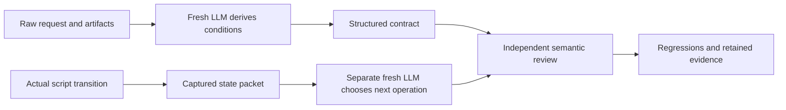

# Fresh-context review of until-loop v2



The review tests two different boundaries: whether the skill preserves what the
user meant, and whether an LLM receiving a script packet can select a legal,
useful next operation without the earlier conversation. The executing LLM retains
semantic judgment. The script continues to enforce state, identity, coverage and
recovery rules.

## Findings and changes

| Finding | Change | Why this is enough for the observed gap |
|---|---|---|
| Default independent-work guidance could conflict with an explicit early stop | Preserve success, work guards, early-stop outcomes and precedence in the interpretation; explicit stop overrides ordinary continuation | The next LLM can distinguish a permitted increment from a requested stop without a new parser |
| Flattening criteria could turn “A or B” into two required outputs, or make a blocker count as success | Keep success alternatives and conditional obligations intact inside a criterion; keep incomplete-stop branches separate | All listed criteria remain mandatory while each criterion retains its actual meaning |
| User stops and already-authorized conditional waiting needed distinction | A plain user stop requires a later instruction; “wait until X, then continue” permits observation-based resume | Preserves the user's original permission without inventing a new one |
| Paused/recovery packets requested supposedly issued input files that did not exist | Print exact valid JSON templates, required provenance kind, immediate operation and command; say the host creates the file | A fresh host can construct a valid adapter input from the packet itself |
| Mandatory `next` refresh displaced the already-applicable resume operation | Make refresh optional when the packet is current, and name the immediate state operation | A fresh LLM need not keep reprinting unchanged state before acting |
| Failed-verifier guidance could imply a completion claim even after a continuation | Describe the unresolved verifier result without inventing the prior decision | Packet guidance is selected from actual protocol facts |
| Earlier tests mainly proved runtime validation or task outcomes | Add CLI packet-execution regressions and separate fresh-context intent/packet evaluations | Understanding, legal transport and observed state changes become separate evidence |

New tasks use skill `0.3.0-rc.2` and freeze `decision-rubric/2`. Existing snapshots
remain readable and keep their saved policy. A final card clarification distinguishes cold recovery without a packet from
an adapter call that has just returned one: only the former needs an initial
`next`. The main 21-case run retains its immutable snapshot; this final wording
is checked separately with the card and an actual newly returned active packet.
The code change adds no new phase,
contract schema, natural-language compiler, provider setting or external service.

[SKILL.md - Interpret the contract: preserve stop precedence and Boolean meaning](/Users/dadleet/src/until-loop-v2/SKILL.md:86), [until_loop_packet.py - _immediate_instruction: select operation from state](/Users/dadleet/src/until-loop-v2/scripts/until_loop_packet.py:261).

## Discernment rules retained in the existing contract

A criterion can say “CSV or JSON,” “if duplicates exist, report them,” or “no API
change.” The LLM must verify the alternative or conditional branch that actually
applies. It must not omit a prohibition just because the functional check passes.
A false `while` guard says no guarded work should start; success still depends on
the requested outcome. A do-once-then-check instruction requires its first action,
even if an earlier artifact claims the outcome already holds.

Missing information without a global stop can coexist with useful independent
work. In contrast, “stop immediately if any source is missing” applies before
that ordinary continuation rule. The incomplete result can be persisted as a
pause; there is no automatic wakeup, and a future `next` cannot resume it. The
host must supply the kind of resumption evidence the saved pause requires.

All-satisfied criteria normally warrant completion without extra product edits.
We considered rejecting every all-satisfied `continue` in code and rejected that
change: a failed configured verifier can still need diagnosis while the product
criteria remain accurately satisfied. Such a continuation must name the
unresolved check. Runtime acceptance does not establish that its rationale is
true or useful.

We also considered a predicate language, Boolean expression tree, mandatory
criterion-diff schema and new terminal-stop phase. These add schema migration and
maintenance without solving the key semantic problem: an LLM can still encode the
wrong interpretation or fabricate provenance. The current change instead makes
the interpretation reviewable and exercises it directly. Revisit structured
predicates only if repeated failures survive this simpler approach.

## Actual packet-to-transition trace

A CLI fixture submits `blocked` with `resume_on: condition_observed`. The runtime
enters `paused` at cycle 0. Its returned packet now prints a provenance record
whose kind is already `condition_observed`. The regression extracts that JSON,
replaces only the observation reference, writes it at a chosen safe path, and
executes the printed resume command after substituting that path. Readback shows
`active`, the same cycle, and a fresh action ID. No verifier ran.

The companion uncertainty test deliberately interrupts submission after a
counting verifier runs. The next real packet prints an `abandon` resolution
record containing the uncertain action ID. The test fills only the inspection
reference and file path, executes the returned command, and verifies cleared
uncertainty, unchanged cycle, a fresh action and exactly one verifier execution.
This establishes operational completeness of the printed records. It does not
establish that an arbitrary LLM will ground its observations truthfully.

[test_packet_decisions.py - Packet template tests: execute printed resume and recovery records](/Users/dadleet/src/until-loop-v2/tests/test_packet_decisions.py:182), [until_loop_packet.py - _emit_nonwork_guidance: exact records for nonwork operations](/Users/dadleet/src/until-loop-v2/scripts/until_loop_packet.py:287).

## Evaluation design

Worker requests do not contain expected answers, suspected defects, remediation
plans or grading criteria. Packet workers receive a real captured packet and may
read the designated workspace; they do not inherit the skill or this conversation.
Intent workers receive the skill, original request and raw fixture facts, then
state the contract and initial decision. Expectations are kept outside the worker
workspace and are for independent evaluation only.

Every worker runs in a new ephemeral host with read-only scope, at most two in
parallel. The harness retains the request, transcript, final response, actual
script output, source hashes and workspace snapshots. It snapshots the complete
skill/runtime, because a frozen rubric alone does not freeze the renderer or card.
No model override is supplied. Semantic grading is independent of the worker's
self-description; a process exit of zero is never a correctness score.

An intermediate probe showed the worker also incorporating the evaluation-only
read-only restriction into its proposed task contract. The final probe prompt
clarifies that workers must describe the original task actions without executing
them, and must not add this testing restriction to that task contract. This is
an evaluation clarification, not permission for the worker to write files.
Baseline and final prompts are retained; these are diagnostic comparisons, not
a controlled estimate of a single wording change.

The packet probes ask what the agent would do; they do not themselves execute
product changes or claim full-loop convergence. Separate deterministic tests
execute the printed commands. Previous live task runs remain useful historical
evidence with their already-recorded limitations.

## External evidence and contrary considerations

The layered approach follows the distinction between an agent's transcript and
its actual environment outcome in [Anthropic's evaluation guidance](https://www.anthropic.com/engineering/demystifying-evals-for-ai-agents).
That guidance also recommends multiple trials for variable model behavior and
warns that strict graders can reject valid solutions. Here, semantic interpretation
is reviewed alongside command and state checks rather than reduced to wording
matches.

[Anthropic's public blind-comparator instructions](https://github.com/anthropics/skills/blob/main/skills/skill-creator/agents/comparator.md)
provide a concrete precedent for independent comparison. We apply the separation
of evaluator expectations from worker inputs, without treating a second LLM as
infallible. Their [agent-design guidance](https://www.anthropic.com/engineering/building-effective-agents)
also favors adding complexity when needed. Those sources support the evaluation
method; the local fixtures determine whether this implementation works.

## Validation results

| Check | Result | What it establishes |
|---|---|---|
| Full package suite | 126 shell checks and 59 Python tests pass | Runtime, compatibility and packet-execution regressions |
| macOS Python 3.9.6 and Python 3.14.7 | Same 59 tests pass on both | The exercised deterministic behavior works on both local interpreters |
| Natural-language probes | 10/10 decisions pass independent semantic review | Preserves alternative success, stops, constraints, required first action, review reset and conditional resume in these fixtures |
| Model-written contracts | 10/10 preserve the exact request and pass actual frozen-adapter initialization | Returned JSON is usable transport; this check alone does not prove its semantics |
| Packet-only probes | 11/11 next decisions pass independent review | Correctly chooses work, completion, pause, recovery and terminal boundaries from actual packets and raw artifacts |
| Proposed packet records | Six supplied argv/payload pairs pass structural validation; two additional argv forms are valid while their evidence-dependent input remains unavailable | Ready records are valid; pending evidence is kept distinct from malformed input |
| Current-packet plus skill probe | Pass | A successful resume packet is used directly, with no invented refresh or permission prerequisite |
| Host execution | 28/28 processes exit normally; zero timeouts or source/workspace drift during each host run | Evidence collection completed within the declared limits; process exit is not the semantic score |

The 28 hosts comprise five baseline probes, one intermediate resume probe, the
final 21-case screen and one final card/current-packet probe. The main 21 used one
immutable skill/runtime snapshot. The last card clarification has its own snapshot
and targeted probe; the runtime and rubric are identical. No final-candidate
claim depends on silently rewriting a source snapshot.

The baseline's two raw-language probes passed. Three packet probes were partial:
they selected safe boundaries but did not provide the already-applicable complete
adapter operation. The observed-source agent waited for an input file supposedly
issued by the adapter; the uncertainty agent had the same misconception. After
adding real record templates, the intermediate resume probe still chose `next`
because the packet made refreshing a prerequisite. Making refresh optional fixed
that handoff in the final observed-source probe.

Two null-input cases in the final screen are correct boundaries. The uncertain
verifier probe lacks actual process-status evidence, so the agent identifies the
resolution route but does not fabricate its provenance record. The weak-verifier
probe chooses the remaining implementation/documentation work and leaves the
post-work assessment unset until those observations exist. Three other null calls
are expected: done, halted, and a user pause lacking a later instruction.

The first evaluator labeled recovery operationally partial, then revised that
grade after examining the allowed null-input schema and missing process evidence.
The reason for revising that assessment is recorded in the grading artifact. This
review of the evaluator matters: forcing a ready resolution record would reward
invented evidence. A passed next-decision probe does not mean every command is
ready to execute immediately.

The failed-verifier fixture also prevents an overly simple expected answer: its
verifier unconditionally fails and its desired formatter output is unspecified.
The agent correctly diagnoses both facts and pauses for actual acceptance
requirements instead of editing a check merely to make it green.

## Evidence and reproduction

- [grades-final-nl.json - Natural-language grades: all ten decisions independently reviewed](/Users/dadleet/src/until-loop-v2-validation/fresh-context-review/grades-final-nl.json:1).
- [grades-final-packet.json - Packet grades: decisions and recovery adjudication](/Users/dadleet/src/until-loop-v2-validation/fresh-context-review/grades-final-packet.json:1).
- [fresh-output-check.json - Protocol observations: returned contracts and callback records](/Users/dadleet/src/until-loop-v2-validation/fresh-context-review/runs/final/full/fresh-output-check.json:1).
- [grades-current-packet.json - Resume follow-up: current packet is consumed directly](/Users/dadleet/src/until-loop-v2-validation/fresh-context-review/grades-current-packet.json:1).
- [package-final.log - Package run: 126 shell checks and 59 tests](/Users/dadleet/src/until-loop-v2-validation/fresh-context-review/package-final.log:1).
- [python39-final.log - Compatibility run: all 59 tests on Python 3.9](/Users/dadleet/src/until-loop-v2-validation/fresh-context-review/python39-final.log:1).
- [fresh_context.py - Behavioral harness: frozen inputs and fresh host evidence](/Users/dadleet/src/until-loop-v2/tests/fresh_context.py:1).
- [check_fresh_outputs.py - Output checker: actual contract initialization and callback validation](/Users/dadleet/src/until-loop-v2/tests/check_fresh_outputs.py:1).

```sh
python3 tests/fresh_context.py prepare --label next-candidate --skill-root /absolute/path/to/until-loop
python3 tests/fresh_context.py run --label next-candidate --run-id first-screen
python3 tests/fresh_context.py summarize --label next-candidate --run-id first-screen
python3 tests/check_fresh_outputs.py --label next-candidate --run-id first-screen
bash tests/until-loop.test.sh
```

Use new labels/run IDs. Evaluate semantic outcomes against explicit expectations
outside worker inputs; the harness does not auto-award a semantic pass. The
checker never executes arbitrary model commands or verifiers: its contract
initializations occur in fresh observer workspaces, and its callback validation
uses a fixed argv allowlist and the frozen runtime's validators.

## Limits and next useful tests

Keep the installed baseline unchanged; these results support the candidate's
clarity and exercised behavior, not a broad deployment claim. One default-model
trial per final case does not establish reliability across models, seeds or
platforms. Packet prediction does not establish execution of the proposed product
work. The synthetic fixtures do not authenticate real user permission or guarantee
that a model cannot follow malicious evidence. Worker isolation here is procedural
and read-only; it is not a hard information-security boundary against a deliberately
noncompliant reader.

The next useful expansion is repeated trials of these same cases, followed by
held-out prompts where a false work guard coexists with an unmet exit condition,
a real assertion-based verifier contradicts an otherwise plausible result, or
hostile artifact text tries to override the saved contract. Add a full-loop trial
that crosses stop, authorized resume, material edit and stale evidence in separate
sessions. Those tests would add confidence; another universal state schema would
not by itself address the remaining semantic risk.
