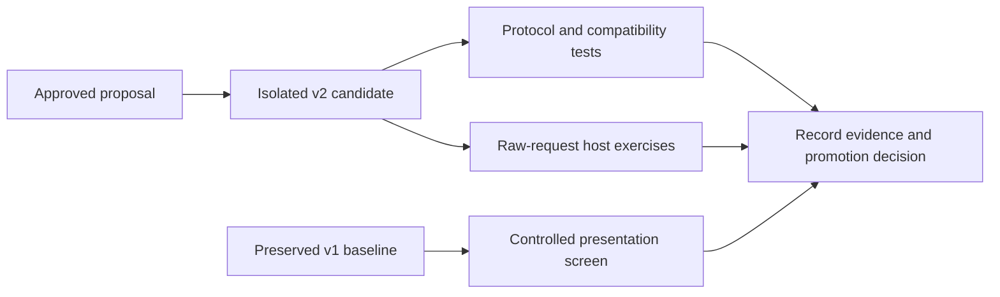

# Rubric-packet implementation and validation

The proposal is implemented in the isolated candidate at
`/Users/dadleet/src/until-loop-v2`, branch `codex/until-loop-rubric-v2`, based on
`7d24bbca20576fad673768ca0562027a6c3cd563`. The installed baseline in
`/Users/dadleet/.grok/skills/until-loop` remains unchanged. The implementation
includes the LLM execution context, structured contract and rubric, action-bound
assessment, durable rejection, replay, pause/resume, scope revision and explicit
verifier recovery. It retains the version-1 path and its behavior.

A subsequent review produced candidate `0.3.0-rc.2` and a 59-test suite, clarified
conditional intent and resume guidance, and exercised fresh LLM contexts. See
[FRESH_CONTEXT_REVIEW.md - Follow-up validation: current candidate results](/Users/dadleet/src/until-loop-v2/FRESH_CONTEXT_REVIEW.md:1).
The implementation and live-run counts below describe the earlier checkpoint.

The original design and alternatives remain in
[PROPOSAL.md - Design proposal: ownership and experiment rationale](/Users/dadleet/src/until-loop-rubric-proposal-20260913/PROPOSAL.md:1).
This report separates implementation evidence from promotion evidence.

## Implementation decisions

| Proposal requirement | Implemented choice |
|---|---|
| Natural-language interface | The candidate card derives the contract; users supply no named arguments or required JSON. |
| Script-owned control, LLM-owned judgment | The protocol validates legal operations, coverage and mechanical checks. The LLM chooses actions and supplies the semantic verdict. |
| LLM-specific “You are here” | Packet restores role, bound workspace, full state path, action cursor, environment uncertainty and immediate decision. |
| One authoritative contract | V2 stores it in `state.contract`; it does not create a redundant `prompt.md`. |
| One frozen rubric policy | JSON in `references/decision-rubric.md` is validated and copied into the run. |
| Stable action/replay identity | Runtime-generated 32-character lowercase hex IDs, issued inbox paths, canonical receipts and conflict/stale checks. |
| Paused work | `blocked` becomes `paused` without verifier or work-cycle increment; `resume_on` makes the required provenance type explicit. |
| Scope correction | Revision preserves original wording, previous/new contracts and correction provenance. Restart retains the prior policy too. |
| Recoverable rejection | Safe malformed current results receive a durable reason and the same-action packet; cold `next` restores that reason. |
| Uncertain external effects | Verifier intent is durable before execution; recovery packets suppress work until explicit resolution. |
| File/data safeguards | Record and display bounds, no-follow and single-link checks, runtime-owned metadata, escaped data, complete control rails and journal admission before verification. |
| Legacy compatibility | Explicit `v2` dispatch isolates the new closed schema; no migration of saved v1 runs. |

The separate `v2` verb is internal adapter transport. It is deliberately not a
new user-facing control syntax. The full earlier README is retained as the
version-1 guide; the new README describes the candidate's behavior and includes
three rendered diagrams and current source links.

## Deterministic validation

| Check | Observed result | Evidence |
|---|---|---|
| Full shell/package suite | 126 checks passed, zero failures; 52 Python tests passed | [package-final.log - Full package run: shell and runtime results](/Users/dadleet/src/until-loop-v2-validation/package-final.log:1) |
| macOS Python 3.9 | Same 52 tests passed | [python39-final.log - Compatibility run: minimum-version test result](/Users/dadleet/src/until-loop-v2-validation/python39-final.log:1) |
| Version-2 protocol tests | 22 tests cover gates, replay, pauses, revisions, rejection, hostile data, recovery and journal capacity | [test_v2.py - V2 regressions: executable behavior checks](/Users/dadleet/src/until-loop-v2/tests/test_v2.py:1) |
| Existing version-1 behavior | All 30 existing runtime tests retained and passed | [test_runtime.py - Legacy regressions: preserved compatibility checks](/Users/dadleet/src/until-loop-v2/tests/test_runtime.py:1) |
| Packet integration | Actual printed submit command accepted a blocked assessment with all required fields; paused reprint command worked | Covered by protocol tests and the renderer's isolated callback smoke |
| Documentation | Three Mermaid diagrams rendered; local source links and Python syntax checked | [validation.json - Final manifest: hashes and document checks](/Users/dadleet/src/until-loop-v2/validation.json:1) |

The independent runtime review found and the implementation fixed invalid ID
regex anchors, a missing `resume_on` field in the printed response shape, a
nonexistent printed status command, incomplete frozen-policy validation,
uncertain-verifier read behavior, a path-resolution identity race, force-restart
through uncertainty, and insufficient prior-contract retention. Further checks
added durable rejection, history-capacity coverage and isolation between v1/v2
pending journals before state creation. The final bounded review
found no material issue in the reviewed protocol scope.

The generic skill-creator Python validator could not import PyYAML in the
available Python environments. The card's YAML was instead parsed with the
system YAML parser; its name, description and existing host/invocation metadata
were checked against the baseline. The preserved multi-host metadata also
exceeds that generic validator's Codex-only allowlist. No runtime dependency or
host policy was added to make that check appear green.

## Presentation comparison

All 12 A/B/C host runs completed normally. Each arm passed 4/4 first-action
screens and 10/10 external artifact checks. All three completion claims were
already-satisfied tasks with unchanged artifacts; none was unsupported.

This experiment kept v1 mechanics fixed and prohibited state edits. B and C
received the same 849-byte frozen guidance in the skill and packet respectively.
It measures first-action choice and placement, not multi-turn convergence,
contract derivation or v2 enforcement. Candidate C's presentation snapshot is
implemented in the evaluation harness, not as a second production state format.

C used 9.62% more reported input tokens, 11.25% more output tokens and 6.60% more
summed worker elapsed time than B. These are observations from one run per
case/arm, not evidence that packet placement caused those differences. The
comparison demonstrated no quality advantage over the equal-content skill-only
control. Raw counters, excerpts and reproduction commands are retained in
[PILOT_REPORT.md - A/B/C results: outcomes, cost and limits](/Users/dadleet/src/until-loop-v2-validation/PILOT_REPORT.md:1)
and [aggregate.json - Recorded metrics: arm-level totals and comparisons](/Users/dadleet/src/until-loop-v2-validation/aggregate.json:1).

## Live candidate behavior

Raw-request evaluations use fresh disposable workspaces and actual ephemeral
Codex hosts. They receive the candidate card and original request, with no
prewritten criteria or completion verdict. Results are retained under
`/Users/dadleet/src/until-loop-v2-validation/live/_artifacts`.

The helper task reached v2 `done` at cycle 1. Independent calls confirmed
trimming and blank-input fallback; the guide described both behaviors. The
missing-facts task reached `paused` at cycle 0, preserved the original billing
placeholders and configured no verifier. The prose task reached `done` at cycle
1 with no verifier; independent readback found 96 words, both runbook recovery
steps, no blame, and a final deployment-ID request.

The original already-satisfied request said to leave the workspace untouched.
Its host verified the flags and changelog without creating any loop state. That
supports the artifact outcome but does not exercise v2 completion. A separate
raw-request variant explicitly allows bookkeeping while forbidding product-file
edits. The card now distinguishes permitted bookkeeping from an explicit ban on
all writes, and never claims a runtime transition that did not happen.

The bookkeeping-permitted variant reached v2 `done` at cycle 1, with both
product files byte-for-byte unchanged. The cold-resume task used two actual
host sessions: the initial session accepted `continue` at cycle 1 and ended;
the next session retained that state, added both remaining Next steps actions,
and accepted `complete` at cycle 2. Independent history inspection found exactly
those two assessment events and no restart. The final artifact retained its
Purpose sentence and included both requested actions.

All seven raw-request host processes exited normally without timeouts. The
retained [LIVE_REPORT.md - Raw host runs: outcomes and capture limits](/Users/dadleet/src/until-loop-v2-validation/live/_artifacts/LIVE_REPORT.md:1)
records their boundaries. These ran during implementation and lack per-host
runtime source hashes; they are not proof that one immutable revision passed
all live cases. The final deterministic tests and source manifest separately
identify the finished candidate.

## Promotion decision and limits

Keep this as an implemented candidate. The deterministic checks demonstrate
stronger protocol enforcement and recovery under the exercised conditions. They
do not demonstrate better LLM judgment. The first-action screen did not establish
a quality advantage for packet placement. The proposal's evidence threshold for
replacing the installed baseline is therefore not met by this screening run.

There is no scheduler, mandatory external judge, fixed stage lifecycle, numeric
score, provider configuration or automatic state migration. No release, commit,
push or installation is implied by passing tests. Broader model/seed coverage,
Linux validation and a controlled full-loop cost comparison remain future
promotion evidence, rather than claims made by this candidate.
