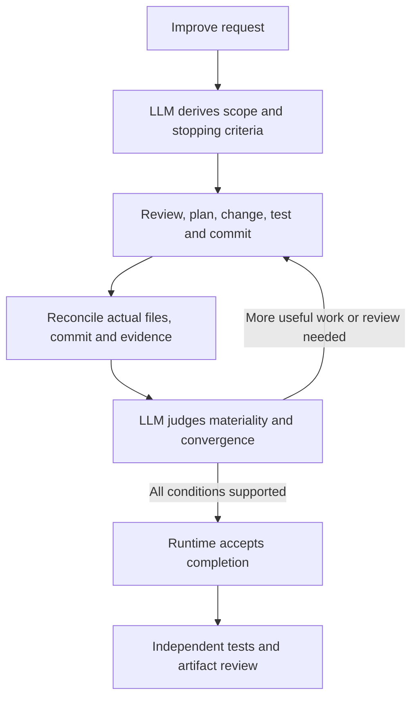

# Improve hardening and recovery validation



This follow-up implements the lessons from the first installed Improve trial.
The parent now makes final artifact checks, reviewer-suggestion triage and
commit-before-assessment recovery explicit. The independent execution checker
checks project tests, every changing commit and the final workspace. The
until-loop runtime remains generic: it validates state and assessment shape;
the LLM judges review substance and convergence.

## Decisions implemented

| Observation | Change | Boundary |
|---|---|---|
| The first execution left a generated cache until a reviewer noticed it | Compare final workspace against the initial inventory and declared outputs, including ignored artifacts | Preserve preexisting files and unrelated staging; remove only confirmed disposable artifacts created by this run |
| A reviewer suggested a redundant test matching the hidden oracle | Require a failure, violated requirement or concrete in-scope benefit; record accept/decline with evidence | Investigate uncertainty; a demonstrated material finding still resets convergence |
| The checker ran its hidden oracle but did not run the project suite | Rerun and retain the visible suite independently | Passing the oracle cannot excuse a failing or empty project suite |
| Only one verbose commit was sufficient for the old checker | Check all changing commits after the fixture baseline | Message sections are a mechanical prerequisite; independent review still assesses their substance |
| A Git side effect can happen before the runtime accepts its assessment | Reconcile commit, current files, checks and notes before submitting the pending action | Git and runtime submission are not one atomic transaction; missing review evidence must be supplied, not inferred |

These are parent-level obligations, with no new required user arguments.
See [SKILL.md - Reviewer suggestions: accept or decline based on evidence](/Users/dadleet/src/until-loop-v2/examples/improve/SKILL.md:98),
[SKILL.md - Interrupted commits: recover verified work without a duplicate commit](/Users/dadleet/src/until-loop-v2/examples/improve/SKILL.md:124),
and [SKILL.md - Final workspace: ownership-aware artifact comparison](/Users/dadleet/src/until-loop-v2/examples/improve/SKILL.md:136).

A successful check never means that every possible defect has been found.
The checker is a test harness for the supplied fixture, not a new state machine
embedded in Improve and not a generic policy for every user's repository.

Independent code review also reproduced an all-skipped suite that passed the
initial hardening check, and a six-section commit without classification or
streak information. Both findings were accepted for correction. The resulting
checks distinguish discovered tests from non-skipped tests and require those
commit-message indicators. These are evidence-presence checks: the script does
not judge whether a claimed classification or streak is correct.

## Controlled fresh-context scenarios

The two isolated repositories were prepared with the existing execution
fixture: seven real commits, a README requirement missing from the helper,
visible tests that omit that behavior, a staged user draft and an untracked
scratch file. Each initial host loaded the installed Improve card and created
its own v2 contract. A different agent with no inherited turns resumes each
workspace from its durable state and current artifacts.

The independent oracle and expected outcomes remain outside the workspace
supplied to the execution hosts. This is a tool-scope instruction boundary,
not an operating-system sandbox. The hosts deliberately yield at exact
checkpoints; the experiment does not claim to simulate a process kill, power
loss or an arbitrary filesystem transaction failure.

Independent contract review found that a frozen test-only instruction saying
“this host stops” could be misapplied by the successor. The handoff request now
states that the preceding host's one-time boundary has finished and explicitly
authorizes continuation. The observed checkpoint/action is retained separately.
This fixes the test's authority ambiguity using existing continuation rules;
it does not add a product runtime flag. The original success criteria remain
necessary after the handoff.

### Commit before assessment

The first host performs a real changing iteration, writes its learning commit
and durable notes, then yields before submitting the corresponding assessment.
The fresh host receives the original request and workspace. Validation checks
whether it reconciles the existing commit without duplicate work, completes
the pending iteration and performs the required later reviews. Recovering an
action or rerunning a test is not itself another clean review.

### Material change after one clean review

The first host repairs the initial defect and reaches its first accepted clean
review. The evaluator then introduces a scoped committed defect that changes
name case despite the existing documented behavior and tests. The fresh host
must assess the changed candidate against the original contract. The prior
clean review cannot support the changed code: the material defect requires a
reset and two later complete clean reviews after its repair.

The evaluator's intervening commit is a real scoped commit, separate from the
Improve iterations. Its recorded pre-resume check fails three existing tests:
`Ada` becomes `ada`, including ASCII- and Unicode-padded forms. Blank inputs
still return `Anonymous`. Thus the material change has an observable failure
against existing requirements, without giving the fresh host the external
oracle or a desired assessment.

## Reproduce and assess

Run this with two new disjoint directories:

```sh
python3 tests/improve_execute.py prepare \
  --evidence-dir NEW_EVIDENCE --workspace NEW_WORKSPACE
```

Give the first
host the installed skill and the request shown in the activation report. For
the commit-gap case, make its controlled boundary the first changing commit
plus durable notes, before assessment submission. For the reset case, make it
the first accepted clean review and introduce a separately recorded scoped
material change after the host has yielded. Preserve the checkpoint files and
Git identity before resuming.

Start a different host without inherited turns. Supply only the bound workspace,
installed skill, original request and explicit continuation authority. Do not
give it expected decisions or grader artifacts. Then run the independent checker
with the same evidence/workspace bindings and inspect actual notes, assessment
receipts and commits. A script cycle count cannot prove distinct review work.

Fresh fixture preparation also records a preexisting ignored artifact. The
checker must preserve it while rejecting newly generated artifacts. Older
file-only snapshots remain readable, but cannot establish whether an empty
directory is new; new snapshots inventory directory entries as well.

## Evidence and limitations

The package passes **83 Python tests and 126 shell checks**. The eleven new
checker regressions also pass on Python 3.9. They cover successful multiple
learning commits, preservation of a preexisting ignored artifact and unrelated
staging, suite failure despite a passing oracle, empty and entirely skipped
suites, a later terse commit, empty required sections, missing classification
and streak information, valid prose variants, unexpected generated artifacts,
and compatibility with old file-only snapshots.
[test_improve_execute.py - Checker regressions: positive behavior and false-pass prevention](/Users/dadleet/src/until-loop-v2/tests/test_improve_execute.py:147).

Both controlled execution scenarios reached `done` and passed the strengthened
checker. Independent artifact review confirmed the substantive recovery and
review behavior; it also identified evidence corrections described below.
[improve_execute.py - check: independent suite, oracle, commit and inventory checks](/Users/dadleet/src/until-loop-v2/tests/improve_execute.py:401).

| Scenario | Actual state and Git trace | Review result |
|---|---|---|
| Commit before assessment | Checkpoint at cycle 0 with commit `7ed14d7` and an empty result inbox; the fresh host accepted the original pending action, retained the same commit and finished at cycle 3; four final project tests and the oracle pass | The material iteration was reconciled, then two distinct complete no-change reviews followed; recovery did not become an extra review |
| Material change after one clean review | Checkpoint at cycle 2 with fix `87869ea`; evaluator commit `af9b556` introduced three failures; fresh-host repair `db8d1a1` restored behavior; five final project tests and the oracle pass | The material repair reset the prior streak; two distinct post-repair no-change reviews completed before `done` at cycle 5 |

The second range contains three changing commits: the initial Improve repair,
the evaluator's external intervention, and the fresh host's repair. All three
pass message and scope checks. The intervention is not an Improve review.
Both workspaces preserve the original staged draft and untracked scratch bytes
and index state, with no unresolved scoped edits or unexpected final artifacts.

- [checkpoint.json - Commit-gap checkpoint: real commit before any accepted assessment](/Users/dadleet/src/until-loop-v2-validation/improve-hardening-20260914/commit-gap-checkpoint/checkpoint.json:1).
- [intervention.json - Material intervention: three actual pre-resume failures](/Users/dadleet/src/until-loop-v2-validation/improve-hardening-20260914/material-reset-checkpoint/intervention.json:1).
- [commit-gap-semantic-review.json - Independent review: reconciliation and distinct review evidence](/Users/dadleet/src/until-loop-v2-validation/improve-hardening-20260914/commit-gap-semantic-review.json:1).
- [material-reset-semantic-review.json - Independent review: material reset, repair and later reviews](/Users/dadleet/src/until-loop-v2-validation/improve-hardening-20260914/material-reset-semantic-review.json:1).

Two evidence corrections were made after execution. The first run's final
assessment called its two later reviews “independent,” although one fresh host
performed both. Its notebook now clarifies that they were distinct self-reviews;
independent artifact evaluation happened afterward. The second run's notebook
retained abbreviated history lists. Full messages have now been captured for
both cases in per-workspace `review-history.md` catalogues, mapped to each
review's immutable input HEAD. These catalogues are explicitly retrospective;
they do not prove when a previous host read each message. Original accepted
receipts were preserved, including the wording and the second run's rejected
malformed JSON submission. That rejection consumed no work cycle and did not
duplicate an assessment or commit.

The first evaluator briefly generated a Python cache during additional checks
and removed its own generated directory. The execution host had already left
a clean scoped workspace; final inventory was rechecked after evaluation.
The second evaluator disabled bytecode throughout and reported no generated
artifact. These details distinguish execution behavior from later review work.

The result is two successful controlled fresh-host recovery traces, with
review-assisted evidence corrections. It is not an unassisted end-to-end
reliability claim, a process-crash test, a multi-model benchmark or proof that
every possible defect will be found. The checker uses bounded English message
indicators; it cannot judge whether a classification, streak or learning claim
is true. Distinct-review and evidence-quality judgments remain with the LLM
and independent reviewer.

The installed Codex bindings point at this maintained working checkout; the
Grok baseline is unchanged. Source changes remain uncommitted. Current source
hashes, final checker reports and test logs are indexed in
[improve-hardening-validation.json - Hardening checkpoint: source identity and validation evidence](/Users/dadleet/src/until-loop-v2/improve-hardening-validation.json:1).
The earlier activation report and manifest retain their historical results;
their hashes must not be treated as this checkpoint's source identity.
