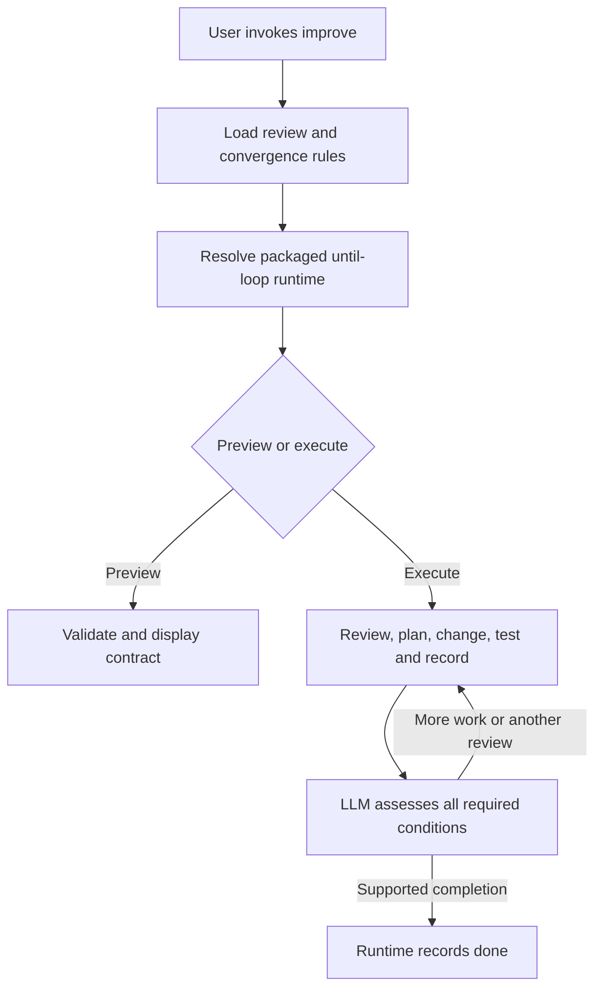

# Improve implementation



The reusable Improve parent and its until-loop dependency are installed for
the local Codex pilot. The existing Grok installation remains unchanged.
Installation uses relative symlinks to one maintained source, so later source
edits are immediately visible locally. This is a working-checkout installation,
not a published or immutable release.

This report records the activation checkpoint. Later checker hardening and
controlled recovery trials are recorded in
[IMPROVE_HARDENING.md - Follow-up validation: current checks and recovery evidence](/Users/dadleet/src/until-loop-v2/IMPROVE_HARDENING.md:1).

| Installed path | Source |
|---|---|
| `/Users/dadleet/.codex/skills/improve` | `/Users/dadleet/src/until-loop-v2/examples/improve` |
| `/Users/dadleet/.codex/skills/until-loop` | `/Users/dadleet/src/until-loop-v2` |

The parent resolves its physical filesystem path before loading the relative
until-loop card. This prevents a lexical Markdown link from choosing the wrong
runtime through the host symlink. The installed preview command was exercised
through its Codex path and returned `preview`, `not_initialized`, and
`not_executed`. The user still supplies natural language.
[SKILL.md - Runtime binding: resolve the installed parent's physical path](/Users/dadleet/src/until-loop-v2/examples/improve/SKILL.md:12).

## Use it

```text
Use $improve on these changes.
Use $improve on the parser changes, preserving its public API.
Dry-run $improve on these changes. Show the work and stopping conditions.
Use $improve on these changes, but do not stage or commit anything.
```

An execution request authorizes the requested improvement workflow and its
scoped local commits. A preview request authorizes interpretation only. If a
fresh host has not refreshed its skill list, the installed card can also be
loaded explicitly from `/Users/dadleet/.codex/skills/improve/SKILL.md`.

Changed iterations record Review, Plan, Changes, Validation, Key learnings,
and Remaining work in their Git commit body. No-change reviews retain durable
notes without manufacturing an empty commit. Explicit user overrides remain
part of the derived contract. Every material finding or fix resets the review
streak; two distinct, fully completed trivial-only reviews are required for
the default success condition.
[SKILL.md - Improve intent: iteration work, commits and convergence](/Users/dadleet/src/until-loop-v2/examples/improve/SKILL.md:52).

## Verification

At activation, the package suite passed 72 Python tests and 126 shell checks.
The thirteen preview tests also passed on Python 3.9, including a hermetic
installed-style symlink test with no source or workspace writes.
[test_preview.py - Installed binding regression: exercise preview through symlinks](/Users/dadleet/src/until-loop-v2/tests/test_preview.py:113).
The official skill-creator validator accepted the installed Improve card.
The six interpretation fixtures still validate. The earlier five usable model
expansions and two fresh readers remain evidence for their recorded checkpoint;
they were not silently rerun or relabeled as new trials.

The actual full execution trial **passed**. A fresh agent loaded the installed
card, derived eight criteria, initialized v2, repaired the documented behavior,
and reached runtime `phase: done` at cycle 3. An independent oracle confirmed
the final behavior, and an independent reviewer found no material problem in
the committed candidate or the distinct review evidence.

| Completed iteration | Observed work | Clean-review count |
|---|---|---:|
| 1 | Found the missing blank-name behavior, planned the fix, updated code/tests/docs, ran five passing tests and made a scoped learning commit | 0 |
| 2 | Re-read current history and candidate; checked six input cases and the full suite; recorded a no-change review | 1 |
| 3 | Performed a distinct contract trace with four additional whitespace/boundary cases and current checks; recorded a no-change review | 2 |

For the concrete input `"\u2003\t\u00a0"`, the original helper returned an
empty string despite the README requirement. The repaired helper normalizes
that value to an empty string and selects `Anonymous`. Passing this check
established behavior, while the recorded material fix kept the convergence
criterion unsatisfied until the two later reviews completed. The final
assessment covered all eight criteria and the runtime accepted completion.

The changing iteration produced commit
`e3f8545659136656325c377bc30705b4c33a79f1` **in the isolated test repository**.
Its six-section message explains how comparing documentation history with
narrow test coverage exposed the missing behavior. Only `formatter.py`,
`test_formatter.py`, and `README.md` were committed. The two no-change reviews
created durable notes and no empty commits. The staged draft's original blob
and bytes and the untracked scratch file remained unchanged; scoped files had
no unresolved edits.

- [material-iteration-commit.txt - Actual Git message: review, plan, validation and key learnings](/Users/dadleet/src/until-loop-v2-validation/improve-implementation/material-iteration-commit.txt:1)
- [working.md - Review evidence: material reset and distinct later reviews](/Users/dadleet/src/until-loop-v2-validation/improve-execute-live-workspace-20260913/.until-loop/working.md:27)
- [20260914T021533Z-88597.json - Independent execution check: oracle, completion, commit scope and preservation](/Users/dadleet/src/until-loop-v2-validation/improve-execute-live-20260913/reports/20260914T021533Z-88597.json:1)
- [final-fixture-tests.log - Final committed candidate: five passing tests](/Users/dadleet/src/until-loop-v2-validation/improve-implementation/final-fixture-tests.log:1)

Independent review identified a generated Python cache from the initial
baseline test. The agent checked its ownership, removed only those generated
files, and repeated final checks with bytecode writes disabled. This was a
review-assisted cleanup; the first attempt did not leave a clean final
workspace without that feedback. A proposed test change to copy the hidden
oracle's exact input was not treated as a defect: the model had not been given
that oracle, the implementation already handled it, and existing regression
tests plus the separate final oracle established the stated behavior.

This is one actual new-run v2 trial with self-review by the executing agent
and independent artifact review afterward. It establishes that this exercised
workflow completed; it is not a multi-model reliability benchmark, a cold
restart execution test, or a proof that all defects will be found. The runtime
continues to validate transitions and criterion coverage while the LLM judges
review substance and whether evidence establishes convergence. No additional
Improve state machine or scripted review counter was introduced.

The activation manifest supersedes the earlier preview checkpoint for claims
about the installed pilot; the earlier manifest and failed trials remain
historical evidence. Source changes in the skill checkout are uncommitted.
[improve-implementation-validation.json - Activation evidence: installed bindings, source hashes and completed trial](/Users/dadleet/src/until-loop-v2/improve-implementation-validation.json:1).

## Reproduce the execution test

The fixture tool prepares seven commits that change actual code, tests and
documentation. Its final README requires a blank-name fallback that the helper
does not yet implement, and the visible tests omit that behavior. An independent
oracle, initial snapshots and preservation evidence are stored outside the
workspace given to the model. There is no remote, and Git identity is local to
the fixture.

```sh
python3 tests/improve_execute.py prepare \
  --evidence-dir /tmp/improve-evidence-new \
  --workspace /tmp/improve-workspace-new
```

Give a fresh agent the installed Improve card and this request, using the new
workspace as its bound repository:

> Use improve on formatter.py, test_formatter.py, and README.md. Consider the
> last seven full commit messages, plan and implement worthwhile improvements,
> run meaningful tests, and commit scoped changing iterations with detailed
> learnings. Continue until two distinct consecutive completed reviews are
> trivial-only. Preserve the staged user-draft.txt and untracked scratch.txt.

Then inspect actual artifacts independently and run:

```sh
python3 tests/improve_execute.py check \
  --evidence-dir /tmp/improve-evidence-new \
  --workspace /tmp/improve-workspace-new
```

The current checker executes both the independent behavior oracle and the
visible project unittest suite, reads final runtime state and accepted
assessments, inspects every changing commit's paths and learning-message
fields, and compares final artifacts with the baseline inventory. It preserves
preexisting ignored files and the original unrelated bytes and staged blob.
It rejects an unexecuted
fixture. Its minimum assessment count is only a mechanical prerequisite:
independent review must still establish that the notes describe distinct,
complete reviews of the resulting candidate. The script does not count LLM
review quality or turn a plausible notebook into proof.
[improve_execute.py - check: independent project tests, commits and workspace inventory](/Users/dadleet/src/until-loop-v2/tests/improve_execute.py:401).
