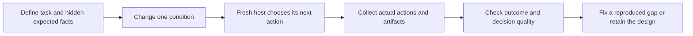

# Improve: next changes and experiments



**Recommendation: fix one newly reproduced checker defect, improve when evidence
is captured, then pilot experiments that measure false completion, uncertainty
handling and unnecessary work.** Keep the division already chosen: scripts
collect facts and enforce the protocol; the LLM judges materiality and whether
the full objective is established.

This is a proposal. The small checker probe below was executed; the new
behavioral experiments and implementation changes have not been executed.
This proposal does not modify the skill or runtime implementation.

## A new defect the exploratory probe actually found

The current checker parses the first `Ran N tests` string from combined stdout
and stderr. I ran its existing synthetic checker fixture with all four project
tests skipped, then added one printed diagnostic line to the same suite:

```python
print('Ran 999 tests in 0.000s')
```

| Observed condition | Actual non-skipped tests | Checker-reported executed tests | Checker result |
|---|---:|---:|---|
| Four skipped tests, normal unittest output | 0 | 0 | Reject |
| Same skipped tests, extra summary-shaped stdout line | 0 | 995 | Pass |

The independent behavior oracle continued to pass in both cases. The probe
isolated test-result counting; it used synthetic checker state and receipts,
not an actual LLM execution or a valid runtime convergence claim. A separate
reviewer confirmed the defect from the code and retained output.
[improve_execute.py - run_fixture_tests: first-match summary parsing](/Users/dadleet/src/until-loop-v2/tests/improve_execute.py:221),
[suite-summary-noise-probe.json - Controlled probe: rejected and falsely accepted versions](/Users/dadleet/src/until-loop-v2-validation/improve-next-experiments/suite-summary-noise-probe.json:1).

**Adopt next:** obtain counts and failures from the actual `unittest.TestResult`
object through a small trusted launcher. Keep stdout/stderr as diagnostics.
Write the structured result through a separate harness-controlled channel,
not an arbitrary line printed by a test. An absent, malformed or incomplete
result must remain a failed verification. This prevents the reproduced output
confusion; it is not an operating-system security boundary against arbitrary
hostile code executing with the same privileges.

Change `run_fixture_tests` and its focused tests. Preserve existing behavior
for ordinary passes, empty discovery, skipped suites, failures and timeouts.
Add regressions for all-skipped tests with fake summaries, passing tests that
print misleading count/skip text, and malformed or missing structured results.
This is a fixture-checker repair, not a new until-loop state machine.
[improve_execute.py - project-suite gate: parsed counts affect acceptance](/Users/dadleet/src/until-loop-v2/tests/improve_execute.py:414).

## A second change justified by the completed trials

**Adopt next: capture evidence before each assessment, with explicit origin.**
The completed trials needed later clarification of reviewer independence and
retrospective full-history catalogues. That is a concrete gap in contemporaneous
records, even though the behavior and recovery checks passed.
[IMPROVE_HARDENING.md - Evidence corrections: what was supplied after execution](/Users/dadleet/src/until-loop-v2/IMPROVE_HARDENING.md:155).

A small evidence-capture helper should record the action ID, contract revision,
HEAD plus relevant dirty-file identity, the exact seven-commit window and full
messages, actual check-result locations, and reviewer identity/role. Reuse a
full-message catalogue for repeated history windows. Label facts collected by
tools separately from host judgments and any later reconstruction. Capture
short decision explanations and observed tool events; private reasoning is not
needed.

The packet can then identify which factual references are present, missing or
stale and ask the LLM to assess the criteria. Presence does not prove that a
review was substantive or that the model read and understood a message. Do not
turn this helper into a second state machine or silently alter the completion
contract. Test whether the improved capture actually reduces later evidence
repairs before adding mandatory fields throughout the generic runtime.
[SKILL.md - Standalone history binding: full messages and current windows](/Users/dadleet/src/until-loop-v2/examples/improve/SKILL.md:41),
[review-policy.md - Record: candidate identity and current evidence](/Users/dadleet/src/until-loop-v2/examples/improve/references/review-policy.md:59).

## Experiments that could change our decisions

| Priority | Experiment and controlled change | Unknown it measures | Observable failure and resulting decision |
|---|---|---|---|
| 1 | Paired uncertainty cases: identical task and candidate, but current passing evidence, current failing evidence, or unavailable/stale evidence. Repeat with equivalent wording and reordered clauses. | Does the host distinguish satisfied, unsatisfied and unknown, and preserve the same contract under paraphrase? | False completion, invented evidence, an unnecessary blocker, or different obligations under equivalent wording would justify a targeted rubric/interpretation change. |
| 2 | Commit before notes: interrupt after the real Git side effect but before durable iteration evidence. Resume a fresh host. | Can it reuse a commit without inventing the missing review or counting recovery as a clean pass? | A duplicate commit, reconstructed claims presented as original observations, or false convergence would justify changing capture timing or recovery guidance. |
| 3 | Overlapping user work: after planning, independently add an uncommitted edit in the same scoped file, including staged and unstaged hunks. | Can it preserve ownership when an edit is in scope but is not its own? | Overwriting or staging user work, or applying stale review evidence, would justify stronger candidate/ownership reconciliation. A necessary clarification is an acceptable outcome when attribution cannot be resolved. |
| 4 | Blinded defect discovery: several repository shapes, requirement-backed hidden defects, and genuinely clean controls. | Can it find defects absent from visible tests without manufacturing improvements? | Measure missed defects and unnecessary edits separately. Examples include CSV row loss, config precedence and state persistence; success on another formatter alone would add little diversity. |
| 5 | Reviewer-value comparison: matched cases with self-review alone versus one blinded reviewer; include a real defect, a redundant suggestion and a confident but wrong suggestion. | Does reviewer involvement improve results enough to justify its cost? | Extra churn, false material resets or acceptance of unsupported advice without better defect detection argues against making more reviewers mandatory. |
| 6 | Generated runtime action sequences and fault injection at additional boundaries. | Do combinations of revision, pause, replay and interrupted verification preserve invariants? | Minimize a failing sequence into a regression before changing runtime code. Existing individual replay/pause/revision and post-verifier tests are controls, not new coverage. |

The current checkout also extracts a shared review policy with owner-specific
bindings. Add a focused consumer-binding probe: give two consumers different
history windows and phase/callback rules, then ask a fresh host what it should
do from each returned packet. It must respect the selected owner and avoid
starting the standalone until-loop adapter for an owner-managed phase. This
tests instruction leakage between consumers without requiring another full
repository improvement run.
[SKILL.md - Owner-managed entrypoint: standalone adapter exclusion](/Users/dadleet/src/until-loop-v2/examples/improve/SKILL.md:30),
[review-policy.md - Required owner binding: scope, evidence and callback authority](/Users/dadleet/src/until-loop-v2/examples/improve/references/review-policy.md:8).

The existing natural-language suite already samples alternatives, global stops,
false guards and corrections. The new contribution in experiment 1 is controlled
pairs, equivalent paraphrases, repetitions and explicit uncertainty grading,
not merely another example of `and` or `or`.
[fresh-context-cases.json - Existing language and packet fixtures: baseline coverage](/Users/dadleet/src/until-loop-v2/tests/fresh-context-cases.json:1).

The previous commit-gap case deliberately included durable notes. The previous
material reset involved a committed external change. Neither establishes the
missing-notes or overlapping-uncommitted-work outcomes above.
[IMPROVE_HARDENING.md - Controlled scenarios: boundaries actually exercised](/Users/dadleet/src/until-loop-v2/IMPROVE_HARDENING.md:70).

## What a correct unknown looks like

Hypothetical input: the notebook says tests passed at revision A, but the current
candidate is revision B and no relevant test result is bound to B.

The testing criterion is **unknown**. The next useful action is to run the
relevant checks on B or locate valid current evidence. It is not yet a proven
behavior defect, and missing evidence alone is not a blocker while an authorized
check can run. A failing current check establishes an unsatisfied criterion;
a passing current check can satisfy that criterion, but does not by itself
establish the whole Improve convergence condition.

If the only required check is unavailable and no useful authorized work remains,
report the concrete blocker and preserve the unknown criterion. Score unjustified
abstention too: a host that always says “unknown” is not a successful evaluator.
[SKILL.md - Host loop: reassess, choose useful work and evaluate the whole exit](/Users/dadleet/src/until-loop-v2/SKILL.md:187).

## A bounded first pilot and its measurements

1. Repair the counting defect and add its deterministic regressions.
2. Run twelve prepared decision cases twice in fresh contexts: six equivalent
   prompt pairs spanning current, failed and missing/stale evidence. Keep other
   obligations explicit and fixed; record the first decision before feedback.
3. Run three full workflow trials: missing notes after commit, overlapping user
   work, and a clean candidate that should converge without invented edits.
4. Use separate held-out variations to check any prompt change. Broaden the
   blinded defect corpus and reviewer comparison only when the initial results
   identify a question those runs would resolve.

This is a screening pilot, not a reliability estimate. Record raw numerators
and denominators, variation across repeats, and uncertainty when samples are
small. Preserve provider failures and invalid-fixture counts separately rather
than dropping them from a success denominator.

Track false completion, known-defect misses, unsupported material changes,
correct unknown decisions, unnecessary abstention/blocking, duplicate side
effects, user-work loss, evidence requiring later repair, and time/tool/token
cost when the host exposes those values. Do not silently infer unavailable
usage values. Also track distinct new failure classes found: another failure
of the same familiar formatter case is a regression result, not a discovery.

Keep the solver's final decision separate from the independent evaluation
outcome. Grade actual files, Git state and executable properties mechanically;
calibrate semantic judges with known good and bad evidence. Keep hidden oracles
outside the task's accessible environment where practical, and describe the
actual isolation boundary. Never grade success by matching one exact tool
sequence when several safe sequences establish the requested outcome.

## External evidence and contrary considerations

Anthropic's evaluation guide separates new-capability experiments from regression
suites, emphasizes both environment outcomes and execution traces, and documents
tradeoffs between brittle deterministic graders and variable model-based judges.
Those points support the proposed split; they do not establish this skill's
reliability. [Anthropic - Demystifying evals for AI agents](https://www.anthropic.com/engineering/demystifying-evals-for-ai-agents).

ReliabilityBench's preprint organizes evaluation around repeated trials,
meaning-preserving perturbations and injected tool failures. Borrow that design;
its measurements in other domains and models should not be transferred to our
coding skill. [ReliabilityBench - Research method and scope](https://arxiv.org/abs/2601.06112).

Hypothesis supports generated stateful action sequences and shrinking failures.
That is a candidate method for experiment 6, not a recommendation to install a
new framework before it is useful. We can start with the existing hermetic
harness and a small seeded generator. [Hypothesis - Stateful testing](https://hypothesis.readthedocs.io/en/latest/stateful.html).

**Defer** additional production loop states, numerical completion scores,
mandatory reviewer teams and further attempts to infer semantic truth from
commit-message regexes. Their benefit has not been shown locally. Fix the
reproduced counting bug and improve factual evidence capture first, then let
new experiments determine which further changes earn their complexity.

## Source freshness

During this review, concurrent workspace edits changed the Improve card and
preview harness and added the shared review policy. Those edits are preserved;
references above use their current locations. The execution checker used in the
new probe still matches the previously recorded checker source. The earlier
83-test checkpoint does not validate the concurrent edits, and this proposal
makes no such claim. The proposal and probe are the only changes made by this
review task.
