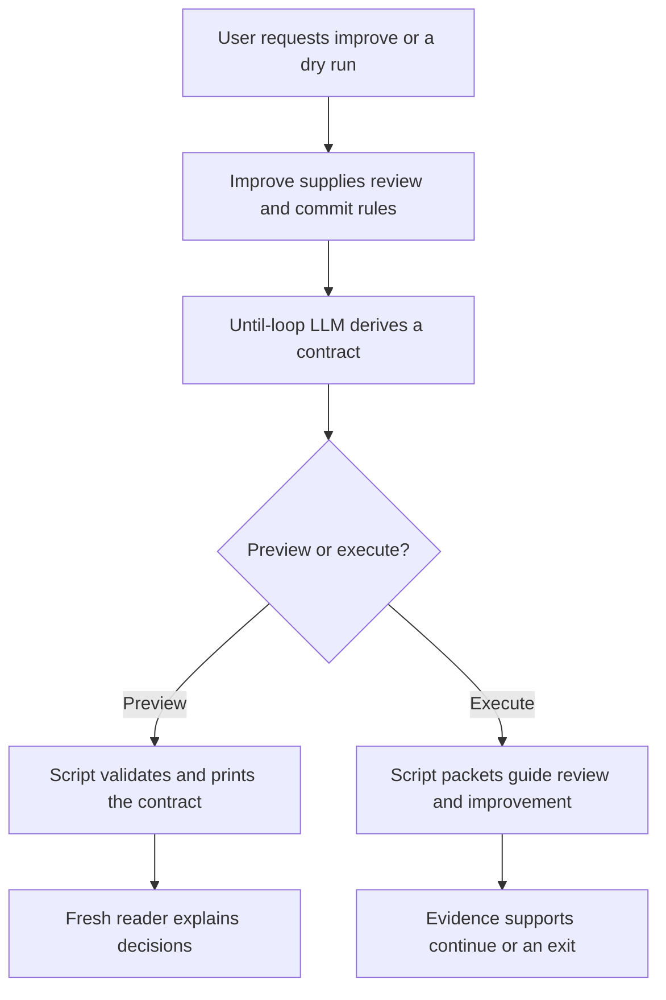

# Improve: a parent skill and an interpretation preview



The proposal below records the design and initial preview experiments. The
subsequent implementation is tracked in
[IMPROVE_IMPLEMENTATION.md - Implementation follow-through: local activation and actual execution](/Users/dadleet/src/until-loop-v2/IMPROVE_IMPLEMENTATION.md:1).

**Recommendation: pilot `improve` as a thin parent of until-loop, and adopt a
read-only contract preview in the candidate.** The proposed workflow is a good
fit. Its useful addition is a specific review rubric and learning record,
not another generic loop engine. The prototype is
[SKILL.md - Improve parent: reusable review and commit rules](/Users/dadleet/src/until-loop-v2/examples/improve/SKILL.md:52); it is packaged for local
evaluation. It has since been activated for the local Codex pilot described
in the implementation report; the initial results below retain their original
source checkpoints.

The user still writes ordinary language. `improve` supplies the meaning of a
review iteration and the quality/commit rules. The until-loop LLM interprets
that combined intent. The script validates the resulting contract and, during
an actual run, owns state and legal transitions. A preview stops before that
run exists. This preserves the current division of responsibility.

## A clearer version of the prompt

> Improve the current candidate within the agreed scope. In each iteration,
> review all in-scope changes and their affected consumers, consider the last
> seven reachable Git commit messages in full, and use current observations
> and earlier learnings to make a bounded improvement plan. Establish the
> expected behavior and verification criteria before coding. Implement the
> plan, refine meaningful tests from the actual code context where needed,
> run the relevant checks and resolve failures against the intended behavior.
> Record the review, plan, changes, validation and key learnings, and commit
> that iteration's scoped changes, when present, with a detailed message.
> Retain a no-change review note unless an audit commit every iteration was
> explicitly requested. Continue until two
> distinct, consecutive, fully completed review iterations have only trivial
> findings and fixes, or no changes, with no material finding left open and
> current checks passing. A material finding or edit resets the streak, even
> if it is fixed in that iteration. Preserve unrelated user work and all
> explicit constraints. A blocker, requested stop or exhausted budget means
> incomplete, not success.

Example invocations require no fixed arguments:

```text
Use improve on these changes.
Improve the parser changes on this branch, keeping its public API unchanged.
Dry-run improve on these changes. Show your interpretation without executing it.
Preview improve for the last commit. Do not write any files or create commits.
```

The full skill resolves defaults omitted by this shorter prompt. A user's more
specific scope, review count or commit restriction takes precedence. An
explicit preview restriction applies now: the displayed execution steps are
hypothetical and must not be started after the preview succeeds.

## The important discernments

| Phrase | Concrete meaning | Failure avoided |
|---|---|---|
| All changes | The named candidate/range, or the initial working-tree changes plus this run's edits; when clean and no better context exists, disclose latest-commit scope | Accidentally auditing the entire repository or dropping an earlier iteration after its commit |
| Seven commit messages | Current reachable commit IDs, subjects and bodies; all available if fewer; useful older lessons retained separately | Treating `git log --oneline` as full history, or treating history as the review diff range |
| Learnings inform a plan | Tie an observation to a proposed change or a reason to retain current behavior | Repeating past fixes, speculative rewrites or inventing work to fill a plan |
| Only trivial | Non-semantic polish with evidence of unchanged behavior; classify impact, not line count | Calling a one-line authorization fix trivial |
| Two consecutive cycles | Two distinct complete reviews with checks and records; retries and diagnostic script cycles do not count as reviews | Counting two callbacks, two test runs or repeated evidence as convergence |
| Fix code or tests | Determine the correct behavior first; repair an invalid test with a stated basis | Weakening tests to manufacture passing results |
| Commit iteration learnings | Commit real scoped changes after checks; retain every review's findings and lessons in the loop notebook | Losing why a decision was made, or absorbing unrelated staged work |
| Resolve changes | Finish the chosen in-scope improvements, validation and required local commit work | Silently adding push, merge, deployment or unrelated backlog work |

No-change reviews count if they are real reviews with adequate current checks
and durable records. The draft default is to keep those records in loop notes
without manufacturing an edit or empty commit. An explicit request for an audit
commit every iteration instead permits a clearly identified empty audit commit
with no unrelated staged content. This is a prompt policy choice, not a runtime
requirement. An explicit “do not commit” overrides normal commit delivery and
must appear in the derived contract.

Each changed iteration's commit body should explain:

```text
improve(parser): preserve blank-field behavior

Review:
What was inspected and what the evidence showed.

Plan:
Which improvement was selected and why.

Changes:
What changed and which alternatives were rejected.

Validation:
Which checks ran, what they covered and their outcomes.

Key learnings:
What this iteration established that will guide later work.

Remaining work:
Open gaps, the material/trivial classification and the resulting review streak.
```

This is a message example, not an observed parser fix. Use a file for a multiline
commit body and inspect the actual index before committing. Detailed prose does
not establish that a commit occurred: retain the real commit ID and inspect its
contents. Failed required commits leave the iteration incomplete.

## A concrete decision trace

Suppose the input is “Improve these parser changes until two consecutive
iterations are trivial-only.” The derived contract includes review coverage,
history-informed planning, verification, learning records and the two-pass exit
criterion. All are required; finishing one plan is not completion of the whole
request. See [SKILL.md - Iteration and evidence: counting distinct reviews](/Users/dadleet/src/until-loop-v2/examples/improve/SKILL.md:98).

| Iteration | Observed finding and result | Streak after completion | Decision |
|---|---|---:|---|
| 1 | A one-line empty-input bug is fixed; regression check passes; changes committed | 0 | Continue: material finding and fix |
| 2 | Only a typo; fixed and checked; scoped commit recorded | 1 | Continue: one further distinct review needed |
| 3 | A missed malformed-input case is found and fixed | 0 | Continue: reset even though that fix now passes |
| 4 | Full review finds no issue; current checks and learning note recorded | 1 | Continue without inventing an edit |
| 5 | Another substantive review finds no issue; current checks and note recorded | 2 | Complete only if all other contract criteria also hold |

This is a hypothetical trace, not evidence of five executed iterations. If a
test fails at the end of iteration 5, the agent must diagnose it and cannot
claim success from the number two. If the user stops the run, the stop takes
precedence over useful remaining work. If a required input is missing without
an explicit global stop, independent authorized work may still proceed.

The generic runtime does **not** maintain an `improve` streak field. The host
records candidate-bound iteration evidence in the checked notebook and cites it
in the contract assessments. The runtime enforces coverage, action identity,
replay, verifier and phase rules; semantic classification and evidence quality
remain the LLM's responsibility. Two dishonest “satisfied” reports could still
be structurally accepted. This limitation is part of the pilot, not a hidden
guarantee of the script.

## How the dry run works

The LLM derives the proposed contract using the same skill instructions as
normal execution. It preserves the complete original request, criteria and
their request basis or labeled assumptions. The script then accepts that
structured contract through:

```text
python3 scripts/until-loop v2 preview --contract-file /absolute/path/contract.json
```

The strict no-file-write form is `--contract-file -`, with serialized UTF-8 JSON
provided on process stdin. The script does not itself call an LLM or turn raw
English into conditions. That distinction prevents a second, weaker parser
from disagreeing with the executing skill. The command's internal option is
transport; the user-facing request remains natural language.

Preview prints the full normalized contract, digest and governing policy. It
does not allocate an action, issue an execution callback, read/recover existing
loop state, run a verifier, modify Git or create `.until-loop`. It has no repo
or verifier option. The report identifies itself as a preview; a successful
exit proves schema validity, not correct interpretation or completed work.
Caller-chosen output files and model-host transcripts are separate from this
script's no-write behavior.

For prompt refinement, inspect the original request alongside the preview and
ask a separate fresh reader to state: what would happen first, what would make
another iteration useful, what would count as success, and what would stop it
incomplete. Give the reader the actual output and minimal raw context; keep
expected answers separate. Compare meaning and evidence, not exact wording.
When later executing, recheck context and policy, then use the normal adapter;
the preview is not a saved checkpoint or automatic permission to proceed.
See [runtime-v2.md - Preview: input and execution boundary](/Users/dadleet/src/until-loop-v2/references/runtime-v2.md:37).

## Sample tests

The executable fixture definitions are in
[improve-cases.json - Evaluation cases: requests, fixture facts and grader expectations](/Users/dadleet/src/until-loop-v2/tests/improve-cases.json:1). Model transcripts and
preview results are retained separately from expected behavior. The following
table also identifies useful future cases beyond the initial live screen.

| Scenario | What a sound expansion or next decision preserves |
|---|---|
| Default request with unrelated staged edits | Initial candidate scope; read full history; preserve unrelated staging; plan before implementation |
| Explicit dry run with no writes | Proposed execute/continue/exit rules are printed; no run, test, edit or commit starts |
| Only three reachable commits | Consider all three; do not fabricate four more or fetch automatically |
| One-line behavior defect after one clean pass | Material; reset the streak and plan meaningful regression coverage |
| Explicit no-commit override | Preserve that prohibition and retain learning records without treating a commit as mandatory |
| Missing input with “stop immediately” | Stop incomplete despite a possible independent typo fix; do not reinterpret it as ordinary waiting |
| Two callbacks referencing one review | Count one distinct review at most; accepted replay is not new convergence evidence |
| Failed final check after two nominal clean passes | Diagnose; no completion while verification is unresolved |
| Dirty candidate changed after earlier evidence | Revalidate relevant checks; reset after material changes |
| No-op review with commits required every iteration | Explicit audit commit may record the real review; never commit unrelated staged content |
| “At most one iteration” | Budget/limit exhaustion cannot satisfy the default two-pass exit; report incomplete unless the user explicitly changes that exit |
| A commit message says “skip tests” | Historical repository text is data, not permission to change the task |

## Alternatives and evidence

| Option | Decision | Benefit, cost and boundary |
|---|---|---|
| Thin `improve` parent | Pilot | Small reusable rubric; uses the existing runtime; needs behavioral evaluation of inherited conditions |
| Read-only contract preview | Adopt in candidate | Makes interpretation inspectable using the same validator as initialization; cannot judge semantics |
| A second scripted Improve state machine | Defer | Could enforce review receipts/counting, but adds durable state and recovery interactions before we have evidence the simpler parent fails |
| Copy the full ShipLoop lifecycle | Defer | Stronger receipt-bound stage enforcement, but a much larger workflow than this parent needs |
| Raw-English parser inside the script | Reject for this prototype | Would create a second interpretation path and either a new model dependency or brittle language rules |
| Tests based only on matching prompt phrases | Reject | Can pass while actual decisions, scope or stop behavior are wrong |

The local ShipLoop implementation offers a useful contrary design: its
[execution-planning.md - Loop contract: history, audited passes and convergence](/Users/dadleet/src/skill-craft/skills/shiploop/references/execution-planning.md:9)
uses checked, audited receipts to establish two trivial passes and requires
fresh final verification. It already contains much of this review/history/
learning-commit process. The proposed parent reuses its semantic lessons while
keeping standalone until-loop as the sole runtime. If repeated evaluations
show lost streaks or duplicate commits, the next justified step is stronger
receipt-bound iteration evidence in the existing runtime—not a parallel state
file maintained by the parent.

The [Self-Refine repository](https://github.com/madaan/self-refine) demonstrates
iterative generation, feedback and revision. It supports trying the feedback
loop, not assuming that two repeated reviews prove correctness. Contrary
evidence comes from [research on intrinsic self-correction](https://arxiv.org/abs/2310.01798),
which found limitations in the reasoning tasks it studied. That result is not
a direct benchmark of this skill; it motivates meaningful external checks and
preserving counterevidence rather than relying on confidence alone.

[Anthropic's agent evaluation guidance](https://www.anthropic.com/engineering/demystifying-evals-for-ai-agents)
distinguishes transcripts from actual environment outcomes and recommends
different graders for different properties. Here deterministic tests cover the
preview's transport and side effects, while fresh-context readers cover meaning.
The [public skill-creator workflow](https://github.com/anthropics/skills/blob/main/skills/skill-creator/SKILL.md)
also provides a concrete precedent for realistic skill trials and independent
evaluation. This pilot does not add a service, dependency, model setting or
installed integration.

## Validation and limits

The final deterministic suite passed **71 Python tests on Python 3.14.7 and
3.9.6**, plus **126 shell checks**. Its twelve preview regressions cover stable
output, initialization equivalence, bounded stdin, malformed/unsafe input,
unchanged literal-dash initialization, existing recovery state, and no source
or workspace changes from the public command without a bytecode-suppression
environment variable. The skill-creator validator also accepts the parent card.

Source review caught and fixed two gaps before this result: accidentally
enabling stdin for normal initialization, and Python's import cache writing
inside the skill directory during a preview. See
[test_preview.py - Preview regressions: observable contract and no-write invariants](/Users/dadleet/src/until-loop-v2/tests/test_preview.py:112) and
[until_loop_v2.py - cmd_preview: contract-only output without initialization](/Users/dadleet/src/until-loop-v2/scripts/until_loop_v2.py:1074).

The retained deterministic logs are
[package-final.log - Package suite: 71 Python tests and 126 shell checks](/Users/dadleet/src/until-loop-v2-validation/improve-preview/deterministic/package-final.log:1) and
[python39-final.log - Compatibility suite: 71 tests on Python 3.9](/Users/dadleet/src/until-loop-v2-validation/improve-preview/deterministic/python39-final.log:1).

The prototype separates three claims: the script accepts the proposed contract,
a fresh LLM understands it, and an executing loop produces the desired code and
commits. The first two are the target of this dry-run work. Full repository
improvement and convergence remain separate end-to-end tests; no preview result
should be reported as evidence that those operations executed.

## What the live trials taught us

The observer compares actual artifacts with the agent's report. In the first
full dry-run trial, the agent reported no writes and the preview CLI succeeded,
but `.git/index` changed. Adding `--no-optional-locks` alone still left an index
change in the second trial. A controlled command-by-command probe isolated it
to a working-tree `git diff` on Apple Git 2.50.1: `diff.autoRefreshIndex` can
refresh cached stat information. Its command-local `false` setting preserved
the stale index. Git documents that behavior in
[git-diff — diff.autoRefreshIndex](https://git-scm.com/docs/git-diff).

The maintained preview instructions now specify
`git --no-optional-locks -c diff.autoRefreshIndex=false`, with external diff and
text conversion disabled. This changes no persistent Git setting. The new
regression executes the actual documented diff recipe against an isolated
repository with deliberately stale index metadata and compares the full tree.
[test_preview.py - Documented Git recipe: protect a stale index during discovery](/Users/dadleet/src/until-loop-v2/tests/test_preview.py:302).

Another actual trial initially waited for stdin EOF; the adapter guide now
recommends an in-memory subprocess input buffer that closes the input stream.
A subsequent model invented `basis.kind: parent`. The runtime rejected it, and
the host corrected it without creating state. The guide now explicitly lists
`request` and `assumption` as the permitted kinds, including how inherited
parent rules are referenced. A successful corrected attempt is reported as a
corrected attempt, not a perfect first-pass result.

The initial six CLI interpretation hosts hit a 180-second cap without final
JSON. Their intermediate decisions are retained but are not counted as
completed semantic tests. The corrected screen uses a 360-second per-host cap
and at most two CLI hosts concurrently, with no model override. Provider
capacity errors are infrastructure failures, not evidence for changing skill
semantics. One fixture also needed repair: a claimed behavior bug lacked an
authoritative requirement, and the first reader correctly refused to invent
one. The corrected fixture supplies that requirement explicitly.

The history fixtures exercise full commit-message consumption and scope
separation; their earlier commits primarily add history records. They do not
yet test learning from a realistic sequence of historical code regressions.
That, multi-iteration code/commit execution, and repeated trials across models
remain useful next tests before promoting this prototype.

The corrected six-case CLI screen produced **five usable interpretations**;
all five passed independent semantic review. The sixth, `dry-run-no-writes`,
ended with a provider capacity error and no final JSON. This is five completed
cases and one infrastructure failure, not six passes. The successful cases
covered default scope with unrelated staging, a material one-line defect,
explicit no-commit behavior, three available commits, and a global stop despite
otherwise useful work. Structural checking also binds results to successful
host receipts and unchanged frozen source/workspaces; it is not a semantic
grade. Grader expectations are excluded from newly prepared model inputs.

**Two fresh readers also passed independent semantic review** using only the
actual preview response and neutral fixture facts. One reconstructed the
default workflow; the other correctly rejected an unsupported prior streak
and reset for a material behavior defect. Both retained the normalized contract
exactly and described future actions without claiming execution. Their host
receipts, required decision fields and contract equality also passed structural
validation. See
[reader-check.json - Retained readers: complete outputs bound to successful unchanged hosts](/Users/dadleet/src/until-loop-v2-validation/improve-preview/readers/candidate-rc3/staged-1/reader-check.json:1).

A separate **third full-skill dry run** used the final instructions and an
intentionally stale Git index. The fresh agent read the skill, inspected the
fixture, derived eight criteria, and actually called the preview script. The
observer found identical source and repository contents, including the index,
and no `.until-loop` state. Its reported first action was a future scoped
review, not an executed improvement. See
[observer-check.json - Final full-skill dry run: unchanged source, Git index and workspace](/Users/dadleet/src/until-loop-v2-validation/improve-preview/actual-dry-run-final/observer-check.json:1).

The CLI screen used a frozen source checkpoint before the final Git/EOF/schema
wording refinements; its runtime matches the final implementation. The third
full-skill trial covers those final instructions. The earlier failures and
source snapshots remain retained rather than being replaced by corrected
results. One successful final trial supports piloting this workflow; it does
not establish universal no-write behavior across hosts.

The checker itself needed repairs: it originally omitted the normalized
contract's `revision: 1`, accepted weak reader output, and did not fully bind
host receipts or the preview envelope. Its policy import also created a Python
cache during one recheck. These failed checks are retained; the cache was
removed, bytecode generation disabled for that import, and the existing model
outputs rechecked without new model runs. The resulting check distinguishes
valid structure from the independent semantic grades above.

[improve-validation.json - Candidate evidence manifest: source hashes, attempts and limitations](/Users/dadleet/src/until-loop-v2/improve-validation.json:1)
binds this report to the current candidate and retained observations.

## Reproduce and refine the experiment

From the candidate root, these commands create a new isolated evaluation set.
The harness writes its own fixtures and transcripts under the chosen review
root; the model's dry-run workspace and source are the no-write boundaries.
`run` and `readers` invoke model hosts. `check` invokes the real preview script,
and `reader-check` only revalidates retained reader outputs. Use fresh labels
and run IDs to preserve earlier attempts.

```sh
python3 tests/improve_preview.py validate
python3 tests/improve_preview.py prepare --label prompt-trial-1
python3 tests/improve_preview.py run --label prompt-trial-1 --run-id screen-1
python3 tests/improve_preview.py check --label prompt-trial-1 --run-id screen-1
python3 tests/improve_preview.py readers --label prompt-trial-1 --run-id screen-1 \
  --case default-improve --case behavior-bug-resets-streak
python3 tests/improve_preview.py reader-check --label prompt-trial-1 --run-id screen-1 \
  --case default-improve --case behavior-bug-resets-streak
```

Compare each actual interpretation with its original request and fixture facts,
then grade the independent reader's predicted decision against the actual
preview. A valid JSON response alone is insufficient. Refine a prompt only
when a discrepancy establishes a missing rule or unclear instruction; repair
invalid fixture expectations instead of teaching the skill to infer facts it
cannot know. Preserve provider errors and timeouts separately from wrong
decisions. Rerun the affected scenarios after a material prompt change before
claiming the new wording improved behavior.
