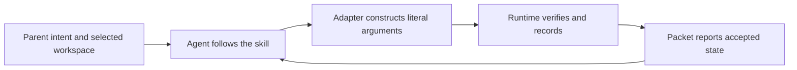

# until-loop integration follow-up — 2026-09-12

Status: repairs and integration validation complete. Skill 0.2.1 and demo 0.1.3.
Baseline `e5d3ae9` (skill 0.2.0). Commit identities and driver closure are
retained in the evidence manifest after the final completion call.
Scope: current skill, adapter, packet, runtime, tests, and the installed smoke
parent. Baseline source was clean; existing untracked `tasks/` are unrelated.
The prior completed audit remains recorded in AUDIT.md and INTENT_REVIEW.md.
This follow-up is driven by a new until-loop run preserving that prior history.

## Concrete findings and changes

| Finding | Baseline evidence | Change |
|---|---|---|
| Literal option values were not safely transported by the examples. | Separate argv `--prompt --help` returns usage 64 even when the shell quotes the value. `--prompt=--help` preserves it. | Use `--name=value` for arbitrary text in the internal adapter, with POSIX quoting as well when using a shell. User requests still need no flags. |
| Hard links bypassed runtime metadata checks. | Replacing history with a hard link to an external regular file allowed `complete` to append to the external file. | Refuse multiply-linked runtime metadata before execution or mutation. |
| Git's optional exclude update followed redirected files. | A symlinked `.git/info/exclude` received `.until-loop/` through its external target during init. | Skip unsafe exclude updates while allowing the run to initialize. |
| Resume could read conflicting frozen instructions. | A modified `prompt.md` was accepted by `next` while the packet displayed the original objective from state. | Validate the settled prompt against the saved objective after pending recovery. Refuse a missing or inconsistent copy before another verifier/transition. |
| Parent handoff wording mixed natural-language intent with a repository flag. | The adapter already honored the parent's `REPO` binding; a wrong-workspace failure was not demonstrated. | Clarify that the parent selects the absolute workspace as context and the same agent reads the child's internal adapter. This is a clarity improvement, not a claimed reproduced routing bug. |
| A host combined its notebook metadata check with an unsafe read. | The first fresh-context probe detected link count 2 but reported also printing the notebook content. | Require a metadata-only probe, followed by a branch that permits content access only for a safe file. A fresh retry followed that sequence. |

The runtime still does not interpret arbitrary natural language. The agent
makes the semantic completion decision; the adapter transports its literal
values and the runtime enforces the mechanical transition. No new parser,
background service, dependency or host configuration was introduced.

## Reconciliation of the old pending list

The unchecked entries in REVIEW_CONVERGE.md are historical review observations.
They do not all represent current unimplemented work.

| Historical item | Current disposition |
|---|---|
| Unreachable empty-force branch | Already removed by the earlier runtime audit. |
| Duplicate run-directory creation | Already removed; the lock wrapper owns creation. |
| Loose stop-rail assertions | Remaining shell assertions now require the exact standalone stop line. |
| Corrupt state, whitespace evidence and last-evidence display | Already implemented and covered by the runtime suite. |
| Final-source parent smoke after the natural-language redesign | Passed with unchanged runtime/card/adapter/parent sources; the test-only fingerprint difference is retained below. |

[REVIEW_CONVERGE.md - historical ledger: why old unchecked entries remain](/Users/dadleet/.grok/skills/until-loop/REVIEW_CONVERGE.md:1)

Earlier history is preserved. Settled `history.jsonl` is not reparsed or
authenticated on each call; arbitrary external edits to old history are outside
this repair. State remains authoritative, and current artifact evidence is
required for success. This avoids implying a tamper-proof audit log.

## Validation

Evidence directory: `/Users/dadleet/src/until-loop-integration-20260912/`.

- Baseline: 126 shell checks and 25 runtime test methods passed.
- Actual adapter-template smoke: extracted and executed all four current
  command templates from references/runtime.md. Leading options, apostrophes,
  dollar substitutions and backticks remained literal; no injected files were
  created. State followed active cycle 0, active cycle 1, read-only resume at
  cycle 1, then done at cycle 2. Two history events matched those completions.
- Runtime regressions: 30/30 methods pass, including five new methods for
  leading-option transport, hard-linked metadata, unsafe exclude paths,
  corrupt prompts after recovery, and literal CRLF/CR/Unicode preservation.
  The baseline failures are retained in `runtime-boundary-baseline.md`.
- Full suite: 126 shell checks plus 30 runtime methods pass. The installed
  parent option passes 137 shell checks plus the same 30 runtime methods.
- Python floor: all 30 methods pass on Apple Python 3.9.6. The first floor run
  caught use of the newer `Path.hardlink_to` in two test fixtures; those now
  use `os.link`. Both the failed and repaired logs are retained. The ordinary
  interpreter is Python 3.14.7.
- Two independent implementation reviews found no material regression or
  wiring mismatch. The later notebook sequence clarification also received
  a separate contract review with no behavioral mismatch.

### Current native parent acceptance

The installed Grok host exited 0 after 208 seconds. Its trace shows the
parent card, child card and runtime adapter were read before the first CLI
call. The actual calls were init, incomplete complete, next, and successful
complete. All 14 shell calls in the host trace returned 0.

The parent selected `/tmp/until-loop-demo.3eQCt1`; the resolved saved repository
matches that directory. Its caller workspace received no loop state. History
contains exactly cycle 1 with `done_claim: false` and cycle 2 with
`done_claim: true`. Final phase is `done`, with `hello.txt` exactly `hi\n` and
`cycled.txt` exactly `2\n`; there is no pending transition. No runtime verifier
was selected for this file-writing smoke. Direct read-back independently
checked the bytes, state, frozen prompt and history.

The trace also shows separate metadata-only notebook probes, safe exclusive
creation, a later content read after the safe result, and a guarded final
write. No test file was read or executed by the native host.

The runtime, child card, adapter, references and parent card were byte-identical
before and after the run. One test-only assertion was refined during it, so
the broad capture wrapper correctly returned 1 for its all-file fingerprint
check despite the native host exiting 0. `native-parent/process-result.json`
retains that result; `native-parent/acceptance.json` distinguishes stable
execution sources from the test-only delta. The later Python-floor fixture
repair likewise changes tests only. This is not an all-files-unchanged claim.

### Unsafe notebook probe and retry

A separate fresh-context agent resumed a run whose notebook had two hard
links. It completed the safe status-file task and preserved the external
file, but reported accidentally reading the notebook in its initial combined
inspection. That attempt failed the no-read requirement and is retained.

After clarifying the metadata-only/conditional-access sequence, a fresh
fixture and fresh agent completed `status.txt` with exact bytes `ready\n`,
reached done at cycle 1, and reported skipping the unsafe notebook entirely.
The supplied probe uses `os.lstat` and reports link count 2 without reading
content. The retry had one preliminary Python syntax error before any access.
Independent read-back confirmed unchanged external bytes, the unchanged hard
link and the accepted output/state/history. This is one observed recovery in
host behavior, not mechanical enforcement of notebook access.

### Decisive implementation locations

- [runtime.md - Exact interpolation: literal option values use one argv element](/Users/dadleet/.grok/skills/until-loop/references/runtime.md:51)
- [scripts/until-loop - check_metadata: rejects preexisting hard links and unsafe file types](/Users/dadleet/.grok/skills/until-loop/scripts/until-loop:78)
- [scripts/until-loop - validate_settled_prompt: frozen prompt matches authoritative state](/Users/dadleet/.grok/skills/until-loop/scripts/until-loop:187)
- [scripts/until-loop - ensure_exclude: optional updates skip redirected targets](/Users/dadleet/.grok/skills/until-loop/scripts/until-loop:323)
- [until-loop-demo/SKILL.md - Procedure: selected workspace and child adapter ownership](/Users/dadleet/.grok/skills/until-loop-demo/SKILL.md:50)

The current native-host acceptance target is macOS/Grok. The recorded tests do
not establish Linux host acceptance or universal language understanding. Runtime
path checks address preexisting redirection, not hostile concurrent filesystem
replacement. Verifier effects remain outside the state transaction.
