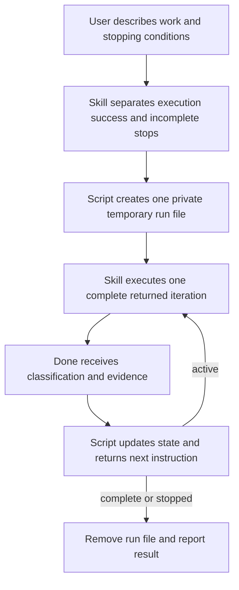
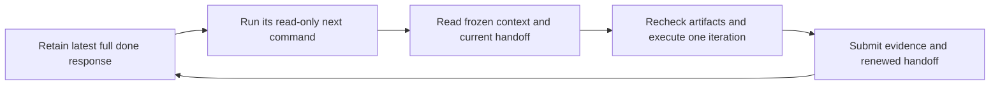
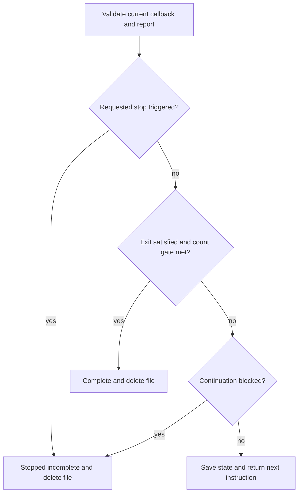
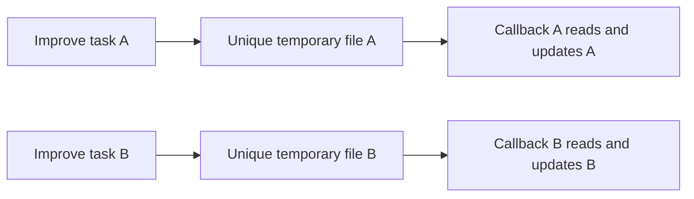

# Until Loop: natural-language work, script-owned transitions



Until Loop turns a natural-language request into work to perform, evidence needed
for success, and conditions permitting another iteration. The LLM interprets and
performs the work. A small Python script owns the state and tells the skill what
to do next. **Execute the returned work first, call `done` with its result, then
follow the complete return value.** `done` means one iteration finished; it does
not mean the whole request succeeded.

This source candidate is **0.4.0-rc.2** in
[whichguy/until-loop](https://github.com/whichguy/until-loop). New runs use one
unique temporary JSON file. Existing durable v1/v2 runs keep their own commands
and recovery contract. There is no automatic migration or background scheduler.

## Ask naturally

```text
/until-loop Fix the importer and document it. Keep checking until valid and
malformed rows behave as specified and the examples match the actual output.

/improve Review these changes and the last seven full commit messages.
Plan and implement worthwhile improvements, test them, and repeat until two
consecutive complete reviews find only trivial or no changes. Commit changed
iterations with detailed validation and key learnings. Do not push.

/improve Preview how you would interpret that request, without executing it.
```

Users do not provide fixed command arguments or fill in a JSON form. The script's
internal JSON protocol makes action identity and state transitions explicit;
it does not replace natural-language interpretation with a keyword parser.

The default standalone Improve binding selects the initial dirty candidate
(including relevant untracked files), or the latest commit when clean, unless
the user names another scope. History informs the plan without expanding that
scope. It checks the last seven reachable full commit messages on each review,
or all available messages when fewer exist. A meaningful changed iteration
gets a scoped commit after checks; a no-change review gets a task record rather
than an empty commit. Explicit no-commit instructions and audit-commit overrides
are retained. See [Improve card — standalone ownership and callback binding](examples/improve/SKILL.md).

## Separate execution from terminal conditions

| Part | Question | Example |
|---|---|---|
| Execution / `work` | What ordered body belongs in one iteration? | Review current changes/history, plan, implement, check, record and commit if required |
| Successful exit | What evidence establishes the whole result? | Current checks pass, no material issue remains, and two complete trivial reviews are consecutive |
| Continuation | What gap justifies more work, and what stops it incomplete? | Repeat while useful authorized work or a required review remains; honor requested stops and real blockers |

Every clause must survive interpretation. `and` retains jointly required
outcomes. `CSV or JSON` can be a genuine successful alternative. “Succeed or
stop if access is lost” describes success and an incomplete stop, not two ways
to claim success. A conditional obligation retains its premise. A `while`
guard is checked before work; its becoming false does not itself establish the
requested outcome. An explicitly requested first action remains required.

The skill briefly explains its interpretation before starting. Broad language
such as “good enough” gets a task-specific observable rubric from repository
context and the user's goal. Essential ambiguity gets a focused clarification;
a clear request does not acquire an approval questionnaire. Generic work does
not inherit Improve's two-review gate unless that policy was requested.

| Natural request | Correct distinction |
|---|---|
| Reproduce the bug until it passes 30 times | Thirty test runs are evidence, not thirty trivial reviews; a batch can fit one iteration |
| Stop after five checks **if still running** | Complete on check five succeeds; still running on check five stops incomplete |
| Stop if production-secret access is needed | The trigger is needed, not needed **and unavailable** |
| Export CSV **or** JSON, and if access is lost stop incomplete | Either correct format can succeed; triggered access-loss stop is cancellation |
| Run `tool migrate --dry-run` and review its output | This executes an authorized command; it is not a preview of the workflow |
| Preview how Improve would handle this candidate | Explain the proposed future work/conditions without starting or executing it |

An interpretation preview has no state file, callbacks, task tests, edits or
commits. It describes the future execution contract; it does not rewrite future
success to mean “a preview was produced.” A prohibition on **all filesystem
writes** also forbids a runtime tempfile. A narrower prohibition on project edits
can allow temporary bookkeeping. Already-established success needs evidence,
not manufactured changes or unnecessary initialization.

[SKILL.md — interpretation: clause preservation, stops and preview](SKILL.md)
contains the maintained model guidance.

## Script and LLM responsibilities

| Owner | Responsibility | What it does not prove |
|---|---|---|
| Skill / LLM | Interpret all clauses, execute the iteration, inspect current artifacts and judge evidence | A fluent completion claim is not independent verification |
| Runtime | Validate schema and action token, update the consecutive count, select active/complete/stopped, emit the next prompt | It cannot detect an omitted requirement or a false semantic report |
| One run file | Current contract/context, random run ID, action number, trivial streak and latest report/handoff | It is not a historical evidence journal or crash-recovery system |
| Task record and required commits | Candidate identity, findings, plan, actual checks, results and learnings for each review | A commit alone does not establish a complete review |

Every active packet restores the execution context: the bound workspace,
complete work/conditions, progress, latest report, current instruction, report
schema and exact callback arguments. Prior evidence is explicitly an unverified
claim to recheck. A returned prompt cannot grant permissions or guarantee that
a named tool is installed. The skill uses current host tools and authorization.

The script supplies an action-specific focus, such as resolving a material
finding or performing another distinct review. That focus does **not** replace
the complete execution body. The skill cannot stop after planning when the
iteration also requires implementation and checks. It cannot privately perform
three reviews and send one callback, or count callback retries as new reviews.

[until_loop_ephemeral.py — active packets and transitions](scripts/until_loop_ephemeral.py)
is the implementation; [callback adapter — schema and exact calls](references/runtime-ephemeral.md)
is the internal interface.

## Continue after compaction



The latest `done` **return** is the continuation handoff. It includes the workspace,
work and conditions, current action and streak, exact read-only `next_argv`, exact
fresh `done_argv`, report schema, frozen `context`, and the latest report with its
rolling `handoff`. A fresh executor can retrieve current state and proceed without
remembering earlier conversation. It rechecks newer user instructions and actual
artifacts before acting; stored claims are not proof or new permission.

| Context | What survives in every successful return |
|---|---|
| `context.request` | Canonical user goal and accepted clarifications |
| `context.scope` | Original candidate/base, included files/range, exclusions and ownership boundaries |
| `context.authority` | Commit/no-commit, push/no-push, record requirements and other action constraints |
| `context.environment` | Relevant environment facts, tool locations and check commands to recheck |
| `context.resources` | Purpose plus exact absolute file paths or retrievable artifact locators |
| `last_report.handoff` | Current candidate, applied work/decisions, check and commit receipts, remaining gaps, and new locators |

Stable context is frozen at `start`. Each `done` replaces the rolling handoff with
a complete compact summary, retaining still-relevant earlier facts. For example,
after a parser repair is committed and a subsequent clean review completes, its
handoff still identifies that repair/commit and any unresolved integration check.
It does not merely say “clean again.” The original baseline and exclusions remain
unchanged even though HEAD has moved. This uses the same 16 KiB temporary state
file and introduces no journal or separate required record file.

Before compaction, preserve the entire latest JSON return rather than only a
command or the `instruction` field. If only a previously executed `done` invocation
survives, use its exact Python/script/state locator for read-only `next`; do not
replay `done`. A stale packet's `next_argv` retrieves the current action without
incrementing the streak. An error with a known state handle also returns that
read-only refresh command. Inspect uncertain errors rather than assuming a retry
is safe or executing the body again.

A terminal return contains context and the final report for explanation after
file deletion. A missing file plus a lost terminal response cannot establish
whether completion or an incomplete stop happened. The host must retain a packet
or handle; this is compaction continuity within the logical run, not abandoned-
session discovery or a promise that the host preserves every tool result.
Old context-less contracts remain usable but are explicitly labeled as missing
that context. New skill runs populate it before execution.

## A complete Improve trace

Suppose an importer silently converts invalid amounts to zero. The initial tests
cover valid input only. This is an illustrative trace, not a test receipt:

1. `start` saves the interpreted work and gate two, then returns action one.
2. The skill reads the candidate and full available history, identifies the
   material bug, plans rejection behavior, repairs it, adds a meaningful failing-
   then-passing regression check, runs applicable tests and makes the required
   scoped commit. It submits `non-trivial`, an unsatisfied exit and actual evidence.
3. `done` resets the streak to zero and returns a prompt to recheck the result in
   another complete iteration. A passing test alone has not ended the loop.
4. The next distinct review examines the repaired candidate and affected behavior,
   finds no material issue, and confirms current checks. It records an empty plan
   and no-change reason, then reports `trivial`. The script stores streak one and
   returns another full-review instruction.
5. Another distinct review checks the current candidate against the criteria.
   With only trivial/no findings, current checks and no unresolved issue, its
   report establishes success. `done` advances the streak to two, deletes the
   tempfile and returns `complete` with no further callback.

A material issue in step five resets the streak to zero even if repaired in that
iteration. Two clean reviews can suffice for an initially good candidate; a
candidate needing one fix normally needs at least three iterations. There is no
forced count of changes and no incentive to invent cosmetic work.

| Report classification | Count effect | Required basis |
|---|---|---|
| `trivial` | Add one | A complete distinct iteration/review, only trivial or no changes, no material finding, applicable checks |
| `non-trivial` | Reset to zero | Material finding or behavior change, even a one-line fix already repaired |
| `unresolved` | Reset to zero | Work, checks or assessment remains incomplete |

The callback also supplies the complete rolling `handoff` and reports
`exit_assessment` (satisfied/unsatisfied/unknown),
`continuation_assessment` (allowed/blocked/cancelled), and observed evidence.
Unresolved cannot assert satisfied. The script enforces the numeric gate in
addition to the model's assessment of all substantive clauses.

## Transition order and failure behavior



Cancellation takes precedence over a success claim. A triggered user-prescribed
stop maps to cancelled even when its cause is also a dependency problem. Without
that requested stop, an actual obstacle preventing useful work maps to blocked.
If success is established and the gate is met, no further continuation is needed.
Otherwise blocked ends incomplete. Stopped is not a successful exit.

`next --state PATH` reprints the current packet without changing bytes or counters.
Use the exact active packet's `done_argv`; its run/action token prevents accepting
a stale callback or another run's token. Invalid reports are rejected before
mutation. Successful terminal output comes only after file deletion.

Input rejection or cleanup failure reports unchanged state. A partial filesystem
write reports uncertain state: inspect the same file, stop if unusable, and do
not replay work or silently create a replacement run. The runtime rejects unsafe
linked files and state above 16 KiB. Keep evidence concise and locatable in the
task record; the file retains the latest report rather than accumulating history.

## Concurrent runs and intentionally small state



Two runs can share a workspace without sharing loop state. Each has an independently
created mode-0600 file and keeps its handle in its own task context. There is no
`.until-loop/current` pointer, lock service, journal or background owner process.
The individual Python process can exit after each callback; the logical task
continues using its file. Terminal completion or stopping removes that file.

This isolates **loop state**, not edits, index operations, commits or test outputs.
Use separate worktrees for concurrent writers, or a deliberate ownership agreement.
One caller at a time owns each state file in a trusted temporary directory. The
runtime does not support two simultaneous callbacks on the same file. Abandoned
hosts may leave orphan tempfiles; no restart discovery or automatic recovery is
promised. A missing file is a lost handle/run, not permission to reconstruct a
success claim. These boundaries keep the design proportionate to an ephemeral loop.

## Existing durable runs

Explicit continuation of v1/v2 `.until-loop` state uses its matching adapter and
prior evidence/recovery rules. No state is converted, overwritten or removed to
start a new independent callback run. A bare “continue” uses the identified run
from task context; ambiguity is resolved before mutation.

The old evidence collector remains available to those durable Improve bindings.
New standalone Improve uses the task record and required commits instead of the
collector's shared `.until-loop/evidence` catalogue. It does not accidentally
attach observations to another run merely because that directory exists.

- [Legacy skill instructions — selected durable-run execution](references/legacy-skill.md)
- [V1 adapter — existing commands and recovery](references/runtime.md)
- [V2 adapter — existing criteria and recovery](references/runtime-v2.md)
- [Archived v2 guide — historical behavior and experiments](references/v2-guide.md)
- [Improve evidence — current callback records](examples/improve/references/callback-evidence.md)

## Packages and marketplace ownership

Authoritative Until Loop sources are the root card, scripts, references and agent
metadata. `scripts/sync_plugin_views.py` generates two self-contained testable
packages: `plugins/until-loop` and `plugins/improve`. The latter includes the
Until Loop card/runtime to which its Improve card binds; no sibling install or
source-checkout path is required.

The [Skill Craft catalog](https://github.com/whichguy/skill-craft-market) owns
marketplace discovery and release pins. Until Loop's source owner is this
repository. **Improve's canonical marketplace source remains
[whichguy/skill-craft](https://github.com/whichguy/skill-craft/tree/improve-v0.2.0-rc.1/skills/improve).**
This repository's bundled Improve is its maintained integration distribution.
Merging this source does not repoint that separate marketplace package or change
installed skill symlinks. The initial Until Loop release was `v0.3.0-rc.3`; this
candidate requires an immutable release and catalog-pin update for marketplace
activation. Consult the live catalog for its current pin.

## Local Codex skill discovery

For a local source-checkout link, point the `until-loop` entry at the generated
card, not at this repository. Codex recursively discovers `SKILL.md` files below
each `~/.codex/skills` entry. A link to the checkout would therefore expose the
source card, the integration-only Improve example, and generated package cards.

From the checkout root, regenerate the view and update only the Until Loop link:

```sh
python3 scripts/sync_plugin_views.py
mkdir -p "$HOME/.codex/skills"
codex_skill_link="$HOME/.codex/skills/until-loop"
if [ ! -e "$codex_skill_link" ] || [ -L "$codex_skill_link" ]; then
  ln -sfn "$PWD/plugins/until-loop/skills/until-loop" "$codex_skill_link"
else
  printf '%s\n' "Refusing to replace non-symlink: $codex_skill_link" >&2
  false
fi
```

That target contains one `SKILL.md` and its colocated runtime. It does not install
or replace Improve. Keep `~/.codex/skills/improve` managed by Improve's canonical
Skill Craft installation; do not point either local entry at `examples/improve`,
`plugins/improve`, or the repository root. If the guard refuses the existing
Until Loop path, inspect and resolve that user-owned file or directory manually.

See [Publishing — ownership and release sequence](docs/PUBLISHING.md). Source
publication, package relocation tests, a model execution probe and marketplace
activation are separate claims.

## Validation and evidence limits

The [release-validation plan and probes](docs/RELEASE_VALIDATION.md) cover local
skill discovery, the exact canonical Improve package, fresh-context execution,
and natural-language interpretation. Model probes are opt-in; the deterministic
suite does not call a model or treat a callback as proof that a review occurred.

```sh
python3 scripts/sync_plugin_views.py --check
PYTHONDONTWRITEBYTECODE=1 bash tests/until-loop.test.sh
python3 -m unittest discover -s tests -p 'test_ephemeral_runtime.py'
python3 -m unittest discover -s tests -p 'test_plugin_packaging.py'
```

The deterministic suite covers callback transitions, invalid/oversized reports,
stale and cross-run tokens, read-only reprinting, failed writes and cleanup,
independent run files, and relocated packages. Existing v1/v2 and collector
checks retain compatibility coverage. CI exercises Linux and macOS with Python
3.9 and 3.14. Passing protocol tests does not prove the LLM interpreted arbitrary
natural language faithfully or performed the reported work.

The additional [compaction validation](docs/COMPACTION_VALIDATION.md) checks
continuation by handing successive script returns to separate fresh agents.

A fresh-model execution probe should load the relocated packaged Improve card,
work on a deliberately flawed disposable Git candidate, retain exact callbacks
and evidence, and let an independent oracle inspect the resulting code. It must
establish real implementation before `done`, actual repeated full reviews, scoped
commit behavior and terminal cleanup. Historical v2 harnesses and reports remain
v2 evidence; they must not be described as callback runtime execution.

[Initial production integration validation — rc.1 checks and probe boundaries](docs/CALLBACK_VALIDATION.md)
records the earlier baseline and reproducible fixture. The compaction report
records the current continuation-context follow-up.
