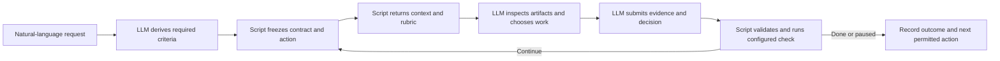
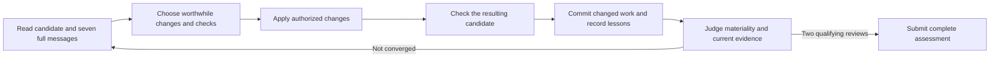
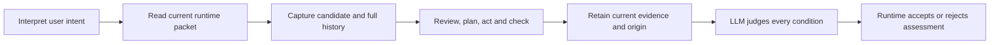
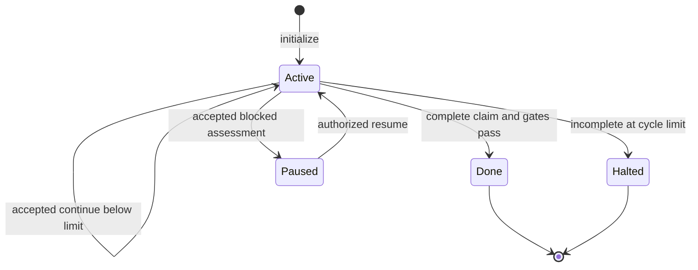
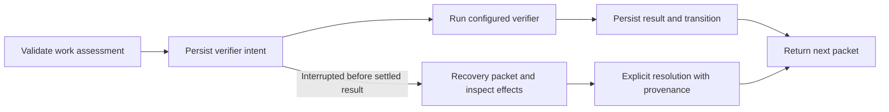

# until-loop: state-oriented rubric candidate



**The script controls the loop; the LLM decides what work is useful and whether the outcome is established.** This candidate implements the state-oriented rubric proposal without adding a natural-language command parser, a numeric completion score, or a mandatory delivery lifecycle.

Describe the task normally: “Finish the importer, document it, and keep checking until valid and malformed rows behave as requested.” The skill derives a durable contract, follows the returned context and rubric, inspects artifacts, and submits a structured assessment. The internal JSON and command options are transport written by the agent, not a questionnaire for the user.

This is **skill 0.3.0-rc.3**, maintained in [whichguy/until-loop](https://github.com/whichguy/until-loop). The earlier `until-loop-v2` checkout and separate Grok installation of 0.2.1 remain historical comparison baselines. New tasks in workspaces without saved runs use explicit `v2` commands. Workspaces with version-1 state keep their original commands, schema, verifier behavior, and recovery contract, including authorized restarts for new tasks. V2 refuses initialization over that legacy state; there is no automatic state migration. The complete earlier guide is retained in [v1-guide.md - Version-1 guide: established behavior and historical audit evidence](references/v1-guide.md).

## Install from Skill Craft

The [skill-craft-market catalog](https://github.com/whichguy/skill-craft-market)
provides two packages from this repository:

| Package | Use it for | Included runtime |
|---|---|---|
| `until-loop` | Pursue an ordinary-language task until its evidence-based exit condition holds. | Its own Until Loop card, adapters and scripts. |
| `improve` | Review changes, learn from seven full commit messages, implement worthwhile fixes and converge after two qualifying reviews. | A bundled Until Loop runtime bound to the Improve card. |

Improve works on its own; installing the `until-loop` plugin separately is
optional when you also want that general-purpose entrypoint. A plugin install
does not begin a loop or create task commits. Choose either a marketplace plugin
or a development skill-directory installation for each skill on a host, to
avoid duplicate entrypoints.

For Codex:

```sh
codex plugin marketplace add whichguy/skill-craft-market
codex plugin list --marketplace skill-craft-market --available --json
codex plugin add improve@skill-craft-market
# Optional general-purpose loop:
codex plugin add until-loop@skill-craft-market
```

For Claude Code:

```sh
claude plugin marketplace add whichguy/skill-craft-market
claude plugin marketplace update skill-craft-market
claude plugin install improve@skill-craft-market
claude plugin install until-loop@skill-craft-market
```

Start a new conversation after installing. Then ask naturally, for example
“Use the Improve skill on these changes,” or “Use Until Loop to finish the
importer and verify malformed rows.” See the [Improve guide](examples/improve/README.md)
for preview, scope and commit examples. Filesystem/command access, Python 3,
Git for Improve, and the project's own check dependencies are required.

The initial marketplace release is **`v0.3.0-rc.3`**. Catalog entries pin that
release; a later edit on `main` does not update installed copies. Source cards
remain at `SKILL.md` and `examples/improve/SKILL.md`; the `plugins/` trees are
generated distributions. See [Publishing and package validation](docs/PUBLISHING.md)
for the binding, release sequence and verification commands.

## Preview a prompt and try the Improve parent

Start with the [Improve README](examples/improve/README.md) for quickstart
requests, scope and commit defaults, completion rules, recovery, prerequisites
and installation limits. The worked examples below explain how those rules
interact with the runtime.

Ask naturally: “Dry-run improve on these changes. Show how you interpret the
work and stopping conditions without executing it.” The candidate parent adds
seven-commit history, review/plan/test/learning-commit iterations and a
two-consecutive-trivial-pass stopping rule. Its default records no-change
reviews in notes; explicit requests for audit commits or no commits are retained.
The parent is maintained in `examples/improve`. A development installation can
point `~/.codex/skills/improve` there and `~/.codex/skills/until-loop` at the
repository root. The parent resolves its physical card path before loading
the packaged runtime. Marketplace packages use the equivalent self-contained
layout described above; they do not rely on another local skill installation.

With a development skill-directory installation, source edits are visible through
the Codex symlinks. Publishing a Git commit does not establish a stable release or
install the candidate on another host. Keep Improve with its matching Until
Loop package; the [Improve installation notes](examples/improve/README.md#installation-and-release-status)
explain the verified scope and discovery fallback.

Invoke it as `Use $improve on these changes` or `Dry-run $improve on these
changes`. The first executes the improvement workflow and commits authorized
changed files after required checks pass; a no-change review writes a durable
note. The second ends after showing its interpretation. Explicit no-commit
instructions suppress commits; an explicit audit-commit-every-iteration request
also records no-change iterations in identified audit commits.

An explicit file list, branch range or baseline determines the review scope.
Otherwise the host freezes initial HEAD and reviews the initial staged,
unstaged and relevant untracked changes together with its later edits. In a
clean tree, it discloses the latest commit's change as the default candidate
unless context identifies a more specific one. The seven-message history window
informs that review; it does not define its diff range or authorize absorbing
unrelated user work. Explicit scope and other user constraints take precedence.
[SKILL.md - Standalone owner binding: candidate selection and commit overrides](examples/improve/SKILL.md).

The until-loop LLM derives the proposed contract; the internal `v2 preview`
command validates and prints it without initializing, recovering or advancing
a run. It prints the full contract and policy, with no executable work callback.
It neither interprets raw English itself nor decides that the goal is achieved.
The stdin form supports a strict no-file-write request. A successful preview
ends there; later execution requires an execution request and fresh context.

See [IMPROVE_PROPOSAL.md - Improve proposal: prompt, decision trace and evaluation design](IMPROVE_PROPOSAL.md),
[SKILL.md - Improve parent: task-specific review and commit rules](examples/improve/SKILL.md),
and [runtime-v2.md - Preview: read-only contract validation](references/runtime-v2.md).

The activation and full execution evidence is recorded in
[IMPROVE_IMPLEMENTATION.md - Local implementation: bindings, execution trial and limits](IMPROVE_IMPLEMENTATION.md).

The Improve workflow requires the executing agent to compare the final
workspace with its initial inventory and declared outputs, including ignored
files produced by tests. It must preserve preexisting work and may remove only
artifacts established as disposable outputs of its own run. An unrelated staged
draft is compatible with completion;
an unexplained generated file still needs an ownership decision.
[review-policy.md - Final inventory: preserve initial work and check run-created artifacts](examples/improve/references/review-policy.md).

The executing agent gives reviewer suggestions an explicit accept/decline
decision. A demonstrated
failure, violated requirement or concrete benefit within scope justifies work.
A redundant test example does not automatically justify an edit or reset the
clean-review streak. Uncertain impact requires investigation; a demonstrated
material defect resets the streak even when fixed immediately.
[review-policy.md - Review: evidence-based acceptance and rejection](examples/improve/references/review-policy.md).

Git commits and runtime assessments are separate operations. After a handoff,
the agent reconciles the actual commit, files, checks and notes with the pending
action. It reuses verified work and submits the missing assessment without
duplicating a commit or counting recovery as another review. Missing review
evidence still requires review; a commit alone cannot prove convergence.
[review-policy.md - Interrupted work: reconcile side effects before assessment](examples/improve/references/review-policy.md).

The follow-up design and recovery tests are documented in
[IMPROVE_HARDENING.md - Hardening report: checker changes and fresh-context scenarios](IMPROVE_HARDENING.md).

## Worked Improve example: from request to completion

This is an illustrative execution, not another measured experiment:

> Use $improve on the formatter changes. Consider the last seven full commit
> messages, preserve my staged release caption, and commit worthwhile fixes
> with their key learnings. Stop after two consecutive reviews find only
> trivial changes or no changes.

The host first identifies the actual formatter candidate and the user's staged
work. It preserves the request in the contract and derives obligations for
review scope, history, meaningful checks, ownership, learning commits and
two-review convergence. “Seven commits” determines the history window; it does
not silently mean “edit everything changed by those commits.”



| Review | Observation and action | Clean-review streak | Next decision |
|---|---|---:|---|
| 1 | Whitespace-only names violate the documented fallback. Fix the behavior, add the missing regression, check and commit the scoped change. | 0 | Continue: a one-line behavior fix is material. |
| 2 | Re-read the current candidate and seven-message window. No worthwhile change remains; applicable checks support it. Record a distinct no-change review. | 1 | Continue: one qualifying review is insufficient. |
| 3 | Perform another substantive review. No material or uncertain finding remains; evidence is still current. Record that review. | 2 | Complete if every other contract obligation also holds. |

If review 3 finds a material defect, its repair resets the streak to zero;
review 4 and review 5 must then independently qualify as distinct review cycles.
Repeated test commands, retries and accepted callbacks never create extra
reviews. A no-change cycle needs a durable record, not an empty commit under
the default policy. An unchanged candidate can reuse applicable check evidence;
the host still performs the next actual review and rechecks its relevance.

An illustrative commit body for the material cycle is:

```text
Fix blank-name fallback after whitespace normalization

Review: Whitespace-only input returned an empty display name.
Plan: Preserve the documented Anonymous fallback after trimming.
Changes: Apply fallback after strip(); add whitespace-only coverage.
Validation: Focused formatter tests pass on the resulting candidate.
Key learnings: Input normalization can expose an empty value after an earlier guard.
Remaining work: Material cycle; streak 0. Two later qualifying reviews are required.
```

The host uses observed changes and results when writing a real message; it
does not copy this example as evidence. Only authorized changes enter the
commit. Staged and unstaged user hunks may coexist in the same file, so a file
being in scope does not authorize staging every hunk. A failed required commit
leaves that obligation incomplete. The default Improve policy creates local
commits; publishing or pushing requires task authorization.
[SKILL.md - Standalone owner binding: history, classification and commit policy](examples/improve/SKILL.md),
[review-policy.md - Review-cycle obligations: ordered work and convergence](examples/improve/references/review-policy.md).

## Worked preview: refine the prompt without running it

> Dry-run $improve on formatter.py and its tests. Use the last seven full commit
> messages. Preserve the public API and do not commit. Show the work,
> continuation condition and exit condition without writing files.

A proposed interpretation would read approximately as follows; it is a
human-readable summary, not the exact JSON transport:

```text
Mode: interpretation only; no task tests, metadata writes, edits or commits.
Scope: formatter.py and its tests, using the inspected candidate baseline.
History: last seven full commit messages, or all available if fewer exist.
Work: review the candidate; plan worthwhile improvements; implement and check them
      only after a later execution request.
Continue: an in-scope material finding, unresolved evidence, or fewer than two
          completed consecutive qualifying reviews remains.
Success: two distinct trivial-only/no-change reviews; no unresolved material
         finding; current relevant checks; public API and user work preserved.
Incomplete stops: explicit user stop, exhausted limit, or a real blocker that
                  prevents useful authorized progress.
Commit policy: no commits; retain review records during later execution.
Evidence not yet established: test results, review findings and convergence.
First action if execution is requested: recheck the candidate, ownership and
                                       current seven-message history window.
```

The host derives that interpretation, then sends the structured proposal to
`v2 preview` on stdin for validation and rendering. The script never interprets
the raw request itself. An existing active run does not change this branch:
preview does not resume or recover it. A successful preview proves that the
proposal fits the protocol, not that it preserves every nuance of the request
or that the proposed work has happened.
[SKILL.md - Preview before execution: read-only interpretation and constraints](examples/improve/SKILL.md),
[runtime-v2.md - Preview: stdin and existing-state isolation](references/runtime-v2.md).

## Evidence collected before the LLM decides



The standalone Improve binding now uses a factual collector before assessments.
It captures the action and contract revision, Git HEAD, scoped file and index
identities, complete history messages, check artifact references and the declared
reviewer role. Full messages are reused through a catalogue, while each review
retains its own window. Another consumer of the shared policy supplies its own
history, phases and callback; it does not inherit this standalone adapter.
[evidence-capture.md - Capture sequence: facts, origin and assessment boundaries](examples/improve/references/evidence-capture.md).

Suppose checks passed on candidate A and a material edit produced B. The
collector can flag the old check's candidate binding as stale. The LLM then
keeps the affected criterion unknown and chooses a current check. A current
failure establishes an unsatisfied testing criterion; a pass supports only what
that check covers. Neither result proves the whole review converged. The helper
does not turn a file hash, a return-code claim, or a repeated callback into a
completed review.

A dependency pause also differs from an explicit user stop. If only the user
can restore a service, an ordinary dependency pause may resume once that
restoration is observed under the existing authority. An explicit stop still
requires its specified later instruction unless conditional resumption was
already authorized. The packet's rubric states this distinction so a fresh
context does not add an unnecessary permission gate.
[runtime-v2.md - Pause and resume: dependency restoration and user instructions](references/runtime-v2.md).

The execution plan and retained experiment results distinguish decision-only
probes, real repository work, and runtime fault injection. Small passing samples
are screening evidence, not a claim that every model and repository will behave
correctly.
[EXPERIMENT_PLAN.md - Work and acceptance matrix: complete experiment scope](EXPERIMENT_PLAN.md),
[EXPERIMENT_RESULTS.md - Results and improvements: observed outcomes and limitations](EXPERIMENT_RESULTS.md).

## What changed

| Area | Version 1 | Candidate version 2 |
|---|---|---|
| Task contract | Frozen prose objective and exit predicate | Original wording, interpretation, stable criterion IDs and criterion provenance |
| Next prompt | Generic reassessment guidance | LLM execution context plus a frozen rubric with emphasis selected from state |
| Completion submission | One evidence string and optional done flag | Evidence and status for every criterion, plus continue/complete/blocked |
| Repeated submission | May consume another active cycle | Action identity and canonical accepted receipt distinguish replay from conflict |
| Blocker | Agent notebook; runtime remains active | Accepted blocked assessment enters paused without a work cycle or verifier |
| Interrupted verifier | Prepared transactions recover; earlier effects need inspection | Durable verifier intent suppresses work callbacks until explicit resolution |
| Contract correction | Explicit restart with history preserved | Explicit revision transaction preserves original request and records correction provenance |

The runtime can reject omitted criteria, stale identities, contradictory decisions and a failed configured check. It cannot prove that evidence is relevant or truthful, that the interpretation includes every obligation, or that a host-supplied authorization reference is authentic.

## How the skill and scripts interact

The user or parent supplies intent and constraints. `SKILL.md` tells the host how to interpret them and select the correct adapter. The v2 adapter explains exact JSON shapes and safe calls. The protocol validates and stores accepted records; the packet renderer projects that state into an actionable prompt. The rubric reference is the policy source, copied into each new run so an installed-file change cannot silently rewrite an in-flight policy.

The renderer does not advance the loop. It also does not execute discovery probes or ask another model to judge a result. The executing LLM uses the host's available tools, observes the current artifacts, and supplies the semantic assessment. The optional verifier runs only at the protocol's defined work-submission boundary.

For exact agent-to-script calls, see [runtime-v2.md - Candidate adapter: contract, assessment and recovery calls](references/runtime-v2.md). The legacy adapter remains [runtime.md - Version-1 adapter: existing calls and compatibility](references/runtime.md).

[until_loop_v2.py - cmd_init: frozen initialization](scripts/until_loop_v2.py), [until_loop_packet.py - validate_policy: policy validation](scripts/until_loop_packet.py).

## “You are here” restores LLM execution context

The first packet section answers six practical questions: what role am I performing, where must I operate, which durable records should I read, what environment facts are known, which action is current, and what decision is required now?

| Context | How it helps select the next action |
|---|---|
| Role | The LLM inspects evidence, chooses useful work and judges completion; the script validates transitions. |
| Workspace | The saved absolute repository binding controls runtime calls, even when a shell starts elsewhere. |
| Full state | The agent reads the authoritative contract and prior accepted assessments before relying on a shortened packet. |
| Environment evidence | A recorded verifier result describes that observation; live tools, permissions and service access come from current host context. |
| Action cursor | The current ID, contract revision and cycle distinguish this decision from an old response. |
| Immediate decision | Active work gets reassessment guidance; paused, terminal and uncertain-verifier states get their corresponding control boundary. |

The language uses concrete verbs such as **Read, Recheck, Choose, Submit**. It does not impersonate system messages, invent model-specific control tokens, or ask for hidden chain-of-thought. Environment context is selective: probe a stale fact when the next action depends on it. An untested tool is unknown, not automatically unavailable or a blocker. Script visibility of Python does not establish the LLM host's network access or authority to act.

[until_loop_packet.py - print_packet: context and bounded packet rendering](scripts/until_loop_packet.py).

## How the rubric guides discernment

The rubric asks about scope, evidence, affected prior checks, useful continuation, and the complete exit condition. Each required criterion is assessed separately as satisfied, unsatisfied or unknown. Unknown cannot satisfy a completion submission, and several easy passes cannot compensate for a missing required clause.

The status applies to the criterion's actual predicate, not to a keyword such
as “validation.” These examples illustrate the distinction:

| Required predicate | Current observation | Assessment and next work |
|---|---|---|
| The formatter handles blank input correctly. | No determining behavioral evidence has been collected. | **Unknown**; inspect or check that behavior. |
| Run the required blank-input regression. | The host knows that check has not run. | **Unsatisfied**; perform the required check. This does not assert that the formatter is broken. |
| The requested report exists. | An authoritative inventory establishes that it is absent. | **Unsatisfied**; produce the required report. |
| The requested report exists. | An incomplete search has not found it. | **Unknown**; resolve its location or absence before deciding. |
| Current scoped checks pass. | A candidate-bound required check fails. | **Unsatisfied**; diagnose the failure and obtain current evidence after repair. |

The host must not invent a separate check or report obligation if the user did
not require one. Likewise, stale evidence leaves the affected claim unresolved;
it is not proof that the underlying behavior failed.
[decision-rubric.md - Evidence question: unknown behavior and unmet obligations](references/decision-rubric.md).

The script selects emphasis from facts it owns. A failed verifier directs attention to the contradiction. A passing verifier asks the host to consider its coverage. A resume asks for revalidation of earlier claims. These are prompt-selection decisions; the script does not infer the next coding task from keywords.

A material change can invalidate earlier tests or review conclusions. The LLM must identify affected criteria and obtain current evidence. Action IDs and contract revisions prevent protocol mix-ups; they do not establish artifact freshness. Likewise, a full response with plausible evidence strings can still be wrong. Independent inspection remains useful where semantic risk warrants it.

[until_loop_v2.py - validate_assessment: criterion coverage and decision gates](scripts/until_loop_v2.py).

## Deriving continuation and exit from ordinary language

The LLM preserves decision meaning in the existing `interpretation` and criteria;
the runtime does not compile English into a predicate language. The interpretation
records success, work preconditions, early-stop outcomes and precedence. Each
negative constraint also receives a criterion with its request basis. All criteria
are required, so an actual success alternative stays inside one criterion.

| Input fragment | Contract meaning and next decision |
|---|---|
| “Export CSV or JSON” | One supported format establishes this requirement; do not invent a requirement for both. |
| “Finish all rows or stop if the source is missing” | Finished rows can mean success; the missing-source branch means stop incomplete. |
| “Stop immediately if a source is missing” | The explicit stop overrides the usual preference to continue independent work. |
| “While reports remain, process the next report” | Check the guard before work. If false, perform no processing; evaluate the separate success condition. |
| “Run the inspection once, then stop if clean” | Preserve the first inspection even if an earlier artifact claims cleanliness. |
| “If duplicates exist, report them” | Establish whether duplicates exist; keep the condition attached to the obligation. |
| “Fix it unless that changes the public API” | Preserve the API prohibition and stop the prohibited action; do not weaken the constraint to satisfy the functional requirement. |

For example, “Reconcile all rows; stop immediately if the source is missing”
with an absent source produces an incomplete pause, even if an unrelated spelling
fix is available. With no explicit global stop, that independent authorized fix
can still be useful. A user-directed stop requires a later actual user instruction
to resume unless the user already authorized a condition such as “wait until the
source arrives, then continue.” A dependency pause can also use an observed
resumption condition when that continuation was already authorized.

All-satisfied criteria normally warrant completion with no extra product edit.
A failed verifier or unresolved acceptance check can justify a diagnostic
continuation; the next action must identify that exception. The runtime does not
force a truthful satisfied criterion to become unknown to permit that diagnosis.
A scope correction retains unrelated requirements and prohibitions; the host must
explain any weakened clause using the correction that actually authorizes it.

New runs freeze `decision-rubric/2`; existing runs retain their saved policy,
including `/1`. The card and renderer remain executable package instructions,
so updating those files can change presentation even while a saved rubric stays
frozen. The behavioral evaluation snapshots the complete skill and runtime to
make that distinction observable.

[SKILL.md - Interpret the contract: preserve conditions and precedence](SKILL.md), [decision-rubric.md - Policy 2: continuation and completion guidance](references/decision-rubric.md).

## An input-to-state-to-output trace

Consider an importer whose happy-path test already passes. The original request also requires malformed-row behavior and usage documentation. The LLM records those obligations as C1, C2 and C3, with their request basis. Initialization freezes revision 1 and issues an action ID and result path.

The packet restores the bound workspace and shows the task criteria. After inspecting the code and guide, the agent reports C1 satisfied, C2 unknown, and C3 unsatisfied. It chooses a malformed-row check and submits `continue`. The script checks identity and full coverage, runs the configured verifier, and records exactly one work cycle. The next packet carries the accepted assessment and check result.

If the same response claimed `complete`, the unknown and unsatisfied criteria would cause rejection before the verifier or cycle increment. If the agent later supplies current evidence for all three and the configured check passes, the script accepts its semantic claim as `done`. If the configured check fails, the run remains incomplete, subject to its existing cycle cap.

This trace is illustrative. Actual acceptance evidence belongs in the implementation report and retained evaluation artifacts, not in this example.

[until_loop_v2.py - cmd_submit: submission, rejection and verification order](scripts/until_loop_v2.py).

## State, identity and continuation



A safely read but malformed current assessment produces a durable rejection reason and another packet for the same action, with exit 2. A later `next` restores that reason; no work cycle or verifier is consumed. Unsafe metadata and invalid state fail before this normal rejection path. `continue` and `complete` are work submissions and follow the existing verifier schedule; a verifier failure still consumes the accepted work cycle. A blocked assessment pauses without verification or a work-cycle increment. Reading a paused run does not resume it. Resume preserves consumed cycles and the contract and issues a fresh action only after the host supplies the required provenance.

The runtime generates 32-character lowercase hexadecimal action IDs and allocates the corresponding result path. The caller cannot select an arbitrary file for submission. An identical accepted structured response is recognized by its canonical content, so changed JSON whitespace does not create new work. A conflicting response for an accepted ID and a never-accepted stale ID are rejected. An old receipt is an acknowledgment of that action, not permission to repeat its work; read the current packet to continue.

An explicit user correction can revise the interpretation and criterion list through a version-checked transaction. The original request and history remain preserved. Failed tests are not authorization to remove their requirements. The host must ground provenance in the actual user context; a string written by the model is not an authenticated user message.

A pending initialization also counts as saved work, even before `state.json` exists. `.pending.json` belongs to v1; `.pending-v2.json` belongs to v2. The matching adapter must recover it. The candidate package's two adapters refuse each other's pending journals, and v2 refuses legacy markers or orphaned history instead of treating them as an empty workspace. Older installed binaries do not acquire these new guards; use the candidate adapter for candidate runs.

[until_loop_v2.py - cmd_next: rejection context on resume](scripts/until_loop_v2.py), [until_loop_v2.py - cmd_resume: pause authority and cycle preservation](scripts/until_loop_v2.py), [until_loop_v2.py - cmd_revise: contract correction history](scripts/until_loop_v2.py).

## Recovery when verification may have run



The verifier can have external effects. V2 records intent before executing it so a crash cannot silently turn a subsequent `next` into permission to run it again. A prepared transaction can be completed from durable data without rerunning the check. If no settled result exists, the packet exposes uncertainty and suppresses ordinary work callbacks.

The nonwork packet states the immediate operation and prints the exact JSON record and command for resume or verifier resolution. The host creates that input file at a safe path and replaces its evidence placeholder with a real observation or user instruction. The script does not issue these input files or authenticate their contents.

The host inspects the relevant process and artifacts, records the observation or user instruction, and invokes the explicit resolution command. Resolution abandons the uncertain submission; it does not claim success or automatically repeat the verifier. A fresh assessment requires reestablishing current evidence. This protects against blind retry, not rollback of external effects or detached child processes.

[until_loop_v2.py - recover_transition: redo recovery without verification](scripts/until_loop_v2.py), [until_loop_v2.py - cmd_resolve_verifier: explicit resolution](scripts/until_loop_v2.py).

## Storage and trust boundaries

Version-2 `state.json` is authoritative. It holds the contract, pinned rubric, current action, latest assessment and verifier recovery state. `history.jsonl` records transitions and accepted assessment receipts, including full prior/new contracts for revisions; `.pending-v2.json` is the redo transaction; `results/` holds agent-written submissions at runtime-issued paths. The legacy `prompt.md` is not a second v2 contract. Optional working notes remain advisory and must pass the skill's metadata checks before reading or writing.

Input records are bounded to 64 KiB, criterion lists to 128 rows, and free-text fields to 4 KiB. State is limited to 256 KiB, history to 16 MiB, the bound repository path to 768 UTF-8 bytes, and derived control paths to 1,024 bytes. The runtime checks journal capacity before starting a verifier. Packet data is bounded to 8 KiB and 12 displayed criterion rows; omissions are explicit and the full state remains available. Read the full contract before completing. Oversized input is rejected rather than silently losing an obligation.

Untrusted values are printed as escaped single-line JSON inside indented data blocks. They cannot create packet headings or control rails through embedded newlines. Commands come from trusted templates with validated IDs and quoted bound paths. This is a formatting boundary, not proof that an LLM is immune to hostile text. Paths are checked for unsafe links, file types, ownership and bounds. As in v1, these protections do not constitute an operating-system sandbox against concurrent hostile filesystem changes.

[until_loop_v2.py - read_regular: file safety and bounded reads](scripts/until_loop_v2.py), [until_loop_v2.py - ensure_history_capacity: journal admission before verification](scripts/until_loop_v2.py).

## Testing and promotion

Run the deterministic package suite with `bash tests/until-loop.test.sh`. It includes the existing runtime regressions and new version-2 tests. These establish mechanical behavior, file boundaries and recovery under the exercised cases. They do not measure whether the LLM derives a complete contract or interprets evidence correctly.

The recorded 2026-09-14 experiment checkpoint passed **115 Python tests on Python 3.14.7 and
3.9.6**, plus **126 shell checks** on macOS. The retained study includes 60
fresh-context decision probes, four actual Git workflows and five runtime
scenarios with 83 ledger events combined for each interpreter. All four workflows passed current focused
tests, separate behavior oracles and preservation checks. The real process-kill
test belongs to the runtime scenarios; the commit-before-notes workflow used a
controlled host handoff. Initial failures, corrected defects and ambiguous
grading oracles remain visible in the report. These different evidence types
are not pooled into a reliability percentage.
[EXPERIMENT_RESULTS.md - Final verification: current counts and study limits](EXPERIMENT_RESULTS.md).
The [checkpoint manifest](experiments-validation.json) binds those results to
its recorded source snapshot; it is historical evidence, not a fresh test run
for every later documentation edit or commit.

The earlier hardening checkpoint passed 83 Python tests and 126 shell checks, including
eleven new execution-checker regressions that also pass on Python 3.9. At the
activation checkpoint, the thirteen preview tests also passed on Python 3.9.
At the earlier
preview checkpoint, five usable prompt expansions passed independent semantic
review; a sixth CLI case hit provider capacity. A separate fresh
full-skill dry run used the final instructions and preserved its repository,
Git index and source exactly. Two fresh readers also correctly reconstructed
decisions from actual preview output. Those earlier trials check interpretation
and preview execution; the subsequent full improvement/commit execution is
recorded in the implementation report linked above.
[IMPROVE_PROPOSAL.md - Validation and limits: observed results and retained failures](IMPROVE_PROPOSAL.md).

The earlier follow-up fresh-context checkpoint added seven CLI regressions and a 21-case
LLM screen: ten natural-language contracts and eleven actual script packets.
All next decisions passed independent review; model-written contracts and ready
callback records were also checked against the runtime. A separate full-skill
probe checks direct use of an active packet returned by resume. Passing these
probes means the tested decisions were appropriate, not that every input record
was already ready or that the proposed product work was executed.

[FRESH_CONTEXT_REVIEW.md - Review results: fixes, evidence and remaining test opportunities](FRESH_CONTEXT_REVIEW.md).

The presentation pilot compares A, the baseline; B, equivalent improved context/rubric in the skill; and C, that content in the packet. Runtime control behavior stays at v1 for all three. Four cases per arm screen narrow test coverage, already-satisfied work, independent work despite a blocker, and cold resume with stale environment claims. Candidate D is evaluated separately because its stronger rejection rules change mechanics. Record the first model decision separately from whether a protocol accepts it.

Screening runs cannot establish universal reliability. Promotion requires demonstrated benefit over the equal-content control, no new known false-success path, acceptable recovery and an understood token/tool cost. If skill-only wording works equally well, it remains a credible simpler choice. Tests that reject an incomplete submission demonstrate enforcement, not improved model judgment.

The user-facing interface stays natural language in every version. This candidate adds no scheduler, provider configuration, mandatory judge, universal stage sequence or weighted score. See the implementation report for the actual tests run, observed defects and corrections, and the candidate's promotion status.

One live boundary deserves explicit treatment: “leave the workspace untouched” can also forbid loop metadata. In that case an agent may correctly verify an already-satisfied task without creating a runtime run. That establishes the inspected task outcome, not a recorded v2 completion. When bookkeeping is permitted, the already-satisfied path should record completion while preserving product files byte-for-byte. The evaluation retains both cases rather than treating them as interchangeable.

[IMPLEMENTATION.md - Validation and promotion: results, boundaries and retained evidence](IMPLEMENTATION.md).
