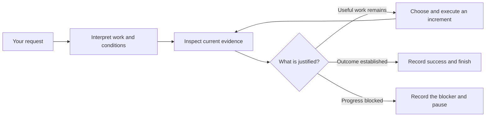
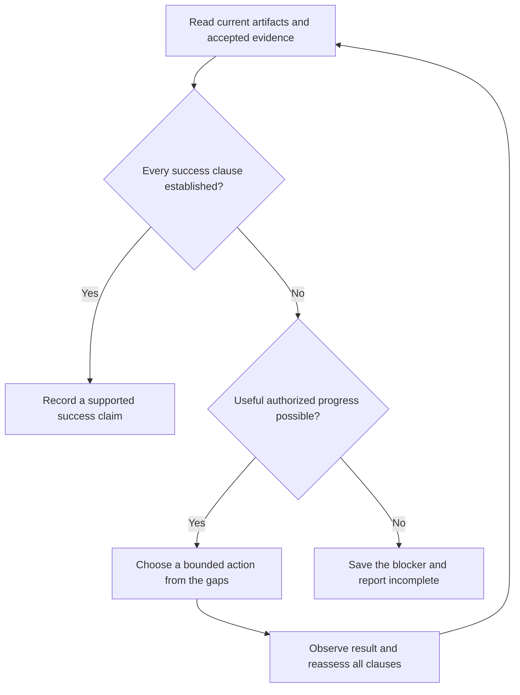
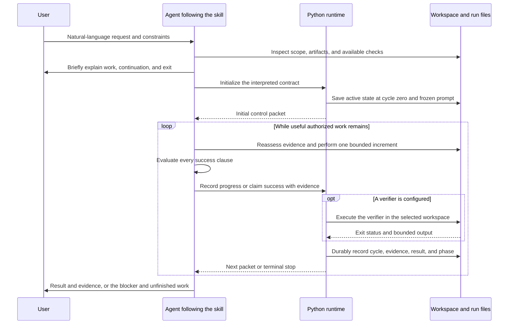
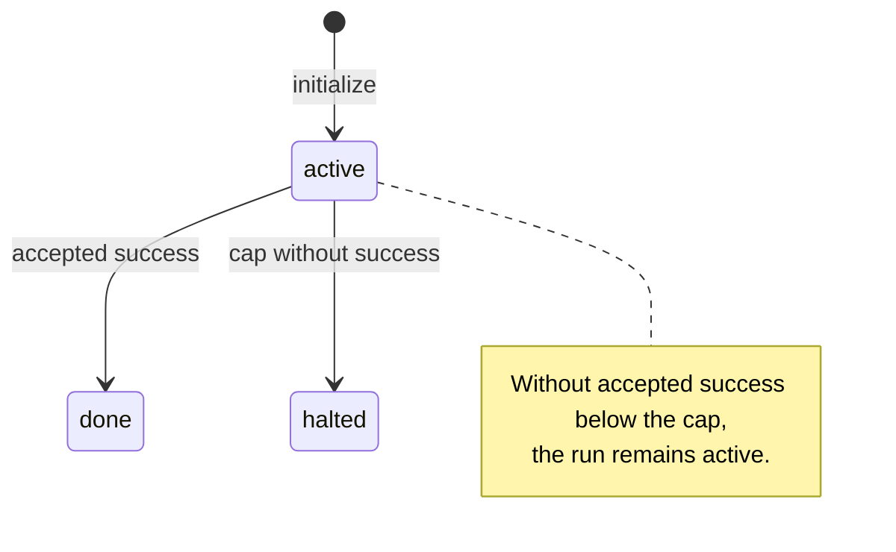
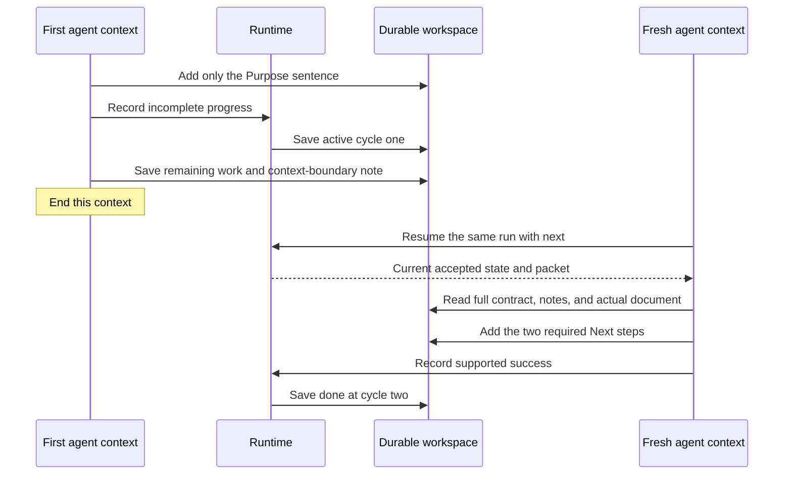
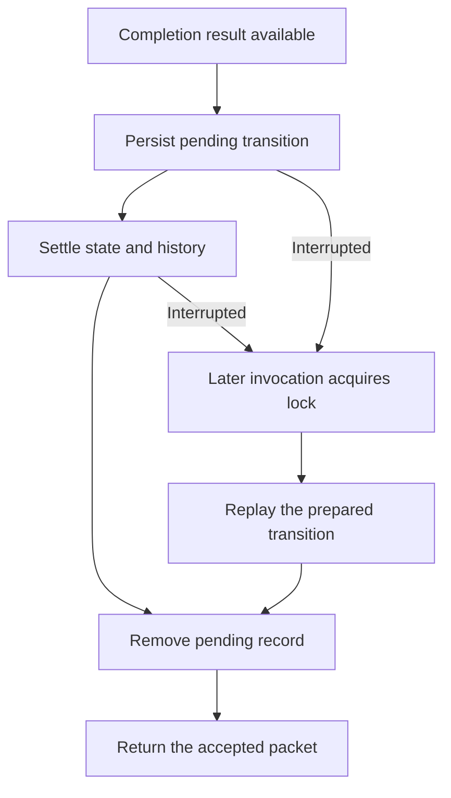

# until-loop



**until-loop turns a natural-language request into an ongoing, evidence-based work loop.** You describe the outcome. The agent determines what to execute, what makes another increment useful, and what would justify stopping. It reassesses those decisions as the work produces new evidence.

The agent makes the semantic judgments. A small Python runtime stores the accepted run state, counts completed increments, runs an optional verifier, and prints the next control packet. The skill supplies the operating instructions that connect those two responsibilities.

For example, a request to finish a helper can arrive with an already-passing test. The agent inspects what the test covers, identifies the missing requested behavior, implements it, checks the remaining clauses, and only then records success. A passing test does not automatically settle the whole request.

This README describes **skill 0.2.1 and runtime state schema 1**. The natural-language design was validated at `7d492d7`; the subsequent integration review adds literal-argument and metadata-boundary repairs. It distinguishes prescribed behavior, observed evaluation results, and illustrative examples. Source links point to the current local checkout used for this documentation.

[SKILL.md - responsibilities and intent: the agent interprets while the runtime records](/Users/dadleet/.grok/skills/until-loop/SKILL.md:25)

## Contents

- [Using the skill](#using-the-skill)
- [Who does what](#who-does-what)
- [How it interprets a request](#how-it-interprets-a-request)
- [How it chooses the next action](#how-it-chooses-the-next-action)
- [The execution sequence](#the-execution-sequence)
- [How completion is decided](#how-completion-is-decided)
- [Worked examples and observed behavior](#worked-examples-and-observed-behavior)
- [What persists between contexts](#what-persists-between-contexts)
- [Resuming and recovering interrupted work](#resuming-and-recovering-interrupted-work)
- [What the user sees](#what-the-user-sees)
- [Calling it from a parent skill](#calling-it-from-a-parent-skill)
- [Internal commands and safeguards](#internal-commands-and-safeguards)
- [Validation and its limits](#validation-and-its-limits)
- [Troubleshooting](#troubleshooting)
- [Source map](#source-map)

## Using the skill

In a host that exposes the installed skill as a slash command, give it an ordinary request:

```text
/until-loop Keep reviewing and fixing this until no substantive issues remain.
```

```text
/until-loop Get the import working end to end, including the malformed rows.
```

```text
/until-loop Tighten this proposal until the recommendation is clear and every claim is supported.
```

```text
/until-loop While there are unprocessed reports, reconcile the next one. Stop when all are accounted for or a source is missing.
```

You do not need to supply named arguments or write a test command. If the request does not explicitly state every condition, the agent derives an appropriate interpretation from the conversation, applicable repository instructions, and actual artifacts. It briefly explains that interpretation so an incorrect assumption can be corrected.

To continue the same saved run in the same selected workspace:

```text
/until-loop next
```

A bare resume of a `done` or `halted` run reports the saved result; it does not start the work again. A genuinely new request or explicit scope correction can authorize a new run, preserving earlier history. The agent handles the internal distinction between resume and restart.

The selected workspace matters. The agent retains the user's or parent's explicit workspace binding. Otherwise, it uses the session's Git root, or its absolute workspace path outside Git. A missing selected directory is an error; the skill does not silently create or substitute a different repository.

The packaged card is explicitly invoked or loaded by a parent. Its existing `disable-model-invocation: true` setting is preserved. Native Grok execution has been exercised; availability of the slash command in another host depends on that host's skill loading. This package does not install or configure another host automatically.

[SKILL.md - natural-language entry: no user-supplied flags are required](/Users/dadleet/.grok/skills/until-loop/SKILL.md:30), [runtime.md - binding and recovery: workspace selection and resume behavior](/Users/dadleet/.grok/skills/until-loop/references/runtime.md:7), [INTENT_REVIEW.md - native acceptance: observed Grok execution](/Users/dadleet/.grok/skills/until-loop/INTENT_REVIEW.md:140)

## Who does what

The word “skill” names a set of instructions loaded by an agent. Reading the card does not launch a second model or a separate reasoning service.

| Participant | Responsibility | What it does not establish by itself |
|---|---|---|
| User or parent skill | Provides the desired outcome, scope, constraints, and any corrections. | An outcome description is not evidence that the outcome has been achieved. |
| Host agent following `SKILL.md` | Interprets the request, chooses useful actions, evaluates evidence, recognizes blockers, and decides whether to claim success. | Its judgment is not a mechanically enforced proof. |
| Internal adapter in `references/runtime.md` | Tells the agent how to bind the workspace and translate decisions into safe runtime calls. | It does not parse arbitrary natural language or choose the work independently. |
| Python runtime | Validates state and evidence format, runs the optional verifier, records transitions, recovers prepared writes, and emits packets. | It does not understand the meaning of the goal or grade all its requirements. |
| Workspace artifacts and checks | Supply observable evidence: changed files, test results, review findings, source material, and direct read-back. | A check only covers the behavior it actually exercises. |
| Durable run files | Preserve the accepted state, frozen interpretation, history, and working notes for recovery. | A note saying “finished” is not a substitute for checking the actual result. |

An important consequence follows: the runtime can accurately record that the agent claimed success and a test passed, while the agent could still have overlooked a requirement. The skill therefore requires whole-condition evaluation, and broader or subjective work should use a separate read-only evaluator when available and authorized. When that is unavailable, the agent discloses that its review was a self-check.

The runtime does not start background work, wake the host after the turn ends, invoke `/goal`, or automatically run an independent classifier. Its goal-like behavior comes from the agent following the interpret–act–evaluate procedure within the active turn.

[SKILL.md - Host loop: evidence evaluation and optional independent review](/Users/dadleet/.grok/skills/until-loop/SKILL.md:91), [SKILL.md - completion boundary: semantic judgment and host continuation limits](/Users/dadleet/.grok/skills/until-loop/SKILL.md:154)

## How it interprets a request

### The four parts of the interpreted contract

The entrypoint describes three decisions: **Execute**, **Continue**, and **Exit**. For durable storage, Exit is separated into **Success** and **Early-stop**, giving four useful parts of the frozen interpretation.

| Part | Question it answers | Example for an import repair |
|---|---|---|
| Execute | What result is wanted, and what kind of work should an increment choose? | Inspect the import path, reproduce missing behavior, make a bounded repair, and validate it. |
| Continue | What unresolved gap makes further work useful, and are its preconditions satisfied? | A required input case still fails, an output has not been checked, or a failure needs diagnosis. |
| Success | What current evidence would establish the complete requested outcome? | Valid and malformed inputs behave as requested, relevant checks pass, and required output or documentation is present. |
| Early-stop | What requires stopping without claiming achievement? | A necessary source is unavailable, the user cancels, permission is missing, or a work limit is exhausted. |

This table is an illustrative interpretation, not a fixed form the user must fill in. The contract may be written as ordinary prose. The agent stores the original request and its interpretation together in the existing frozen prompt; `done_when` contains the success predicate. Blockers are not added as alternative ways to satisfy that success predicate.

The agent obtains the interpretation by inspecting the request and its context. It does not use a deterministic natural-language parser, a fixed keyword scoring system, or a hidden numerical confidence threshold implemented in Python. The Python runtime treats these strings as opaque text.

[SKILL.md - Interpret the contract: execution, continuation, and exit decisions](/Users/dadleet/.grok/skills/until-loop/SKILL.md:46), [runtime.md - derived values: frozen interpretation and success predicate](/Users/dadleet/.grok/skills/until-loop/references/runtime.md:32)

### Preserve the full scope

The agent should identify the requested deliverables, their dependencies, exclusions, and any required review or delivery. It must preserve each necessary clause rather than choosing the easiest one to check.

Consider:

> Finish the helper, document its behavior, and make sure the included test passes.

The existence of a green test does not remove the helper or documentation requirements. Conversely, the agent should not add an unrelated redesign, new integration, deployment, or endless quality pass to a finite request. A commit or publication is part of success only when required by the task or applicable instructions; the loop itself does not universally require either.

A new failure can change the next action without changing the goal. Discovering that the test is weak may justify direct behavior checks or stronger coverage. It does not justify rewriting the exit condition to say “the existing test passes.” An explicit user correction can change the contract; inconvenience or a failed check cannot.

[SKILL.md - scope and corrections: preserve requirements without inventing or weakening them](/Users/dadleet/.grok/skills/until-loop/SKILL.md:50)

### Interpret condition words in context

These are behavioral instructions for the agent, not a formal grammar implemented by the CLI.

| Wording | How the agent should interpret it | Boundary to check |
|---|---|---|
| “Until X” | Evaluate whether X already holds, then work toward it if useful work remains. | Do not manufacture an edit when current evidence already establishes X. |
| “While X” | Check X before choosing the next action. | A false or unknown precondition does not automatically prove the desired final outcome. |
| “A and B” | Preserve both required clauses. | Evidence for A alone does not establish B. |
| “A or B” | Determine whether these are acceptable alternative outcomes or different stopping reasons. | “All processed or a source is missing” includes an incomplete stop; missing data is not successful processing. |
| “Unless X” | Treat X as a contextual exception or precondition. | Do not proceed through an explicit exclusion merely because other work is possible. |
| “Do this once, then check” | Honor the requested action-before-check sequence. | The usual pre-check behavior does not erase an explicit sequencing requirement. |
| “Until the review is clean” | Establish a task-specific review scope and evidence standard. | Do not translate an open quality request into a single superficial test. |

For example, “continue while unprocessed reports remain” and “stop when all reports are reconciled” are related but not identical. A missing source may prevent processing the remaining reports. The success condition is still unproven, but there may be no useful authorized action available. That is a blocker, not a completed reconciliation.

[SKILL.md - condition semantics: while, until, conjunctions, exceptions, and explicit sequencing](/Users/dadleet/.grok/skills/until-loop/SKILL.md:62)

### Turn qualitative goals into a rubric

Words such as “clear,” “complete,” “working,” and “clean” require interpretation. The agent derives observable or reviewable criteria from the actual task.

For a support reply, the criteria may include factual accuracy, tone, inclusion of required recovery steps, and a specific closing request. Word count is one measurable property; it does not determine whether the reply blames the customer or accurately reflects the source.

For an open-ended improve-until-clean request with no specified pass count, the current skill uses **two consecutive substantive review passes with no material findings**. A material change resets that count. This is a skill instruction followed by the agent, not a counter enforced by the runtime. Simple finite work does not acquire a mandatory two-review loop.

If broader or subjective work benefits from independent evaluation and the host permits it, the agent uses a separate read-only reviewer. The package neither pins a reviewer model nor silently creates a new reviewer service.

[SKILL.md - quality interpretation: task-specific rubrics and review convergence](/Users/dadleet/.grok/skills/until-loop/SKILL.md:69)

### Decide whether to assume, investigate, or ask

The agent should make reasonable, reversible assumptions and state them briefly. A missing detail becomes a question when it materially prevents valid work or a defensible completion judgment.

| Situation | Appropriate response |
|---|---|
| A likely entrypoint or existing test can be found in the repository. | Inspect it and proceed using what is actually present. |
| The request uses broad quality language, but the audience and source material are available. | Derive a concrete rubric and explain it briefly. |
| A required date or amount is absent from every provided source. | Ask for the missing fact; do not invent it. |
| One branch of the work needs clarification, but another independent branch is useful and authorized. | Continue the independent work while the question remains open. |
| An operation requires authorization that the task does not provide. | Stop that operation and seek the missing authorization. The loop adds no permission. |
| A check fails after a change. | Investigate the failure and choose a new action; do not weaken the requirement to obtain a pass. |

The initial interpretation is an explanation the user can correct, not a compulsory questionnaire or approval gate. An explanation such as “I’ll cover the parser, malformed-row behavior, and output checks; I’ll stop once those requirements have current evidence” is enough when the intended scope is clear.

[SKILL.md - uncertainty handling: reversible assumptions and material clarification](/Users/dadleet/.grok/skills/until-loop/SKILL.md:78)

## How it chooses the next action



The next action is chosen from the difference between the requested result and the current evidence. It is not necessarily the next item in an old plan.

A useful action can be an implementation change, a targeted test, a source read, a review, or a diagnostic that rules out a cause. The agent should prefer the important unresolved gap or uncertainty that prevents further progress. The skill does not implement a numeric ranking algorithm or promise that every action is optimal.

After acting, the agent checks what changed and what remains. A material edit invalidates affected earlier checks and any applicable clean-review streak. The agent must not cite an old successful test as proof of code it has changed since that test.

Repeatedly issuing the same failing action without new information is not progress. The agent changes strategy when stuck. If no useful authorized alternative remains, it records the actual blocker and the conditions for resumption. The current skill does not enforce a fixed number of identical errors before stopping; this is an evidence-based host judgment.

An increment is a meaningful unit of progress, not a single tool call. One increment may inspect files, make a repair, run checks, and review the result before recording one completion event. The runtime's cycle count therefore does not measure model turns, shell commands, tokens, or review passes.

[SKILL.md - Host loop: gap-based action selection, evidence freshness, and no-progress handling](/Users/dadleet/.grok/skills/until-loop/SKILL.md:95)

## The execution sequence



This is the normal new-request sequence. Resume replaces initialization with `next` and recovery of the existing contract. If the initial inspection already establishes success, the agent can go directly to a supported success record without changing the requested artifacts. If required input prevents starting valid work, it can report the missing input before initializing a run.

The sequence has two distinct evaluations:

1. **The agent evaluates meaning.** Does the current result satisfy all requested clauses? Is another action useful? Is a stop a success or an incomplete outcome?
2. **The runtime evaluates mechanics.** Is the state valid? Is the evidence syntactically acceptable? Did the configured verifier exit successfully? Is the cycle guard exhausted?

Initialization does not run the runtime verifier. Once configured, that verifier runs on **every accepted `complete`**, including a continuation record without a success claim. A host may also inspect or run a candidate check while deciding whether it is relevant, before assigning it as the verifier.

After any completion call, the agent inspects the returned phase and verifier result. Submitting a success claim does not establish that the runtime accepted it as terminal success. A failing verifier can leave the run active or halt it at the cycle guard.

The host continues these actions in the same turn while the skill permits useful progress. A context boundary explicitly requested by the user, a blocker, cancellation, an error, or a terminal result can end that execution. The Python script does not itself schedule another model turn.

[scripts/until-loop - cmd_init and cmd_complete: initialization and accepted transitions](/Users/dadleet/.grok/skills/until-loop/scripts/until-loop:583), [runtime.md - internal adapter: decision-to-command translation](/Users/dadleet/.grok/skills/until-loop/references/runtime.md:32)

## How completion is decided

### Semantic completion and runtime acceptance

The agent should only claim success when it has current evidence for **every** success clause. An omitted verifier does not waive that responsibility; it means completion depends on direct checks, source review, or qualitative assessment rather than a saved shell command.

The runtime cannot evaluate whether a document is persuasive or whether an audit missed a requirement. For a valid active run, it accepts terminal success when the agent supplies valid evidence, makes an explicit success claim, and the optional verifier passes if configured.

Consequently, these are different statements:

- “The runtime recorded `done`.”
- “The whole user request was correctly evaluated and achieved.”

The first is mechanically inspectable from state. The second also depends on the quality and coverage of the agent's assessment and the actual artifacts. The evaluation suite checks examples of that relationship; it does not turn semantic judgment into a theorem.

[SKILL.md - whole-condition evaluation: all clauses require current evidence](/Users/dadleet/.grok/skills/until-loop/SKILL.md:109), [scripts/until-loop - phase selection: mechanical acceptance of a success claim](/Users/dadleet/.grok/skills/until-loop/scripts/until-loop:677)

### Runtime phases



The diagram follows one run. Accepted success requires a success claim and either no configured verifier or a passing configured verifier. A success claim that passes at the last allowed cycle becomes `done`; success takes precedence over the cap in that case. An explicitly authorized new or revised run resets to `active`, as described below.

| Agent success claim | Optional verifier | New cycle has reached the cap | Persisted phase |
|---|---|---|---|
| Yes | Absent or passing | Either | `done` |
| Yes | Failing or timed out | No | `active` |
| Yes | Failing or timed out | Yes | `halted` |
| No | Absent, passing, or failing | No | `active` |
| No | Absent, passing, or failing | Yes | `halted` |

This table applies after a valid `complete` increments the cycle. Invalid arguments, invalid state, or a terminal run's refusal do not become accepted completion events. A green verifier without a success claim does not cause `done`.

A blocker is **not a fourth persisted phase**. Schema 1 accepts only `active`, `done`, and `halted`. An initialized run that stops for missing input ordinarily stays `active`; the agent writes the blocker and resumption needs to `working.md` and reports incomplete. That notebook record is required for an initialized active run leaving incomplete, unless it cannot safely be saved. Merely exhausting a budget is also incomplete.

Terminal `done` and `halted` states reject additional `complete` calls. `next` reprints their result without reviving them. Restart requires an actually new request or explicit scope correction, not a desire to evade an exhausted cap.

[references/state.md - schema: valid phases and rejected blocked state](/Users/dadleet/.grok/skills/until-loop/references/state.md:5), [SKILL.md - incomplete stops: mandatory notes and no automatic budget evasion](/Users/dadleet/.grok/skills/until-loop/SKILL.md:135)

## Worked examples and observed behavior

The first six examples below summarize retained evaluations of version 0.2.0. They are observations of specific runs, not promises that every host or model will behave identically. The final convergence example is illustrative.

### 1. A passing test does not prove the full request

**Observed request:** finish a display-name helper so it trims surrounding whitespace, returns `Anonymous` for blank input after trimming, documents both behaviors, and passes the included test.

The fixture started with:

```python
def display_name(raw: str) -> str:
    return raw
```

Its one test checked only that `display_name("Ada")` returns `"Ada"`. That test already passed.

| Requirement | Starting evidence | Discernment and action | Final evidence |
|---|---|---|---|
| Ordinary names still work | The included test passed. | Preserve the existing behavior. | Included test passed after the change. |
| Surrounding whitespace is trimmed | The existing implementation returned the raw input. | Implement trimming and exercise a padded input. | `"  Ada  "` returned `"Ada"`. |
| Blank input receives the fallback | The existing test did not cover blank input. | Check the empty-after-trimming path. | Whitespace, tabs, and newlines returned `"Anonymous"`. |
| Both behaviors are documented | The initial README did not explain them. | Update and inspect the documentation. | Both behaviors appeared in the README. |

The host persisted a success predicate covering all four clauses. The selected unittest command was useful evidence, but the host did not treat its coverage as broader than it was. The final native acceptance run reached `done` at cycle 1 and exited 0.

That cycle included several tool calls and checks. It was still one accepted work increment. The decisive reasoning was: **green baseline test → uncovered requirements still remain → implement and inspect them → all clauses have evidence → record success**.

[INTENT_REVIEW.md - compound-goal evaluation: weak baseline test did not cause premature completion](/Users/dadleet/.grok/skills/until-loop/INTENT_REVIEW.md:140)

### 2. A while condition can be false before any edit

**Observed request:** while the feature flag or changelog entry is missing, make the smallest correction; stop once the flag is enabled and there is exactly one required changelog entry; check first and leave the product files untouched if both already hold.

Both conditions already held in the fixture. The agent inspected the actual files, made no product edits, and recorded a success completion. The runtime ended at cycle 1; the only new material was bookkeeping under `.until-loop`.

The distinction is important: **no implementation work was necessary**, but the runtime still recorded one accepted assessment/completion. A cycle is not proof that files changed.

[INTENT_REVIEW.md - pre-check evaluation: already-satisfied work remained unchanged](/Users/dadleet/.grok/skills/until-loop/INTENT_REVIEW.md:116)

### 3. Missing facts produce an incomplete stop

**Observed request:** update a billing summary with a renewal date and confirmed invoice total, but proceed only when both values are supported by workspace files; otherwise ask for the missing facts.

The workspace contained neither fact. The agent left the summary's placeholders unchanged, did not fabricate a supporting file, and wrote a blocker note. State remained `active` at cycle 0 with no success event.

The interpreted branches were:

- Success requires both facts, a supported source for each, and the requested summary update.
- Useful execution is unavailable until the missing sources or facts are supplied.
- The explicit “stop and ask” condition ends this attempt as incomplete.

When resumed later, the agent must recheck whether the missing evidence has arrived. An old notebook saying “blocked” does not prove the blocker still exists, just as an old note saying “done” would not prove success.

[INTENT_REVIEW.md - missing-input evaluation: no fabrication or false success](/Users/dadleet/.grok/skills/until-loop/INTENT_REVIEW.md:118)

### 4. A writing task can finish without a runtime verifier

**Observed request:** draft a 90–140-word support reply that acknowledges a failed deployment without blame, accurately includes both recovery steps from a runbook, and ends by directly requesting the deployment ID.

The final draft was 111 words and contained both source-grounded recovery steps. It ended with a direct deployment-ID request. The host used code-assisted word counting while authoring and qualitative self-review for tone, fidelity, and completeness. State recorded `verify_cmd: null` and `last_verify: null`; the run finished `done` at cycle 1.

The word count helped evaluate one criterion. It could not establish whether the response assigned blame or misstated the recovery steps. Those clauses required reading the draft against the source and rubric.

This is an observed self-review, not evidence that a separate classifier was automatically invoked.

[INTENT_REVIEW.md - qualitative evaluation: no runtime verifier and a complete prose rubric](/Users/dadleet/.grok/skills/until-loop/INTENT_REVIEW.md:148)

### 5. Option-looking text can be ordinary content

**Observed request:** put this literal command into a fenced shell example and preserve it exactly:

```sh
widget sync --done-when "ready" --verify "none" --max-cycles 3
```

The agent treated those tokens as documentation content. It did not turn `ready` into the loop's success predicate, `none` into a verifier command, or `3` into the cycle limit. The resulting fenced block matched its reference byte for byte.

The skill recognizes legacy controls only when the **entire invocation** is an exact supported verb followed by option/value syntax, with no surrounding natural-language request. A sentence such as “complete the guide explaining --verify” remains ordinary content. The user does not need an escape flag merely to discuss a command inside a normal request.

[INTENT_REVIEW.md - literal-content evaluation: option text was preserved](/Users/dadleet/.grok/skills/until-loop/INTENT_REVIEW.md:120), [runtime.md - legacy control boundary: exact command forms only](/Users/dadleet/.grok/skills/until-loop/references/runtime.md:88)

### 6. A fresh context can finish only the remaining work

**Observed request:** build a status document in two increments. First add only a Purpose sentence, then end the current context. A fresh context should add the Next steps list and finish only when both sections are present.



The second agent had no inherited conversation history. It used the saved contract, state, notes, and actual document to identify the remaining work. The frozen prompt and predicate did not change. History contained an incomplete completion followed by a successful completion, with no restart event and no duplicate Purpose section.

The persisted context boundary mattered: a fresh agent must recognize that the first stage has already happened, rather than replaying the original request from the beginning.

[INTENT_REVIEW.md - cold-resume evaluation: a fresh agent preserved the contract and completed the remaining stage](/Users/dadleet/.grok/skills/until-loop/INTENT_REVIEW.md:122)

### 7. An open-ended review resets convergence after a material finding

**Illustrative example, not a recorded transcript:**

| Review activity | Result | Clean-pass count |
|---|---|---|
| Inspect the requested scope and repair a material defect. | The candidate changes; affected checks must run again. | 0 |
| Review the current candidate thoroughly. | No material findings. | 1 |
| A further review finds a missed material issue. | Repair it and invalidate affected evidence. | 0 |
| Review the repaired candidate. | No material findings. | 1 |
| Review again with no intervening material change. | No material findings; all other requested criteria also hold. | 2 |

The agent can now claim the requested clean-review outcome if the rest of the task is also complete. Two clean passes do not compensate for a missing deliverable or failing required check. These pass counts are maintained in the agent's assessment/notes; they are not the runtime's `cycle` field.

[SKILL.md - convergence rule: two clean passes for open-ended improvement and reset after material change](/Users/dadleet/.grok/skills/until-loop/SKILL.md:69)

## What persists between contexts

The run directory belongs to the selected workspace. The following is a schematic layout, not a requirement to place project files inside the skill package:

```text
<selected-workspace>/
  .until-loop/
    state.json
    prompt.md
    history.jsonl
    working.md       # agent notebook when needed
    .lock
    .pending.json    # transient interrupted-transition record
```

| File | Owner and authority | Contents and purpose |
|---|---|---|
| `state.json` | Runtime; authoritative settled run state. | Version, phase, current cycle and limit, selected repository, frozen objective/predicate, optional verifier, last evidence, and last verifier result. |
| `prompt.md` | Runtime writes it from the supplied objective at initialization. | The original request and interpreted Execute/Continue/Success/Early-stop contract for a 0.2 skill-created run. Same string as `state.objective`. |
| `history.jsonl` | Runtime; accepted event history. | One event per accepted completion; explicit force restarts append a restart event and retain earlier history. |
| `working.md` | Agent; a notebook, not authoritative runtime state. | Current criteria/evidence, remaining gaps, next action, accepted cycle, and any blocker or requested context boundary. |
| `.lock` | Runtime. | Serializes runtime transitions, including verification. It is not a lock around every product edit the agent makes. |
| `.pending.json` | Runtime; transient redo data. | A prepared transition that can be completed after interruption without rerunning verification. Removed after the transition settles. |

The notebook is useful for multi-step work and required before an initialized active run exits incomplete, unless it cannot be saved safely. The agent checks file metadata without following links before either reading or writing it; a symlink, non-file or multiply-linked file is refused. Unsafe notes are not read through their target. The agent reports the limitation and uses the frozen contract and actual artifacts instead. This check is a host instruction, outside the runtime's metadata enforcement.

The probe inspects metadata only. Content access happens in the branch that confirms a regular file with link count `st_nlink == 1`; printing metadata or a warning followed by an unconditional read is not a guard.

After pending recovery, the runtime checks that `prompt.md` exactly matches the saved objective plus its initialization newline. A missing, unreadable or conflicting prompt is an error before another verifier or transition. Settled history is not authenticated or reparsed on every call; its earlier contents must not be treated as independently validated evidence after external edits.

Because `working.md` is outside the runtime transaction, it can lag behind an accepted completion or survive a later restart. On resume, compare it with the current contract, accepted cycle, and actual files. Do not promote stale notebook text into a new success claim.

The runtime preserves the text it receives. That is distinct from the agent perfectly copying the original user wording into its runtime argument. An evaluation observed minor punctuation normalization during that copying step; the recorded literal-command test preserved its required bytes. The package therefore does not claim universal verbatim transcription by the model.

[references/state.md - durable artifacts: state schema, prompt, notebook, and history](/Users/dadleet/.grok/skills/until-loop/references/state.md:5), [INTENT_REVIEW.md - observed fidelity limit: model copying versus runtime string preservation](/Users/dadleet/.grok/skills/until-loop/INTENT_REVIEW.md:132)

## Resuming and recovering interrupted work

### Ordinary resume

For an existing run, the agent calls `next` with the same selected workspace, then reads the full frozen prompt and state. It reads a safe notebook if present and inspects current artifacts before choosing work.

Ordinary `next` does not increment the cycle, rerun the verifier, or rewrite settled state/history. It takes the runtime lock and can first settle a prepared interrupted transition. Packet previews are abbreviated displays, so they never replace reading the complete contract on resume.

If state says the run is terminal, a bare `next` stays terminal. If it is active with a saved blocker, the agent rechecks the blocker. If it is a legacy run with a simpler frozen objective, the agent can interpret that saved goal without replacing its requirements or restarting merely to add richer notes.

[runtime.md - recovery procedure: same-goal resume and full contract read-back](/Users/dadleet/.grok/skills/until-loop/references/runtime.md:7), [scripts/until-loop - cmd_next: revalidation and packet reprint](/Users/dadleet/.grok/skills/until-loop/scripts/until-loop:632)

### Interrupted completion



Before changing durable state/history, the runtime saves and flushes a redo record describing the intended transition. If the process stops after that preparation, a later invocation can finish the same state and history update. Recovery handles a partially written history event and avoids duplicating an event that was fully written. It does not rerun the verifier for that prepared result.

The guarantee has a boundary. If the process dies during verification, or before the redo record becomes durable, the last accepted cycle can still be current even though the verifier already caused an external side effect. State recovery cannot undo that effect or guarantee it happened exactly once.

Therefore, after an uncertain completion:

1. Do not blindly retry `complete`.
2. Resume with `next` in the same selected workspace.
3. Inspect the accepted cycle, last evidence, and any verifier effects.
4. Decide what work actually remains before recording another increment.

`complete` is not idempotent: repeating it can record another cycle and rerun verification. Runtime locks serialize competing completions, but do not turn duplicate requests into one request. The agent should not treat the lock as permission to run competing workers against the same product artifacts without coordination.

[references/state.md - interrupted writes: prepared recovery and external-effect boundary](/Users/dadleet/.grok/skills/until-loop/references/state.md:49), [runtime.md - uncertain completion: use next instead of retrying complete](/Users/dadleet/.grok/skills/until-loop/references/runtime.md:73)

### New goals, revised scope, and restarts

A new request or explicit correction can require a new frozen contract. The internal force-restart path resets the current state/cycle and replaces the current prompt, while appending a restart event and preserving prior accepted history. It does not promise to archive every previous full contract as a separate file.

The agent must distinguish that authorized change from ordinary continuation. It should not silently discard an active run, restart to evade a cap, or replace a predicate because the current check is inconvenient. Stale notes from the old contract must be reconciled against the new state.

Corrupt state, repository mismatch, and unsafe metadata are errors to investigate. They are not legitimate reasons to bypass validation with force.

[runtime.md - resume and restart distinction: new scope is different from continued work](/Users/dadleet/.grok/skills/until-loop/references/runtime.md:16), [references/state.md - history: restart events preserve prior accepted records](/Users/dadleet/.grok/skills/until-loop/references/state.md:94)

## What the user sees

The user sees an initial interpretation, concise progress updates, and a final result or blocker. Full runtime packets and verifier tails are not echoed by default. Raw output can be shown when requested, when a parent explicitly asks for packet echo, or when an error needs it.

These are **illustrative messages**, not quotations from the retained host transcripts:

| Point in the work | Useful communication |
|---|---|
| Initial interpretation | “I’ll cover trimming, blank input, and the README. I’ll continue while any requirement lacks evidence, and finish once all three behaviors and the included test are accounted for.” |
| Weak check discovered | “The existing test already passes, but it does not exercise whitespace or the blank fallback. I’m checking those paths directly.” |
| Progress after a repair | “The two behavior checks now pass. The documentation clause is still missing, so I’m updating and reviewing it next.” |
| Blocker | “The provided files contain neither the renewal date nor the confirmed total. The summary is unchanged; those facts are needed to continue.” |
| Completion | “The helper handles the requested inputs, the README covers both behaviors, and the included test passes.” |

Good updates connect the action to the criterion or evidence that justifies it. They need not expose a rigid questionnaire, an internal command template, or a long reasoning transcript.

Internally, successful non-help runtime calls produce three sections: `You are here`, `Next prompt`, and `When done invoke`. An active packet offers continuation and success closers; a terminal packet contains `stop — no update`. These are control instructions for the agent. The printed slash-command labels are translated into Python calls; they are not injected into another skill as user messages.

[SKILL.md - communication: concise decisions and evidence instead of full packet echoes](/Users/dadleet/.grok/skills/until-loop/SKILL.md:146), [packet.md - control output: three-section packet and terminal stop](/Users/dadleet/.grok/skills/until-loop/references/packet.md:1)

## Calling it from a parent skill

A parent supplies the objective and constraints in natural language, then reads the until-loop card in full. The same agent now follows that card and its internal adapter. There is no need for the parent to construct the underlying Python command or fill in the runtime's parameters.

The parent must preserve its own requirements when handing over the objective. For example, the smoke parent requires a first increment that creates one file without satisfying the whole goal, then a second increment that creates the remaining file. Those sequencing constraints survive interpretation by until-loop.

The card is the CLI caller. The parent does not type `/until-loop` or invoke `/goal` to try to inject another skill. Older parents that refer to “Exact interpolation,” “Evidence quoting,” or “Error contract” find those details in the internal runtime reference.

The native legacy-parent demo completed two increments in the redesign evaluation. Its source changed during that run, so that observation is explicitly earlier-source compatibility evidence. The final natural-language native cases used stable source hashes. Parent-prose checks and a real host handoff answer different questions; neither should be substituted for the other.

The updated demo explicitly selects its temporary directory as the child's workspace and directs the same agent to read the internal adapter. It hands over the objective as natural language. Current-source parent acceptance and its recorded artifacts are tracked in the integration review below.

[SKILL.md - Parent skills: natural-language handoff and single CLI owner](/Users/dadleet/.grok/skills/until-loop/SKILL.md:159), [INTENT_REVIEW.md - native acceptance scope: parent versus final-source cases](/Users/dadleet/.grok/skills/until-loop/INTENT_REVIEW.md:158)

## Internal commands and safeguards

This section explains maintenance behavior. The normal user interface remains natural language.

### Command responsibilities

| Internal command | Main effect | Important boundary |
|---|---|---|
| `init` | Validate inputs, bind the repository, create active cycle 0, and freeze the supplied contract. | An existing run is refused unless a force restart is explicitly selected for a legitimate new/revised request. |
| `next` | Validate/recover the existing run and print its current packet. | No normal cycle advancement or verifier rerun. |
| `complete` | Validate evidence, increment the cycle, run any configured verifier, and record the result. | Without a success claim, even a passing verifier leaves the run active below the cap. |
| `complete` with a success claim | Evaluate the same mechanical transition with the success flag set. | Semantic completion remains the agent's responsibility; a failed configured verifier prevents `done`. |
| `--help` | Show command syntax. | Help is read-only syntax inspection outside the host loop and is not a control packet. |

The adapter always supplies the selected repository after the verb, preserving its binding even if the host's working directory changes. The agent should pass literal arguments as structured argv where possible. Arbitrary text uses one `--name=value` argument, so a literal such as `--help` stays a value; quoting a separate token does not protect it from argparse's option recognition. Shell use also requires correct POSIX quoting, including embedded apostrophes; it must not simplify or remove user text to make quoting easier. In-sentence option-like content remains content outside the explicit legacy-command form.

Detailed command templates live in the internal reference rather than the user quickstart.

[runtime.md - internal command transport: argument derivation and literal quoting](/Users/dadleet/.grok/skills/until-loop/references/runtime.md:32)

### Defaults and bounds

| Setting or bound | Current behavior | Meaning |
|---|---|---|
| Runtime cycle guard | Valid explicit limit; otherwise a positive integer from `UNTIL_LOOP_MAX_CYCLES`, otherwise 8. | Counts accepted completions, not tool calls or model turns. Reaching it without accepted success yields `halted`. |
| Verifier timeout | Finite positive `UNTIL_LOOP_VERIFY_TIMEOUT`, otherwise 300 seconds. | A timeout is recorded as verifier failure with exit 124. |
| Completion evidence | Nonblank, one line of printable ASCII, at most 4096 bytes. | Full detailed findings should remain in artifacts or notes, with a concise evidence summary. |
| Objective, predicate, and evidence previews | At most 4096 UTF-8 bytes after display normalization, plus a truncation marker. | The stored strings remain full; previews are not a replacement for reading the frozen contract. |
| New verifier capture | Latest 60,000 bytes, then the last 20 nonempty lines with relevant markers. | Prevents runaway output from filling the current result/packet. |
| New prepared verifier tail | Encoded tail cannot exceed 61,000 bytes. | Provides room for capture plus truncation/timeout markers. |
| State version | 1, with a validated closed field set. | Unsupported fields, versions, phases, types, and inconsistent states are refused. |

Legacy settled version-1 state can contain larger historical evidence or output. The runtime supports reading it with bounded display rather than rewriting or silently discarding it. New completion evidence and new prepared records remain strict. Historical metadata is not an unlimited-memory or archival service; do not infer a total on-disk input bound from the display limits.

[scripts/until-loop - defaults: cycle guard and repository selection](/Users/dadleet/.grok/skills/until-loop/scripts/until-loop:43), [scripts/until-loop - verification and display limits: bounded output and timeout](/Users/dadleet/.grok/skills/until-loop/scripts/until-loop:406), [references/state.md - legacy compatibility: bounded display with preserved settled records](/Users/dadleet/.grok/skills/until-loop/references/state.md:112)

### Four different exit/status signals

Distinguish the runtime process exit, the verifier's exit, the persisted phase, and the host process result.

| Signal | Example | Interpretation |
|---|---|---|
| Runtime process exit | CLI exit `0` | The non-help command returned a normal packet. Inspect its phase; this alone does not mean the task succeeded. |
| Verifier result | `last_verify.exit = 124`, `ok = false` | The saved verifier timed out. The runtime can still return CLI exit 0 because it recorded that failure normally. |
| Persisted phase | `active`, `done`, or `halted` | The run may still need work, have accepted success, or have exhausted its cycle guard. |
| Host process result | A native host reaches its own turn limit. | The host can stop independently of the skill's cycle guard. Inspect saved state and artifacts to determine what actually happened. |

In one retained evaluation, the runtime had already reached `done` when the host hit its separate 14-turn evaluation limit and exited 1 before finishing its response. A fresh-fixture evaluation with a larger host allowance completed cleanly. That was not a change to the skill's cycle guard and did not make the first host invocation a clean exit.

[references/state.md - verifier timeout: verifier exit and CLI exit are separate](/Users/dadleet/.grok/skills/until-loop/references/state.md:26), [INTENT_REVIEW.md - host-cap observation: runtime done with a capped host attempt](/Users/dadleet/.grok/skills/until-loop/INTENT_REVIEW.md:154)

### Errors and safety boundaries

| Runtime result | Required handling |
|---|---|
| Exit 2 | Preserve/report stderr and investigate the stated problem before a new mutation. Do not fabricate a next state or bypass invalid metadata with force. |
| Exit 64 | Usage error: stop and report it. Invalid arguments do not establish a new accepted increment. |
| Other nonzero exit | Stop and report raw stderr without blindly retrying. |
| Traceback or `error: internal:` | Treat it as a script bug, preserve the diagnostic, and inspect what may already have happened. |

The runtime validates repository identity against the selected run directory and rejects preexisting symlinks, multiply-linked files and other unsafe metadata paths. Its optional Git exclude update skips redirected or unsafe paths; a skipped convenience entry does not stop the loop. Its verifier runs under an exclusive runtime lock in a login Bash process, re-anchors to the selected workspace, and does not inherit interactive stdin. Timeout cleanup attempts to terminate the process group; if the host refuses group signaling, it falls back to the owned child.

These protections do not create an operating-system sandbox, roll back verifier side effects, contain every detached descendant, or defend against all hostile concurrent filesystem replacement. The notebook's no-follow checks are agent instructions and are outside the runtime's atomic state transaction. The loop never expands the authorization supplied by the user or host.

[runtime.md - Error contract: nonzero exits and forbidden bypasses](/Users/dadleet/.grok/skills/until-loop/references/runtime.md:106), [references/state.md - verifier and filesystem boundary: locking, timeout cleanup, and limitations](/Users/dadleet/.grok/skills/until-loop/references/state.md:26)

## Validation and its limits

### Deterministic validation

Run the package suite from the skill directory:

```sh
cd /Users/dadleet/.grok/skills/until-loop
bash tests/until-loop.test.sh
```

For the optional checks against the installed demonstration parent:

```sh
cd /Users/dadleet/.grok/skills/until-loop
UNTIL_LOOP_DEMO_SKILL=/Users/dadleet/.grok/skills/until-loop-demo/SKILL.md \
  bash tests/until-loop.test.sh
```

For the runtime tests alone:

```sh
cd /Users/dadleet/.grok/skills/until-loop
python3 tests/test_runtime.py
```

The recorded 0.2.0 validation passed 25 runtime test methods, 126 default shell checks, and 137 shell checks with the optional parent path. A fresh isolated package also passed. These are recorded implementation-validation results, not a claim that running a Markdown documentation check reruns the runtime suite.

Version 0.2.1 adds five runtime regression methods (30 total), directly exercises the four internal adapter templates, and rechecks the installed parent. The integration report retains the new results and the failed notebook-access attempt that led to the stricter probe sequence.

[INTEGRATION_REVIEW.md - follow-up validation: current runtime, template, and host evidence](/Users/dadleet/.grok/skills/until-loop/INTEGRATION_REVIEW.md:1)

Runtime coverage includes malformed state and arguments, repository binding, evidence rejection, terminal behavior, concurrency, timeout and output handling, unsafe metadata, interrupted-transition recovery, legacy-state compatibility, and bounded rendering.

The original runtime audit exercised macOS with Python 3.9.6 and 3.14.7. The natural-language redesign was exercised on macOS. Linux is listed as a target platform, but these recorded runs are not a Linux acceptance result.

[INTENT_REVIEW.md - deterministic validation: suite counts and preserved runtime coverage](/Users/dadleet/.grok/skills/until-loop/INTENT_REVIEW.md:103), [AUDIT.md - validation and limits: interpreter and platform coverage](/Users/dadleet/.grok/skills/until-loop/AUDIT.md:87), [INTENT_REVIEW.md - validation limits: redesign platform and host coverage](/Users/dadleet/.grok/skills/until-loop/INTENT_REVIEW.md:177)

### Behavioral validation

The six cases in `tests/intent-cases.json` require real skill execution in isolated workspaces. An evaluator supplies the request and fixture files without giving the executing agent the intended verdict or grading assertions. It then inspects the actual artifacts, saved state/history, and transcript.

| Case | Decision under examination | Recorded primary outcome |
|---|---|---|
| `multi-clause-weak-test` | Does a green but narrow test cause premature completion? | All requested behavior and documentation were addressed before success. |
| `prechecked-while-until` | Does the agent check before making unnecessary changes? | Product files unchanged; done at cycle 1. |
| `qualitative-draft-no-verifier` | Can a prose rubric drive completion without a runtime shell verifier? | Source-grounded draft, self-reviewed rubric, no configured verifier. |
| `blocked-missing-input` | Is missing information distinguished from success? | No fabrication; active cycle 0 with blocker notes. |
| `literal-option-text` | Are option-looking tokens preserved as content? | Exact fenced example; no accidental control interpretation. |
| `cold-resume-two-increments` | Can a fresh context use durable state without restarting or duplicating work? | Active cycle 1 resumed to done cycle 2; contract preserved. |

All six primary outcomes passed in the retained evaluations. Two independent final reviews reported no material documentation/code findings for the redesign. The final native compound and qualitative runs exited 0 on stable source hashes. Known deviations, the earlier capped host run, and the scope of the legacy-parent smoke remain documented.

This evidence supports the tested behaviors. It does not prove universal language understanding, perfect transcription of every request, or that every future model will choose the same rubric and actions. A prompt-only expectation about judgment remains an instruction the host must follow, even when the surrounding bookkeeping is deterministic.

[tests/intent-evals.md - live evaluation procedure: requests, fixtures, and independent artifact grading](/Users/dadleet/.grok/skills/until-loop/tests/intent-evals.md:7), [INTENT_REVIEW.md - behavioral evidence and limits: outcomes, deviations, and source binding](/Users/dadleet/.grok/skills/until-loop/INTENT_REVIEW.md:116)

## Troubleshooting

| Observation | Likely meaning | What to inspect or do |
|---|---|---|
| “The tests pass, but the agent keeps working.” | Another required clause may still lack evidence. | Read the frozen success predicate and the current gap the agent names. |
| “The agent stopped but state is active.” | It may have hit a blocker, a requested context boundary, or a host-level stop. | Read safe working notes and current artifacts; do not equate active with successful completion or an actively running process. |
| “The run is halted.” | The runtime cycle guard was reached without accepted success. | Review remaining work. A bare resume will not reopen it; do not restart merely to evade the limit. |
| “I am not sure whether completion landed.” | Repeating it could create another cycle or repeat verifier effects. | Use `next`, inspect accepted evidence/cycle, and check any side effects. |
| “The packet omits some wording.” | Long or multiline text is normalized and bounded for display. | Read the full saved prompt and predicate, not only their previews. |
| “The notebook says done, but state disagrees.” | Agent notes may be stale or written outside a successful transition. | Treat state as the accepted record and recheck the actual result. |
| “A blocker disappeared since the last session.” | The old stop reason may no longer apply. | Resume the same run and re-evaluate current evidence rather than preserving a stale blocked conclusion. |
| “A path or state validation error occurs.” | The selected repository, metadata shape, or file type may be wrong. | Preserve stderr and investigate. Do not change the repository binding or force through invalid state. |
| “The verifier timed out, but the CLI returned zero.” | The runtime successfully recorded a failed verifier. | Inspect `last_verify` and `phase`; CLI success is not goal success. |
| “The host ended before the final reply.” | Host limits and lifecycle are separate from runtime cycles. | Read state and artifacts to determine whether work was accepted, incomplete, or interrupted. |
| “I want to change the goal.” | This is a scope/contract decision, not ordinary recovery. | State the correction naturally; let the agent distinguish a revised run from continuation and preserve prior history. |

These responses follow the existing host-loop and runtime contracts; they are not a new automatic repair system.

[runtime.md - recovery and errors: how to interpret interrupted or refused calls](/Users/dadleet/.grok/skills/until-loop/references/runtime.md:7), [SKILL.md - host decisions: blockers, evidence, and permitted continuation](/Users/dadleet/.grok/skills/until-loop/SKILL.md:91)

## Source map

| File | What it defines |
|---|---|
| [SKILL.md - entrypoint and Host loop: the agent's operating instructions](/Users/dadleet/.grok/skills/until-loop/SKILL.md:23) | Natural-language interpretation, next-action decisions, completion assessment, communication, and parent handoff. |
| [runtime.md - adapter: safe translation from agent decisions to runtime calls](/Users/dadleet/.grok/skills/until-loop/references/runtime.md:1) | Workspace binding, resume/restart, internal arguments, literal quoting, and error handling. |
| [state.md - persistence contract: schema, history, recovery, and limits](/Users/dadleet/.grok/skills/until-loop/references/state.md:1) | Durable state and its ownership, verifier behavior, transaction recovery, and legacy compatibility. |
| [packet.md - stdout contract: structured control packets](/Users/dadleet/.grok/skills/until-loop/references/packet.md:1) | Packet sections, normalization, bounds, active closers, and terminal stop. |
| [scripts/until-loop - runtime: deterministic state machine and verifier execution](/Users/dadleet/.grok/skills/until-loop/scripts/until-loop:1) | The implemented validation, locking, commands, transitions, recovery, and packet rendering. |
| [test_runtime.py - regressions: executable runtime behavior checks](/Users/dadleet/.grok/skills/until-loop/tests/test_runtime.py:1) | Isolated behavioral tests for the runtime's invariants and failure cases. |
| [intent-evals.md - evaluation method: real host testing of discernment](/Users/dadleet/.grok/skills/until-loop/tests/intent-evals.md:1) | How to run natural-language scenarios without leaking expected decisions. |
| [intent-cases.json - scenarios: requests, fixtures, assertions, and review rubrics](/Users/dadleet/.grok/skills/until-loop/tests/intent-cases.json:1) | The six documented intent cases, including the two-stage cold resume. |
| [INTENT_REVIEW.md - redesign evidence: decisions, observed outcomes, and limitations](/Users/dadleet/.grok/skills/until-loop/INTENT_REVIEW.md:1) | Why version 0.2.0 changed the interface and how it was validated. |
| [AUDIT.md - earlier runtime audit: defects, repairs, and validation scope](/Users/dadleet/.grok/skills/until-loop/AUDIT.md:1) | The preceding runtime hardening audit, scoped to its recorded implementation. |
| [INTEGRATION_REVIEW.md - follow-up audit: current fixes, pending-item disposition, and integration evidence](/Users/dadleet/.grok/skills/until-loop/INTEGRATION_REVIEW.md:1) | The 0.2.1 skill/adapter/runtime/parent interaction review and its validation scope. |

When the code or operating contract changes, update the corresponding explanations, transition table, worked examples, and validation scope together. New behavioral claims require fresh evidence; a passing Markdown link check does not establish new agent behavior.
