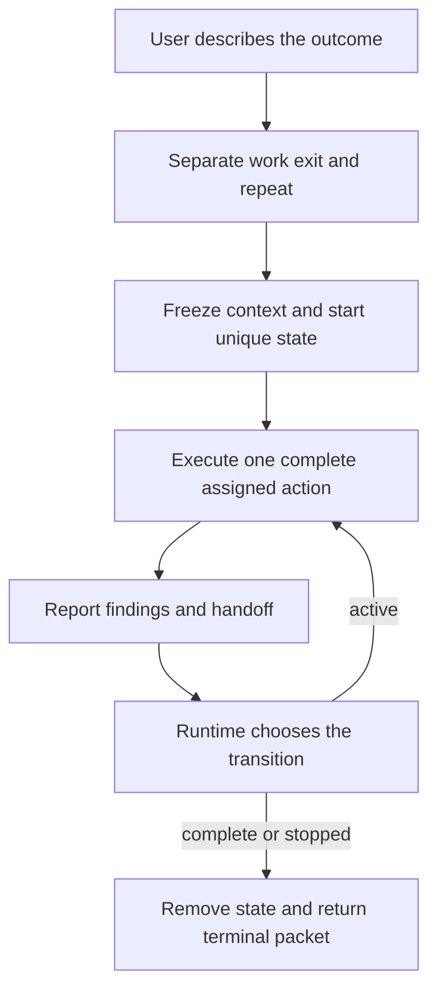
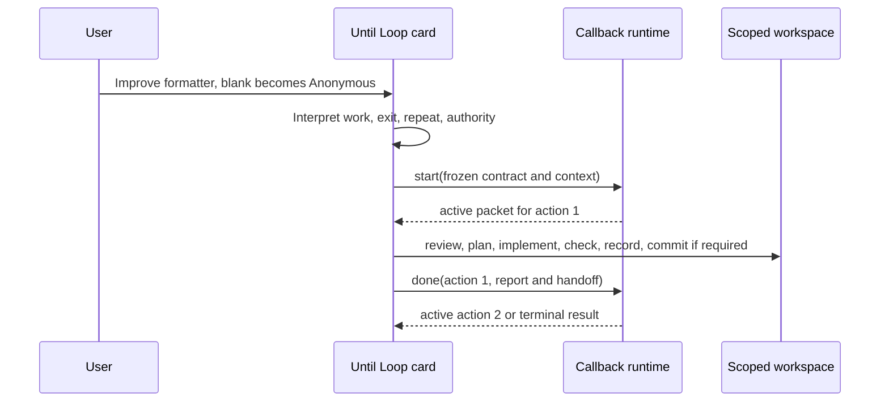
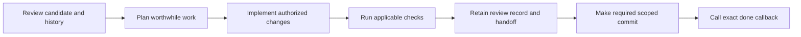
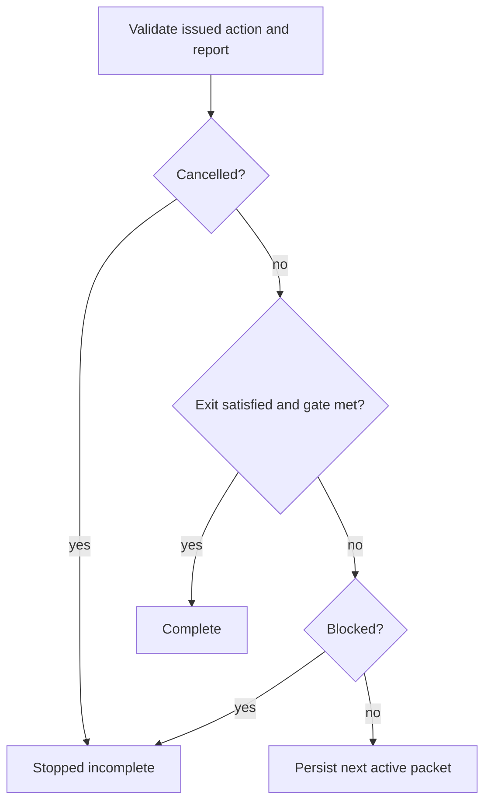
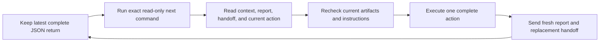
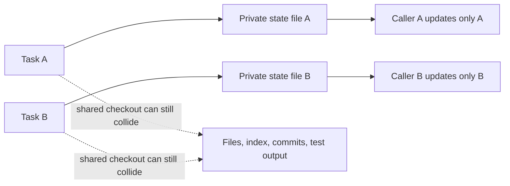

# Until Loop: from a request to a verified stopping point



Until Loop keeps working on a natural-language request until the requested
outcome is established or a real reason to stop is recorded. The model
interprets the request, does the work and judges the evidence; a small Python
runtime preserves the current contract and makes the transition decision.
Users describe intent rather than filling out runtime arguments.

This source candidate is **0.4.0-rc.2**. New runs use one small private callback
file, while explicitly selected durable v1 and v2 runs retain their own adapters.
There is no background scheduler, hidden worker, or invocation of **/goal**.

The contract is deliberately small. A successful **done** process exit says that
the runtime accepted the callback. It does not establish the user-facing result.
The whole returned packet, current artifacts, checks, and retained task record
are the evidence an executor uses to make that assessment.

## Start with a formatter that needs a repair

Imagine a user says:

> Use Improve on the display-name formatter and its tests and documentation.
> It should trim surrounding whitespace, and blank input should return
> **Anonymous**. Review the last seven full commit messages, plan and implement
> worthwhile changes, and run meaningful checks. Continue until two consecutive
> complete reviews find only trivial or no changes and the behavior and
> documentation agree. Preserve unrelated work, commit changed iterations with
> validation and key learnings, and do not push.

That is an illustrative request, not an assertion about a real formatter, test
result, path, commit, or callback. It shows how the request becomes three
different responsibilities:

| Question | Interpreted answer in the story | Why it stays separate |
| --- | --- | --- |
| **Work** | Review the selected formatter candidate and relevant history; plan; implement the fallback if warranted; run applicable checks; record the review; make a required scoped commit before reporting. | It describes one ordered action. |
| **Successful exit** | The formatter and documentation show the requested behavior, current applicable checks pass, no material issue remains, and two consecutive full reviews find only trivial or no changes. | A passing narrow test alone is not enough. |
| **Repeat or incomplete stop** | Continue while useful authorized work or a required review remains; stop incomplete for an actual blocker or a triggered user-prescribed stop. | A stop is not another way to call the request complete. |

This story explicitly selects Improve's review policy. A generic Until Loop
request has a default numeric gate of zero; it does not acquire a two-review
requirement just because the agent is checking a repair.

The interpreter preserves conjunctions, genuine alternatives, conditional
obligations, exclusions, and requested first steps. “CSV or JSON” can be a
successful alternative. “Stop if secret access is needed” is a cancellation
predicate, not “stop if it is needed and unavailable.” A test repetition count
is evidence for that test; it is not a count of qualifying reviews.

For a broad request such as “make it good enough,” the executor derives a
task-specific observable rubric from the target and repository context. It asks
for clarification only when missing scope or acceptance criteria prevents a
valid action or assessment. The maintained interpretation rules are in
[SKILL.md — clause preservation, preview, and sole-caller rules](SKILL.md).

## The lifecycle has one accountable caller

The selected Until Loop card resolves its own runtime, starts or resumes the
chosen state, executes the returned action, and consumes the exact callback
return. A parent can supply the natural-language policy, but it must not create
a second state machine, type **/until-loop**, or invoke **/goal**. JSON and
arguments are internal transport, never the user interface.



For a new run, **start** creates one mode-0600, regular, single-link
**innerloop-*.json** file under a trusted temporary parent. The file is capped
at 16 KiB. It is private runtime state, not a project **.until-loop** directory,
a journal, an evidence catalogue, or a global “current run” pointer. The exact
protocol and recovery boundary are documented in
[runtime-ephemeral.md — start, callback, resume, and error contract](references/runtime-ephemeral.md).

The model supplies a complete interpreted contract. The runtime validates its
shape, retains it, issues a random run ID and an action token, and rejects unknown or
malformed fields. The following is **illustrative JSON only**: its paths,
findings, command, and commit receipt are invented. At runtime, **workspace**
must name an existing absolute directory.
The resource paths illustrate this repository's bundled Improve plugin layout;
the canonical Skill Craft layout is listed separately below.

```json
{
  "workspace": "/work/formatter-example",
  "work": "Review the frozen formatter candidate and the last seven reachable full commit messages; plan worthwhile authorized changes; implement them when warranted; run applicable checks; retain the task record; and make any required scoped commit before done.",
  "exit_condition": "Whitespace is trimmed, blank input returns Anonymous, documentation agrees, current applicable checks pass, no material issue remains, and two consecutive complete reviews find only trivial or no changes.",
  "repeat_condition": "Continue while useful authorized work or a required distinct review remains; stop incomplete on an actual blocker or a triggered requested stop.",
  "required_trivial_reviews": 2,
  "context": {
    "request": "Use Improve on the formatter, tests and documentation. Trim whitespace and return Anonymous for blank input. Read seven full commit messages, plan, implement, check and repeat until two consecutive complete reviews find only trivial or no changes and behavior and documentation agree. Preserve unrelated work, commit changed iterations with validation and key learnings, and do not push.",
    "scope": "Initial base is illustrative commit abc123. Include formatter.py, tests/test_formatter.py, and README.md plus later edits in this run; preserve unrelated staged notes.md.",
    "authority": "Commit only authorized scoped changes after checks. Include Review, Plan, Changes, Validation, Key learnings and Remaining work in the body. No empty commits, no push, and do not absorb unrelated staged content.",
    "environment": "Illustrative environment: run the verified Python command and the selected formatter tests from the workspace; recheck tool availability before relying on it.",
    "resources": [
      {
        "purpose": "selected Improve card",
        "locator": "/opt/example/improve-plugin/skills/improve/SKILL.md"
      },
      {
        "purpose": "bound Until Loop card",
        "locator": "/opt/example/improve-plugin/SKILL.md"
      },
      {
        "purpose": "bound Improve policy",
        "locator": "/opt/example/improve-plugin/skills/improve/references/review-policy.md"
      },
      {
        "purpose": "formatter behavior contract",
        "locator": "/work/formatter-example/README.md"
      }
    ]
  }
}
```

Every new natural-language run supplies all five context fields:
**request**, **scope**, **authority**, **environment**, and **resources**. Each
resource is exactly a nonblank **purpose** and **locator** pair. A locator is
data for a later executor to retrieve; it is never a command, permission grant,
or claim that the referenced artifact is current.

| Fields | Written by | Runtime role | Continuity purpose |
| --- | --- | --- | --- |
| **workspace**, **work**, **exit_condition**, **repeat_condition** | The model, from the authorized request | Validates nonblank fields and existing absolute workspace | Keeps the assigned action distinct from the terminal predicates |
| **required_trivial_reviews** | The model applies the requested policy; generic work defaults to zero and Improve uses two | Counts only accepted reports | Makes a review gate mechanical instead of self-reported |
| **context** | The model freezes the accepted request, baseline, authority, environment, and locators at start | Requires the exact schema and returns it unchanged | Lets a fresh executor recover the original constraints |
| **run_id**, **action_number**, **trivial_streak**, **last_report** | The runtime | Owns identity, count, and stored latest report | Prevents a model from choosing a successor or carrying a counter by assertion |
| Report **evidence** and **handoff** | The model, after actual work | Requires nonblank, correctly shaped values | Carries claims and locators forward for rechecking |

The runtime stores only the current contract, run identity, action number,
streak, and latest report. It has no semantic verifier. In particular, it
cannot tell whether a named test ran, a commit exists, the documentation says
what the report claims, or the model overlooked a requirement.

## Complete the action before reporting it

An active packet contains the workspace, full work and conditions, frozen
context, progress, current report and handoff, a report schema, the exact
**done_argv**, and a read-only **next_argv**. Its action-specific focus directs
attention; it never replaces the entire ordered work body.



For a standalone Improve action, the order is meaningful:

1. Freeze the initial named range or initial HEAD and included staged, unstaged,
   and relevant untracked candidate at start. Later commits do not silently
   select a new candidate.
2. At every distinct review, read the last seven reachable full commit messages,
   or all available messages when fewer exist. History informs the review; it is
   neither the current diff range nor authority to undo prior work.
3. Inspect the candidate, plan worthwhile authorized work, implement it when
   warranted, and run relevant meaningful checks.
4. Retain a host-visible task record with candidate and ownership-aware scope,
   history read, findings, plan or honest no-change reason, actual changes,
   commands/results, lessons, and any commit receipt.
5. After checks pass, make a required scoped commit before calling **done**.
   Its body records Review, Plan, Changes, Validation, Key learnings, and
   Remaining work, including classification and resulting streak.

A no-change review records the reason honestly; it does not manufacture an edit
or an empty commit. An explicit no-commit request keeps the task record without
committing. An explicit audit-commit-every-iteration override may authorize an
identified empty audit commit, but it still must not absorb unrelated staged
content. The executor never resets the user’s index to make the record easier.

The [Improve README — complete review and commit walkthrough](examples/improve/README.md)
expands these choices, including evidence records and no-commit overrides.

The current action ends with a report. Because the illustrative contract carries
context, the following **full report JSON** includes **handoff**. It is a format
example, not an actual callback, formatter result, check result, or commit:

```json
{
  "classification": "non-trivial",
  "exit_assessment": "unsatisfied",
  "continuation_assessment": "allowed",
  "evidence": "Illustrative only: blank input violated the documented Anonymous fallback. Added a failing-then-passing regression, repaired the formatter, checked behavior and documentation, and committed scoped work as def456. Two qualifying reviews remain.",
  "handoff": "Illustrative only: retain the initial baseline abc123 and exclusions in context.scope. HEAD def456 already contains the fallback repair and regression; recheck rather than repeat the edit or commit. Focused checks passed on that candidate. Preserve unrelated staged notes.md. No other known material issue; two complete qualifying reviews remain and no push is authorized. Detailed observations remain in the retained task record."
}
```

| Report field | Accepted values or form | Who judges the meaning |
| --- | --- | --- |
| **classification** | **trivial**, **non-trivial**, or **unresolved** | The model assesses impact and completion; a one-line behavior fix is non-trivial even if already repaired |
| **exit_assessment** | **satisfied**, **unsatisfied**, or **unknown** | The model assesses all substantive exit clauses; unresolved cannot claim satisfied |
| **continuation_assessment** | **allowed**, **blocked**, or **cancelled** | The model identifies useful authorized continuation, an actual obstacle, or a triggered requested stop |
| **evidence** | Nonblank observed account | The model writes actual observations and gaps, never future work or invented proof |
| **handoff** | Nonblank complete replacement summary | The model carries forward candidate identity, decisions, receipts, gaps, and locators; it cannot alter authority or choose a successor |

The script validates the action token and transition fields. Its token is the
random run ID followed by the action number; use the emitted **done_argv**
unchanged, including its **--action=<token>** form. Send the report with structured
arguments and JSON serialization rather than interpolating evidence into a shell
command. Capture actual stdout instead of manually reconstructing the response.
The runtime does not re-grade a semantic review. Each callback reports one
assigned action; incomplete work is unresolved and cannot qualify. Neither
callback retries nor a private sequence of reviews can inflate the streak.

## The runtime chooses the transition



The ordering is intentional: **cancelled** has precedence, then a satisfied
exit plus the numeric gate completes, then **blocked** stops incomplete. A
triggered requested stop is cancelled even when the same fact also describes a
dependency problem. Without that requested stop, an actual obstacle can be
blocked. Neither stopped status establishes success.

For a valid report, **trivial** adds one to the streak. **non-trivial** and
**unresolved** reset it to zero. A terminal result removes the owned temporary
file and returns no new callback. Before selecting either an active or terminal
result, the runtime encodes and size-checks the prospective updated state. The
terminal packet nevertheless retains the number of the just-completed action,
not a hypothetical successor action.

The formatter story therefore has exactly this three-action trace:

| Just-completed action | Completed full work | Callback report | Returned packet |
| --- | --- | --- | --- |
| **1** | Review finds a material formatter/documentation defect; it is repaired, checked, recorded, and committed if required. | non-trivial; exit unsatisfied; continuation allowed; streak resets to 0 | **active**, action number **2** |
| **2** | A new full review finds only trivial or no changes and performs current applicable checks and recordkeeping. | trivial; exit unsatisfied; continuation allowed; streak becomes 1 | **active**, action number **3** |
| **3** | Another distinct full review finds only trivial or no changes and establishes all exit evidence. | trivial; exit satisfied; continuation allowed; streak becomes 2 | **complete**, final action number **3**, state deleted |

The table is an illustrative transition trace. It does not say that any
formatter action really occurred. If action 3 instead discovers material work,
its non-trivial classification resets the streak and the runtime returns a new
active action. The loop does not reward cosmetic churn.

When a user correction changes the accepted work, conditions, scope, authority,
or review criteria, the existing immutable contract is stopped as cancelled.
Only an execution request then starts a newly interpreted contract, and the
new run begins with a zero streak. It never carries clean-review credit across
changed criteria.

## Pick up the assignment after compaction

Suppose the conversation is compacted after the repair and one later review.
The worktree is clean at **def456**. The next executor still needs to review
the candidate that began at **abc123**, preserve the unrelated notes, and avoid
repeating the repair. The frozen context and rolling handoff carry those facts
for different lifetimes.



Each successful active return carries the same frozen context, full work and
conditions, progress, last report, and rolling handoff. The next handoff is a
complete compact replacement, not a delta: it keeps still-relevant receipts,
applied decisions, remaining gaps, and locators for a fresh executor. Earlier
claims remain claims to recheck; a handoff does not authorize a wider scope,
push, new tool, or successor action.

After a context window is cleared, keep the entire actual JSON return, not only
its instruction or the previous command. From an active packet, run its exact
read-only **next_argv** once, read the refreshed packet in full, check newer
user instructions and artifacts, execute one complete current action, and only
then submit its report through the fresh **done_argv**. Never
replay an old **done** call: it may already have advanced or terminally removed
the state.

Terminal output keeps the context, final report, and progress for explanation
after deletion. If terminal stdout and the file are both lost, nothing can
distinguish successful completion from cancellation, corruption, or a lost
handle. Report uncertainty; do not initialize a replacement run or infer
success.

Input rejection and cleanup failure report **state_change: unchanged**. A
filesystem write error can report **state_change: unknown**. When the error
includes a known parsed state handle, its returned read-only refresh command is
for inspection, not automatic replay
of work or callback. There is no atomic crash guarantee, transaction replay,
repair command, restart discovery, or promise that a killed host left usable
state. The runtime rejects missing, oversized, linked, or changed state files
rather than trusting them.

An invalid start or argument-parsing failure may have no known state path and
therefore no refresh command. The adapter limits input-correction retries for
one action to two; that is caller guidance, not another persisted runtime counter.

## Give concurrent runs separate state and workspaces



Each run has its own opaque temporary filename and one caller owns one state
file at a time. The runtime has no same-file lock service, shared process,
background owner, or crash journal. Independent state files permit independent
loops, but they do not coordinate edits, Git index operations, commits, or test
output in a shared checkout.

Use separate worktrees for concurrent writers, or make a deliberate ownership
agreement. Do not delete an orphan merely because its name looks familiar, and
do not treat an arbitrary matching file as a lost task’s state. A missing handle
is not permission to reconstruct a successful result.

## Preview and legacy are explicit boundaries

An interpretation preview explains the proposed work, success conditions,
continuation and incomplete stops, scope/history window, evidence, first action,
and commit policy. It performs no **start**, **done**, task check, edit, stage,
commit, temporary state creation, or callback. A command the user explicitly
asked to run with its own **--dry-run** flag is still work, not automatically an
Until Loop interpretation preview. A prohibition on all filesystem writes also
forbids the temporary run file.

Existing durable v1 and v2 **.until-loop** runs are separate. An explicit legacy
continuation uses the matching legacy instructions and adapter: schema 1/state
or **.pending.json** is v1, while schema 2/state or **.pending-v2.json** is v2.
Until Loop does not silently upgrade, restart, delete, or absorb them into the
new temporary callback file. If a bare “continue” has more than one plausible
owner, resolve that ambiguity before any mutation.

## Source, generated packages, and local skill ownership

The root **SKILL.md**, **scripts/**, **references/**, and supporting metadata are
the authoritative Until Loop source. **examples/improve/** is the maintained
local integration consumer. The generated plugin views are copied into
**plugins/until-loop** and **plugins/improve** by
[sync_plugin_views.py — source-to-package mappings and parity check](scripts/sync_plugin_views.py).
Edit source, then regenerate and verify; do not patch generated copies.

| Distribution | Entry point and callback runtime |
| --- | --- |
| Until Loop source | **SKILL.md** and **scripts/until_loop_ephemeral.py** |
| Until Loop plugin | **skills/until-loop/SKILL.md** and its colocated **scripts/until_loop_ephemeral.py** |
| Bundled Improve integration plugin | **skills/improve/SKILL.md** binds the package-root **SKILL.md** and **scripts/until_loop_ephemeral.py** |
| Canonical Skill Craft Improve | Its own card binds **runtime/until-loop/ADAPTER.md** and that directory's runtime |

The callback runtime requires Python 3.9 or later. Git, test runners and other
tools used by the assigned work remain the workspace's requirements. Copying
only a card is insufficient; an installed package needs its bundled resources.

The Improve package here is an integration distribution, not a claim of
marketplace ownership. [Skill Craft’s Improve source — canonical owner](https://github.com/whichguy/skill-craft/tree/main/skills/improve)
remains separately owned. A source merge in this repository does not repoint an
installed Improve skill, change its marketplace pin, publish an immutable
release, or activate a catalog entry.

For a local Codex checkout, link only the generated Until Loop leaf. Codex
recursively discovers cards beneath each skill entry, so a link to the repository
or plugin root would expose unintended source and integration cards. Regenerate
first, then keep the guard that refuses to replace a user-owned non-symlink:

```sh
python3 scripts/sync_plugin_views.py
mkdir -p "$HOME/.codex/skills"
codex_skill_link="$HOME/.codex/skills/until-loop"
if [ ! -e "$codex_skill_link" ] || [ -L "$codex_skill_link" ]; then
  ln -sfn "$PWD/plugins/until-loop/skills/until-loop" "$codex_skill_link"
else
  printf '%s\n' "Refusing to replace non-symlink: $codex_skill_link" >&2
  false
fi
```

This target contains the one public Until Loop card and its colocated runtime.
It does not install or replace Improve. Keep the separate Codex Improve entry
owned by its canonical Skill Craft installation. If the guard stops, inspect the
existing user-owned path manually instead of overwriting it. Packaging and
publication distinctions are described in
[PUBLISHING.md — authoritative source, generated views, and leaf-link ownership](docs/PUBLISHING.md).

## What the current validation does and does not establish

[RELEASE_VALIDATION.md — release layers, fixtures, receipts, and limits](docs/RELEASE_VALIDATION.md)
separates mechanical protocol confidence from evidence that an executor performed
a meaningful review:

| Validation layer | What it checks | Boundary |
| --- | --- | --- |
| Runtime and package tests | Schema validation, stale/cross-run action tokens, state-size and link safety, read-only refresh, terminal deletion, relocated package parity, and discovery | They cannot prove semantic interpretation or reported work. |
| Isolated release fixtures | Frozen package manifests, protected user work, independent behavior checks, snapshots, and retained callback receipts | They are controlled fixtures, not a user repository. |
| Stale-assessment regression | A later material cycle invalidates an earlier qualifying assessment before regression injection; the helper now revalidates before mutating candidate, runtime, snapshot, or manifest | It fixes a controller boundary, not the production loop’s semantic judgment. |
| Real-runtime integration | The frozen real ephemeral runtime receives exact callbacks through qualifying, material, qualifying, qualifying reports; it checks streak reset, terminal deletion, and no successor prompt | Those reports use synthetic judgments and are deliberately not a live-model study. |

The dated follow-up on **2026-09-19** recorded **314 Python tests**, **126 shell
assertions**, and **14 release-controller helper tests** on Python **3.9** and
**3.14**. It also recorded Improve relocation/plugin-parity, real CLI
composition with synthetic judgments, model-launch boundary, guidance, and
test-group/CI checks. That is compatibility evidence for the reviewed source;
it is not a broad reliability claim, a new live model study, an installation
update, automatic compaction proof, or cross-host certification.

From the repository root, the focused source/package checks are:

```sh
python3 scripts/sync_plugin_views.py --check
PYTHONDONTWRITEBYTECODE=1 python3 -m unittest discover -s tests -p 'test_ephemeral_runtime.py'
PYTHONDONTWRITEBYTECODE=1 python3 -m unittest discover -s tests -p 'test_plugin_packaging.py'
PYTHONDONTWRITEBYTECODE=1 python3 -m unittest discover -s tests -p 'test_release_validation.py'
PYTHONDONTWRITEBYTECODE=1 bash tests/until-loop.test.sh
```

These checks exercise deterministic mechanics. A later model execution still
needs current authorization, actual tool access, current artifact inspection,
and evidence appropriate to the user’s request.

The formatter story ends when its behavior and documentation have current
supporting evidence, the required reviews have happened, and the runtime returns
**complete**. The temporary file is gone; the final packet still explains the
assignment, the last assessment, and the receipts behind the result.

For the complete implementation contract, read
[SKILL.md — interpretation and execution rules](SKILL.md),
[runtime-ephemeral.md — callback schema and failure handling](references/runtime-ephemeral.md),
[until_loop_ephemeral.py — state validation and transition code](scripts/until_loop_ephemeral.py),
[Improve card — review, history, records, and commit policy](examples/improve/SKILL.md),
and [RELEASE_VALIDATION.md — dated validation evidence and limits](docs/RELEASE_VALIDATION.md).
The [compaction experiment — separate fresh executors receiving real packets](docs/COMPACTION_VALIDATION.md)
and [initial callback validation — rc.1 integration evidence](docs/CALLBACK_VALIDATION.md)
retain the earlier execution studies and their stated limits.
