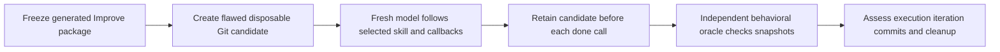

# Production callback integration validation

Historical evidence for `0.4.0-rc.1` (commit `0b6064c`). The packet-only context
limitations recorded below prompted the follow-up [compaction validation](COMPACTION_VALIDATION.md);
they are retained here rather than rewritten as if the earlier run tested it.

The production candidate uses the audited single-file design for new runs while
retaining v1/v2 compatibility. Validation separates deterministic state-machine
checks, actual model execution and interpretation-only screens. A passing report
schema cannot prove that the work happened.

## Deterministic results

Local validation on 2026-09-17:

- **294 Python tests pass** in full discovery on Python 3.9.6, including existing
  v1/v2 runtimes, collector/evidence tooling and historical evaluation support.
- **126 shell assertions pass** in `tests/until-loop.test.sh`; the optional
  external demo integration was not supplied for this run.
- **22 callback runtime tests pass** separately on Python 3.9 and 3.14.
- **7 relocated-package tests pass** separately on Python 3.9 and 3.14.
- Generated plugin parity and Git whitespace checks pass.

The initial integration run encountered an outdated Improve prose assertion and
package drift while source edits were in progress. Both were corrected before
the successful full Python run. Neither is counted as a passing initial run.

Independent review also found a real inherited runtime bug: a random run ID can
start with `-`, so emitting `--action` and that token as separate argv entries
can make argparse treat the token as an option. The runtime now emits
`--action=<token>`. A deterministic regression forces a leading-dash ID and
executes the exact returned command in a real subprocess. The model is never
asked to repair a generated command by hand.

The relocated tests start two files for one workspace, reject swapped action
identity without advancing either, execute the non-trivial/trivial/trivial
sequence, and verify terminal deletion. They also leave an existing durable v2
run byte-for-byte unchanged. This establishes independent state isolation; it
does not test simultaneous edits or simultaneous callbacks on one file.

## Fresh model experiment

The reusable fixture and setup instructions are in
[callback-improve — deliberately flawed candidate and independent oracle](../tests/fixtures/callback-improve/README.md).
The seed's narrow tests pass, but the implementation violates its README:
stable first-occurrence order, first spelling, Unicode casefold equivalence,
generators and non-string rejection. The controlling host's independent oracle
found **8 failures across 17 checks** before execution.

A fresh subagent received only the relocated packaged Improve entrypoint,
disposable candidate and natural-language request to improve it against its
README, make ordinary scoped commits with learnings, and never push. It was not
given the oracle, desired classification sequence, or other agents' conclusions.
The packaged card, bound Until Loop card, runtime and references were frozen;
their file hashes were compared with final generated sources.

The worker retained exact start/report/output JSON and candidate/HEAD/check
receipts before each callback in an external experiment directory. Those records
are experiment instrumentation, not an added runtime journal. The controller
owned one pre-run bytecode artifact and identified it explicitly so cleanup
could preserve user-work boundaries. The oracle runs use disabled bytecode writes.

The repaired first-iteration snapshot passes **17/17 independent oracle checks**.
That oracle was run by the controller after the snapshot was created; it was not
available to the worker or retroactively used to justify its first callback.
The first scoped fixture commit contains Review, Plan, Changes, Validation,
Key learnings and Remaining work, and records the material classification.
The observed sequence was **non-trivial → trivial → trivial → complete**. Each
iteration reran the seven candidate tests; the later reviews also exercised
distinct Unicode and invalid-item boundaries. Exactly one changed-iteration
commit was created, no empty no-change commits were created, the workspace was
clean, no shared `.until-loop` directory existed, and the terminal tempfile was
removed. All three pre-callback snapshots passed 17/17 oracle checks.

The final observed sequence and completion receipts are recorded in the adjacent
[validation result — source hashes and observed outcomes](CALLBACK_VALIDATION.json).

## Cold packet interpretation

A separate fresh subagent read only the initial runtime packet and predicted its
next behavior without executing work or a callback. It correctly identified:

- one complete review/plan/implement/check/record/commit iteration before `done`;
- non-trivial for a repaired behavior bug, trivial for a complete clean review,
  and unresolved when required implementation or checks remain incomplete;
- the exact callback argv and four-field report;
- script ownership of counting, next actions and terminal completion.

The screen also identified limits: the model-written contract referred to a
“designated external evidence directory” without including its path, and the
packet did not contain every experimental package/exclusion/record-location
fact from the host request. These facts were present in the executing agent's
current task context. A packet-only handoff must retain such required locators
or supply them with the handoff; this experiment does not establish that an
arbitrary cold worker can reconstruct missing context. The initial active packet
also does not enumerate every future status; the next actual return supplies
its own instruction and the loaded skill explains active/complete/stopped/error.
The screen is interpretation evidence, not a live terminal/error execution test.

## Compatibility and limits

Historical `fresh_context.py` and `improve_preview.py` prepare v2 contracts and
states. They now reject current callback source before creating artifacts,
directing callers to a matching historical v2 revision. Existing prepared v2
records remain usable. Owner-managed external Improve quality fixtures retain
their separate binding. They are not counted as current callback model evidence.

This is one bounded model run plus a separate packet interpretation. The review
cycles in that run are self-reviews; the oracle independently tests resulting
behavior, not the completeness of every judgment. The study does not prove
universal prompt interpretation, all host integrations, crash recovery, same-file
concurrent writes, or coordinated concurrent repository edits. None is added as
a feature by this release. Repository CI and marketplace activation remain
separate from local evidence; inspect the associated pull request for CI results
and `PUBLISHING.md` for release ownership.
