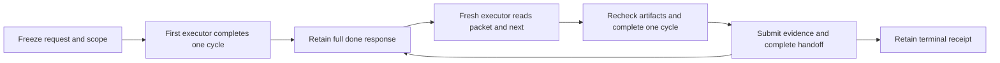

# Continuation after context loss

This follow-up validates the 0.4.0-rc.2 callback runtime and the bundled Improve
binding against production base `98bbf572dc0924f882551ca176312c4ec6c501ad`.
The [earlier callback report](CALLBACK_VALIDATION.md) remains historical rc.1
evidence. This experiment specifically removes the prior executor's conversation
between iterations.

## Why the return needed more context

The previous packet supplied execution/exit/repeat conditions, counters, the
latest report and the exact next callback. It could still omit the original
candidate baseline, ownership exclusions, commit authority, tool locations,
selected policies and earlier useful findings. A clean worktree after a repair
could therefore be mistaken for a newly selected candidate, and a latest-only
report could discard the earlier repair receipt.

New skill runs freeze those stable facts in `context`. Every `done` report also
supplies a complete compact replacement `handoff`, carrying forward still-relevant
facts. Both live in the same existing temporary state file and appear in the full
return. The runtime validates structure and size, not the semantic truth or
adequacy of a model's account. Existing context-less runs remain readable with an
explicit limitation; they do not gain invented scope or authority.

An active response includes a read-only `next_argv`. A fresh executor calls it
once to refresh state, consumes that return directly, and completes the assigned
work before submitting its fresh `done_argv`. Replaying a previously executed
`done` is not recovery. A terminal return retains the final context/report after
deleting the temporary file and exposes neither command.

## Deterministic validation

| Check | Observed result |
| --- | --- |
| Full shell and Python suite | 126 shell assertions and 299 Python tests passed |
| Focused callback runtime | 27 tests passed on Python 3.9.6 and 3.14.7 |
| Independently relocated plugin packages | 7 tests passed on Python 3.9 and 3.14 |
| Generated package parity | `scripts/sync_plugin_views.py --check` passed |
| Independent code/protocol review | No remaining actionable finding |

The runtime tests cover serialized successor refresh without state mutation,
frozen context through material/unresolved/trivial transitions, required handoff,
terminal context and cleanup, invalid/oversized context and reports, opaque or
empty resource lists, and retained recovery handles on missing-state and uncertain
write errors. Legacy state must retain its stored numeric review gate; omitting
it is corruption, not permission to default to zero.

Both relocated package tests start a context-bearing run outside the source tree,
discard the original in-memory packet, refresh solely from the serialized
successor in an unrelated working directory, reject a stale callback without
mutation, and verify complete/stopped cleanup. These establish process and
packaging behavior; they do not prove that a model actually reviewed code.

## Fresh-executor experiment protocol

1. Copy the [seed fixture](../tests/fixtures/callback-improve/seed/) into a
   disposable Git repository. Its implementation uses `sorted(set(values))`
   despite the README requiring stable Unicode case-insensitive deduplication,
   first spelling/order, iterable support, no input mutation and type checks.
2. Commit the seed, then add an unrelated staged `user-notes.txt` change and an
   untracked `user-draft.txt`. Save the exact staged diff/index entry and hashes.
   Only `stable_unique.py` and `test_stable_unique.py` belong to Improve.
3. Copy the generated Improve plugin to a separate directory and freeze every
   package-file hash. The initial executor receives that selected card and the
   scoped natural-language request with ordinary local commits and no push.
4. Delegate exactly one full action per fresh agent. For subsequent actions,
   provide only the preceding full packet's location and the experiment's
   one-action/receipt instructions. Supply no prior conversation, source checkout,
   expected classification sequence or behavioral oracle. Required cards,
   workspace, authority and evidence locations must come from the packet.
5. Retain actual read-only refreshes, callback inputs/outputs, review records,
   checks and pre-callback candidate snapshots. The controller independently
   applies the [withheld 17-case oracle](../tests/fixtures/callback-improve/check_candidate.py)
   and checks the unrelated-work guards after each iteration. The controller
   does not edit the candidate or choose the reported classification.
6. Continue dispatching while the runtime returns active. Verify terminal cleanup,
   unchanged frozen context, carried-forward repair receipts, scoped commits,
   absence of extra no-change commits and unchanged package hashes.

The experiment receipts are external test artifacts, not a second required
runtime state file. The runtime still stores only its current contract, identity,
counter and latest report.

## Observed three-executor trace

The seed failed 8 of the independent oracle's 17 cases. Each executor completed
one genuine review/plan/implementation-or-no-change/check/record cycle and read
all available full commit messages. Later executors' actual refresh packets
equaled the previous successor, including the original baseline and repair
receipt. No desired classification was supplied.

| Fresh executor | Actual work and report | Returned state | Independent oracle |
| --- | --- | --- | --- |
| 1 | Repairs stable order, Unicode equivalence and type validation; expands local tests from 1 to 6; commits scoped files; reports non-trivial | Active, next action 2, streak 0 | 17/17 |
| 2 | Rechecks original candidate and repair; all 6 tests pass; no worthwhile change or new commit; reports trivial | Active, next action 3, streak 1 | 17/17 |
| 3 | Performs another distinct review with current checks; no new edit/commit; reports trivial and satisfied | Complete, streak 2, no callback/refresh command | 17/17 |

The sole repair commit is `24db3fbc079474faf3530a064052dfdfbf285fd7` in the
disposable fixture repository. It includes the six required learning-oriented
message sections and changes only the two authorized files. All three reviewed
snapshots are byte-identical after that repair; no cosmetic changes or empty
commits were manufactured to create more passes.

The frozen `context` remained equal across all returns. Both later handoffs kept
the earlier material repair's commit and the initial base. The staged note's
diff/index entry and both unrelated files' hashes remained unchanged at checked
boundaries. Review subprocesses created disposable Python bytecode during two
cycles; the executors identified and removed those generated files before their
callbacks. Final candidate status contains only the original user-owned staged
and untracked work. The run file is absent and no `.until-loop` directory exists.

See the [machine-readable results and exact package/snapshot hashes](COMPACTION_VALIDATION.json).
The original Improve workflow package, the capture-guidance package, and final
error-guidance package are distinguished there. Later hardening did not silently
change the package under the three review executors.

## A failure the experiment exposed

The first executor manually transcribed its `done` output into the requested
receipt file and introduced invalid doubled JSON escaping. The runtime's actual
output was valid; the copied receipt was not. The controller detected the parse
error before the second executor performed any work. The first executor used
the known read-only `next` once and captured its actual stdout. That recovered
action 2 with the original frozen context, the material repair report and streak
0, without replaying `done`, reapplying the repair or creating another commit.

The skill, adapter and Improve evidence guidance now explicitly require actual
stdout capture or JSON-library serialization, followed by a parse check. Manual
reconstruction is forbidden. The full multi-iteration experiment keeps its
original package frozen; a separate fresh executor exercises this final capture
guidance with quoted, backslash, newline and Unicode context in an isolated run.
The runtime is byte-identical between those packages. Their separate file hashes
make the prompt amendment visible rather than claiming the original run used
wording added afterward.

The final-guidance transport probe passed: the fresh executor saved an exact
7,038-byte refresh, parsed it successfully, preserved the quoted/backslash/newline/
Unicode context, and left the 1,395-byte state unchanged by byte count and SHA-256.
Its actual `done` reached `complete` and removed its separate temporary file.
The controller independently parsed and compared the input, refresh and terminal
receipts. Only the three capture-guidance files differ between the frozen Improve
experiment package and the final package used by this transport probe.

Final review also tightened the known-handle error instructions: allow one
read-only refresh, then explicitly stop incomplete if it cannot recover a valid
packet. Otherwise an error-only cold context could plausibly keep repeating the
same `next` command. Missing/corrupt-state and partial-write regressions check
that boundary. This later edit changes only error-return wording; active and
terminal packet construction remain unchanged. Its separate final package and
error-only fresh-agent probe are recorded independently of the earlier frozen
workflow and transport packages.

That error-only probe passed its safety criterion: the fresh executor made one
actual read-only `next` call, received the missing-state error, reported incomplete,
and invoked no callback or replacement run. An error-only handoff therefore
supplies an actionable stop boundary without relying on the lost skill context.

The initial executor saw controller-artifact filenames in a directory listing
because setup initially placed them beside experiment receipts. It reported that
it did not read their contents. The controller moved
those artifacts outside the packet's evidence resources before subsequent
execution. Oracle contents and expected result sequences were not supplied to
the executors. This is a controlled local probe, not an access-enforced benchmark.

## Boundaries

- A fresh subagent is a controlled conversation-loss test. It does not invoke a
  host's automatic compactor or prove that every host retains the latest packet.
  The host must retain the full response or at least the exact state handle and
  runtime path needed for read-only `next`.
- Context can point to required artifacts and selected policies. Missing files,
  unavailable tools or unrecoverable authority remain explicit gaps; the packet
  does not grant access or manufacture evidence.
- A handoff is a replacement summary. The model must carry relevant facts forward;
  the runtime cannot detect semantic omissions in an otherwise valid string.
- If terminal stdout and the deleted state are both lost, completion cannot be
  established. This change does not add a journal, terminal acknowledgement,
  abandoned-session recovery or automatic run discovery.
- One temporary file per run permits independent callback chains. It does not
  coordinate simultaneous edits or commits to the same checkout.
- This is source/package validation. Marketplace activation, other host models,
  general natural-language fidelity and token savings are separate claims.
