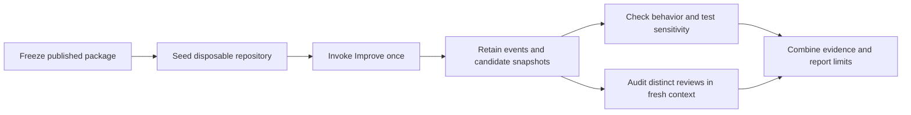
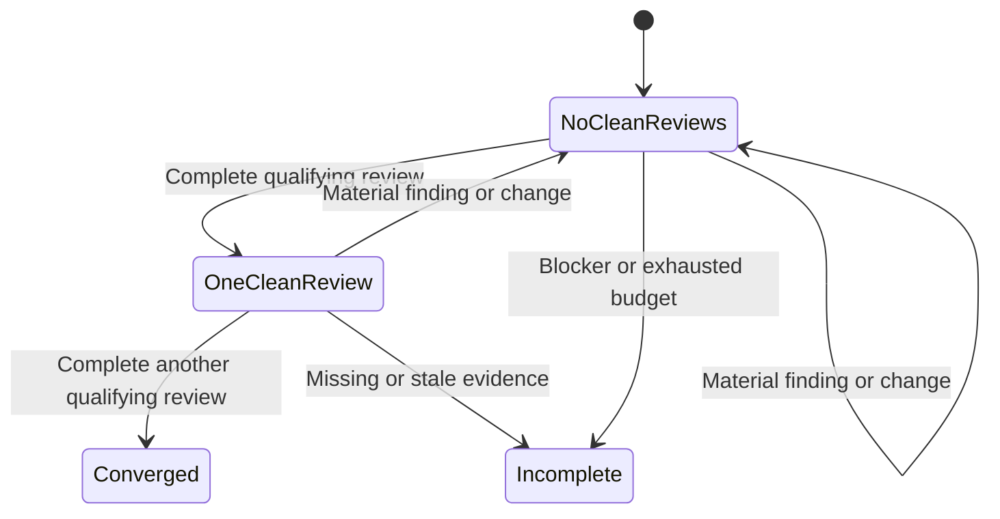
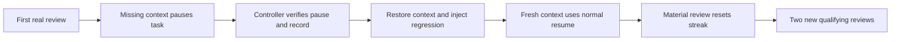

# Evaluating whether Improve actually improves and iterates



The evaluator measures two different outcomes: whether the candidate became
correct, and whether the agent completed the required review sequence. Neither a
passing test command nor a runtime cycle counter establishes both outcomes.
`tests/improve_quality.py` runs the live host. It does not edit the candidate to
satisfy the oracle and does not send follow-up instructions to continue an
autonomous trial. The agent chooses findings, plans, repairs, checks, commits,
and completion using the selected Improve package and its bundled Until Loop.

The canonical evaluation target is `whichguy/skill-craft`, commit
`d8b8432beb6d3cef26e4402a80f8e778f64f129d`, published as
`improve-v0.1.0-rc.1`. The runner uses `git archive` to extract
`skills/improve` from that commit. It does not read the dirty checkout's skill
bytes or select an installed symlink. The package-relative adapter is retained.
This repository owns the evaluation harness and Until Loop integration example;
it does not become the marketplace owner of Improve.

## What one trial does

1. **Prepare.** Build a new small Git repository with seven full commit messages,
   public requirements, visible tests, and unrelated staged, unstaged and
   untracked user work. Freeze the skill package separately. Save the initial
   behavior-oracle result and product/index inventory outside the candidate.
   Run a known reference repair only in a separate fixture-preflight copy to
   prove that the exercise is solvable. That reference execution is never
   reported as an Improve result.
2. **Execute.** Send one ordinary-language request to a fresh `codex exec` host.
   Explicitly select the frozen card. The model reads the card, policy and
   adapter, derives its contract, then owns the work until completion or a real
   incomplete stop. No desired defect or review count is supplied. The maximum
   of six reviews is a safety ceiling, not a target. The observer separately
   limits elapsed time and command actions; command actions are not reviews.
3. **Observe.** Retain structured host events, command outputs, the final
   response, Git facts and copies of candidate files. Observe runtime state
   changes and take a final snapshot after the host exits. A capture is initially
   an observed state, never a declaration that a review was completed. Preserve
   the original runtime state and history. Do not synthesize receipts.
4. **Requalify.** Run evaluator-owned assertions against the final candidate and
   stable intermediate copies. These exercise the same public requirements with
   held-out inputs. Check that previously valid behavior still works. Inspect
   preservation of user files, pending staged state, package integrity, and
   evidence completeness. Test-sensitivity checks execute baseline tests and
   mutated tests in separate disposable copies. Ordinary relative file writes
   made by those tests therefore do not alter the measured candidate.
5. **Audit.** Launch a separate fresh, read-only host. Give it the public review
   policy, transcript and snapshot catalog. It reconstructs the actual reviews,
   triages each as material, qualifying, incomplete or unknown, and cites
   retained evidence. Host claims are evidence to inspect, not trusted answers.
   The auditor receives no desired count or reference repair. Its structured
   judgment has an explicit confidence field.
6. **Grade.** Validate the auditor's record, reject invented references and
   snapshots, recompute the streak, and combine it with mechanical observations.
   A pass requires both supported semantic evidence and successful independent
   checks. Failed or missing evidence cannot be replaced by an optimistic
   summary. Preserve failures and infrastructure retries in the report.

## What counts as iteration



For example, the blank-name fixture publicly promises that whitespace-only
names become `Anonymous`. The defective seed only strips whitespace; its initial
visible suite covers ordinary nonblank names and passes. Independent inputs
establish the missing fallback. A successful agent finds that requirement gap,
adds a regression that fails on the defective code, repairs the formatter, runs
current checks and commits the scoped change. This is a material review even
though the code edit is one line, so its clean streak remains zero. Two later
substantive reviews with current evidence can then establish convergence.

| Observed sequence | Meaning | Completed reviews |
|---|---|---:|
| qualifying, qualifying | Correct candidate reviewed twice | 2 |
| material, qualifying, qualifying | Repair followed by requalification | 3 |
| material, material, qualifying, qualifying | Two rounds of material discovery | 4 |
| qualifying, material, qualifying, qualifying | A later defect resets earlier clean evidence | 4 |

Two defects may be fixed in one material review. Do not require a fourth review
merely because the fixture contains two bugs. Conversely, repeated callbacks,
commit retries, verification commands and repeated completion claims do not
manufacture reviews. Two distinct no-change reviews can legitimately have the
same candidate digest and create no new commit. A trivial comment change can
change the digest without being a material finding; the auditor must justify
that classification. The last qualifying review must describe the final
observed candidate.

## Fixture coverage

| Case | Initial condition | What the external evaluation checks |
|---|---|---|
| `blank_fallback` | Green visible tests omit required fallback | Blank and nonblank Unicode behavior; repair and current regression coverage |
| `clean_control` | Correct code with adequate tests | Two distinct reviews can finish without manufactured edits |
| `csv_contract` | Naive parsing and missing row diagnostics | Quoted commas, escaped quotes, malformed-row diagnostics and continued valid rows |
| `tenant_cache` | Cache key ignores tenant | Same record ID across tenants stays isolated; missing pairs remain missing |
| `decline_suggestion` | Correct code plus an unapproved contrary suggestion | Current requirements win over suggestions and superseded history |
| `commit_retry` | Repair needed; commit hook fails once | Normal retry, pending work preserved, failure/retry not counted as another review |
| `weak_tests` | A required regression is skipped | Code repair and meaningful test sensitivity; green-but-weak tests are insufficient |
| `invalid_test` | Code matches requirements but one test is wrong | Correct the test with a requirement-based explanation; retain correct behavior |

The controlled-resume probe is separate. It starts with a real initial review
and an explicitly requested dependency pause. Only after that pause is observed
may its evaluator restore the public dependency and introduce a visible
regression. A fresh context then resumes the same task. This tests recovery and
streak invalidation; it is not an autonomous defect-discovery trial. If the first
host never reaches the specified pause, report `not_exercised` rather than
fabricating the earlier review or editing runtime history.



The controller's intervention is an evaluator-scoped Git commit, not a change to
the loop's state or history. Its provenance permits reading one specific
condition-observed record; it does not grant access to the evaluator's answer
keys. The combined audit retains both actual invocations and labels the result
`controlled_resume`. An ordinary autonomous trial still requires exactly one
invocation; setting a count of two without verified controlled provenance cannot
pass. The controlled CLI is:

```sh
python3 tests/improve_quality_resume.py prepare \
  --source-repo /path/to/skill-craft --root /path/to/evaluation/reset-001
python3 tests/improve_quality_resume.py start --root /path/to/evaluation/reset-001
python3 tests/improve_quality_resume.py resume --root /path/to/evaluation/reset-001
python3 tests/improve_quality_resume.py audit --root /path/to/evaluation/reset-001
```

## Running the tests

The deterministic tests have no model dependency:

```sh
PYTHONDONTWRITEBYTECODE=1 python3 -m unittest discover -s tests -p 'test_improve_quality*.py' -v
```

The live suite is opt-in and needs an authenticated Codex CLI. Keep evidence
outside both the source checkout and candidate repository. Use a new root for
every trial, including retries:

```sh
python3 tests/improve_quality.py prepare \
  --source-repo /path/to/skill-craft \
  --revision d8b8432beb6d3cef26e4402a80f8e778f64f129d \
  --case blank_fallback --root /path/to/evaluation/trial-001
python3 tests/improve_quality.py run --root /path/to/evaluation/trial-001
python3 tests/improve_quality.py audit --root /path/to/evaluation/trial-001
python3 tests/improve_quality.py summarize --root /path/to/evaluation
```

`summarize` inventories direct trial directories, including incomplete attempts.
It does not recursively replace a controlled probe's initial paused stage with
its combined result. Use the controlled wrapper's audit output and the
`controlled-resume-combined/evidence` record for that verdict. Report autonomous
trials and controlled stages separately; the inventory's aggregate counts are
not a reliability denominator across those different protocols.

`run` uses the configured model; it does not replace the user's model selection.
It selects `--approve-for-me`, which uses the workspace-write sandbox and routes
necessary approvals through automatic review. This option is mutually exclusive
with `--sandbox`; the launcher must not supply both. The audited candidate has
no remote, and the request authorizes only local scoped commits. The separate
auditor uses `--sandbox read-only`. Neither command uses the bypass-sandbox flag.
A capability probe should establish the host's actual ability to read the
frozen package and commit in the disposable candidate before interpreting a
host failure as a skill failure.

A completed semantic judgment is retained even when it is unfavorable. The
auditor is not retried until it produces a preferred result. Infrastructure
failures may be retried in a new audit directory without running Improve again;
all earlier attempt evidence remains present.

The observer must accept a valid `action: null` when the runtime reaches a
terminal state or pause. A dedicated synthetic-host regression exercises that
transition without invoking a model. If an older observer crashed, the recovery
helper can retain remaining evidence without changing the candidate:

```sh
python3 tests/improve_quality_recover.py recover \
  --root /path/to/evaluation/trial-001 --reason 'Observed instrumentation failure'
```

Recovery requires proof of the original invocation and checks that its host is
no longer running. It never invents the missing process result: recovered
observations remain `incomplete`, with an unknown original exit code. A repaired
candidate and a completed evaluation are separate claims.

## Evidence and interpretation boundaries

- **Unsealed same-host trials.** A sibling evidence directory is not a read
  barrier. The prompt forbids evaluator access; the runner checks known access
  signatures and the independent audit inspects the trace. “No observed access”
  is the strongest supported claim. These runs do not establish isolation
  against a hostile agent. Sealed comparative evaluations need enforceable
  read boundaries, such as isolated mounts, not simply another path.
- **Stable capture.** Snapshot copies retain content digests and original file
  modes. Links that cannot be faithfully copied, changing files, corrupt host
  events and missing final evidence prevent a complete evaluation. Runtime
  events may occur between observer polls; the transcript and durable notes
  remain necessary to interpret review boundaries.
- **Preservation.** Matching bytes is insufficient. Accidentally committing an
  existing staged draft can preserve its bytes and index blob while destroying
  its pending status. The preservation check compares the protected content,
  index entry and Git status, including unstaged and untracked work.
- **Selected package reads.** Successful commands must name the frozen card,
  policy and adapter and return their expected content markers. Direct shell
  reads are recognized; Python support is deliberately limited to a parsed
  literal-list `Path`/`print` heredoc. Printed markers, commented-out reads and
  conditional reads do not qualify. Unsupported reading styles can leave the
  provenance check unestablished. This is bounded trace evidence, not proof of
  comprehension or operating-system execution attestation. The current boolean
  source-integrity gate fails when a reading style is unsupported; inspect its
  detailed read markers before attributing that evaluation failure to the skill
  or to incorrect product behavior.
- **Independent tests.** The behavior oracle covers a bounded public contract,
  not all possible defects. Test mutation checks demonstrate sensitivity to a
  particular meaningful defect, not universal test adequacy. A timeout, import
  failure or broken test loader is not evidence that a regression assertion
  caught the mutation. `mutation_outcome` distinguishes `detected`, `survived`
  and `inconclusive`. A green nonempty suite on a known-defective mutant is a
  demonstrated coverage failure; an import error or timeout in that probe is
  incomplete evidence. Both prevent a pass. These copies are not a sandbox
  against deliberately executed absolute-path writes or other host access.
- **Semantic judgment.** JSON validation can reject invented IDs and incorrect
  streak arithmetic. It cannot prove that a cited review was diligent or that
  an auditor's interpretation is right. Supported results retain the actual
  evidence and the self-review/independent-review limitations.
- **Statistics.** A pilot locates failure modes. A small number of successful
  trials is not a reliability rate. Freeze the package, fixtures, harness and
  grading procedure before larger repeated comparisons. Keep timeouts, invalid
  launches, failed audits and non-exercised controlled probes visible.

The design rationale and larger experiment matrix are in
[IMPROVE_QUALITY_TEST_PLAN.md](IMPROVE_QUALITY_TEST_PLAN.md). The dated
[live results report](IMPROVE_QUALITY_RESULTS.md) retains measured sequences,
infrastructure failures, corrections and validation limits. Later documentation
changes do not automatically inherit those validation claims.
