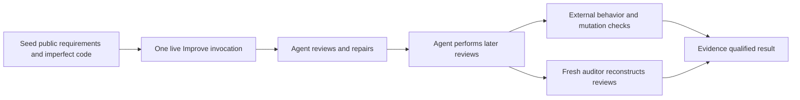

# Improve quality evaluation — 2026-09-14

This study tests whether Improve improves a real candidate and then continues
reviewing it. The result is measured from candidate files, commands, Git history,
runtime records and a separate auditor. A runtime counter alone is insufficient.

The tested skill is the frozen canonical Skill Craft package at
`d8b8432beb6d3cef26e4402a80f8e778f64f129d` (`improve-v0.1.0-rc.1`), extracted
from `skills/improve`. These experiments change the evaluator in this repository;
they do not modify or republish that package. The installed skills and marketplace
pin were not changed by this study.

The [evaluation guide](IMPROVE_QUALITY_EVALUATION.md) explains the implementation
and commands. The [experiment plan](IMPROVE_QUALITY_TEST_PLAN.md) records the
original cases and larger proposed repetition matrix. This is a development
pilot, not that larger frozen comparative study. The machine-readable
[validation record](../improve-quality-validation.json) binds the final reported
results to package, harness and retained artifact digests.

## Live results

The final independent audits are complete. `M` means a completed
material review; `Q` means a completed qualifying review with current evidence.
Neither a retry nor an adapter callback is counted as another review.

| Fixture | Reviews | Sequence | Final tests | Host minutes | External requalification |
|---|---:|---|---:|---:|---|
| `blank_fallback` | 3 | M, Q, Q | 5 | 10.3 | Pass |
| `clean_control` | 2 | Q, Q | 4 | 7.5 | Pass |
| `csv_contract` | 3 | M, Q, Q | 10 | 12.1 | Pass |
| `tenant_cache` | 3 | M, Q, Q | 7 | 12.5 | Pass |
| `decline_suggestion` | 2 | Q, Q | 4 | 9.4 | Pass |
| `commit_retry` | 3 | M, Q, Q | 5 | 11.3 | Pass |
| `weak_tests` | 3 | M, Q, Q | 7 | 11.9 | Pass |
| `invalid_test` | 3 | M, Q, Q | 7 | 11.3 | Pass |

All eight selected autonomous runs used exactly one host invocation and ended
with supported semantic judgments, passing external behavior and mutation checks,
preserved user work, and evidence bound to the final candidate. Earlier failed
attempts are retained below; these eight rows are not a success-rate denominator.

Host minutes measure only the Improve invocation, excluding preparation and the
separate auditor. They reflect this configured host and small fixtures; they are
not latency predictions for production repositories or a comparison of models.

## A concrete repair and requalification trace

The blank-name fixture promises that whitespace-only input becomes `Anonymous`.
Its initial implementation merely strips whitespace, and its visible tests miss
that requirement. The independent baseline oracle therefore fails even though
the initial visible suite is green.

In `pilot-a`, the agent found the missing fallback, wrote regression coverage,
repaired the formatter and created scoped commit
`57f640b2dbc8ba9bc6b948e381d946badb203d96`. Five tests passed after that commit.
The auditor classified this first review as material: changing one line can
change required behavior, so edit size does not make it trivial. Its qualifying
streak was zero.

The second review reread history and scoped files and checked nine boundary
inputs. The third separately assessed test adequacy, the committed diff and
ownership. Neither found a warranted change. Their passing checks still applied
to the unchanged final candidate, so the audited streak became one, then two.
The observed result was three completed reviews and one product commit. The
external oracle passed; the final tests rejected a restored fallback defect.

This explains why three reviews are appropriate for a repair but are not a
quota. The clean control completed two distinct reviews without edits or an
empty commit. Multiple defects repaired during one review also do not force an
extra review. A later material finding must instead invalidate prior qualifying
evidence and begin a new streak.

## What the adversarial cases taught us

- **A green suite can conceal bad behavior.** The blank-fallback and weak-test
  fixtures expose missing or skipped coverage. Final acceptance requires both
  independent contract assertions and a suite sensitive to a meaningful restored
  defect. Passing the original command alone is insufficient.
- **A failing test can be wrong.** The invalid-test fixture already implements
  the documented fallback. The agent corrected the contradictory expectation,
  preserved correct product behavior and added coverage. That test repair was
  material and was followed by two qualifying reviews.
- **A suggestion is not an approved requirement.** The decline-suggestion case
  retained `Anonymous` behavior despite a proposed strip-only simplification.
  The observed two-review result is evidence of restraint, not under-iteration.
- **A commit retry is not a review.** The fail-once hook produced `failed`, then
  `passed`; its hook bytes, mode and local configuration remained intact. The
  auditor assigned both attempts to the first material review. Two subsequent
  qualifying reviews established convergence.
- **Finding several bugs is not necessarily several iterations.** CSV quoting,
  diagnostics and continued processing were repaired together. Its final ten
  tests also rejected three additional isolated mutants: broken quoted parsing,
  removed diagnostics and premature termination. They produced 10, 4 and 4
  assertion failures respectively, with zero test errors. The real candidate's
  tracked files, index and status remained unchanged during those experiments.

The independent semantic audits are retrospective. They establish supported
evidence of distinct self-reviews in these transcripts; they do not turn each
in-loop self-review into an independently staffed review.

## Evaluator failures and implemented corrections

| Observed gap | Correction | Verification |
|---|---|---|
| Valid terminal or paused state had `action: null`; observer assumed an object | Accept the terminal shape and retain a final capture | Synthetic host performs an actual active-to-done transition through the runner |
| CLI rejected combined `--sandbox` and `--approve-for-me` | Supply the single supported execution policy | Launcher regression plus subsequent live runs |
| Auditor schema used unsupported `uniqueItems` | Enforce duplicates in deterministic validation | Successful structured live judgments and duplicate-record tests |
| Snapshot references lost relative path suffixes during controlled merge | Preserve full relative paths; reject escape, collision or missing targets | Controlled catalog tests include granular references and invented-reference rejection |
| Rechecking only the merged evidence root could lose earlier source failures | Preserve both stream checks and conjunct prior integrity with later checks | Initial-access, frozen-source-drift and audit-preservation regressions |
| Printed marker text could resemble a skill read | Require a successful read-shaped command bound to the selected exact file | Printed markers and decoy suffixes rejected; actual shell/Python reads accepted |
| Matching user-file bytes could hide an accidental commit of preexisting work | Compare protected content, index entries and pending status | Absorbed staged-draft regression |
| Mutation validation could execute baseline tests in the measured candidate | Run baseline and mutation in separate disposable copies | Tests attempt local product/unrelated-file writes and verify original preservation |

The initial archive extraction also needed to accept the parent directory
entries emitted by `git archive`. Fixture preparation now tests the frozen
commit rather than a dirty source checkout.

Earlier attempts remain visible. `pilot-c` failed before model execution due to
the launcher options. `pilot-c2`, `tenant-a`, `decline-a` and the initial phase of
`reset-b` were affected by the observer's null-action exception. Their recovered
observations remain incomplete with unknown original exit status. Corrected
attempts use new roots; recovered product success was never silently promoted
to a completed evaluation. `reset-a` was stopped after discovering contradictory
initial instructions about its explicitly controlled follow-up. `pilot-b`'s
first audit failed at schema transport before an answer; the successful second
audit preserves that first attempt. Completed semantic answers were not rerolled.

## Controlled resume and limits

The controlled probe first asks for a real review followed by a dependency pause.
Only after observing the pause does the controller restore public context and
introduce a visible regression in its own scoped commit. A second fresh host
resumes the existing task. The controller never edits loop state or synthesizes
review receipts. The final independent audit must distinguish that intervention
from autonomous discovery and from completed reviews.

`reset-c` completed the controlled test with four independently reconstructed
reviews: **Q, M, Q, Q**. Its streak was **1, 0, 1, 2**. Both actual host
invocations completed, the regression was repaired, current checks passed and
user work remained preserved. This is a controlled cold-resume result, not
four autonomous discoveries. The earlier `reset-b` audit found the same
four-review sequence but correctly kept its overall result incomplete because
the initial observer had lost the original process result.

These trials are **unsealed and run on the same host**. The prompt prohibits
answer-key access; lexical checks and transcript inspection found no prohibited
access in the accepted trials. Those observations do not establish an operating
system read boundary or resistance to a hostile agent. File copies also do not
isolate arbitrary code that deliberately uses absolute paths or network access.

One run per autonomous fixture is useful coverage, not a reliability estimate.
There is no evidence here that most production repositories need exactly two,
three or four reviews. Natural-language contracts and fresh-context judgments
remain model-dependent. Larger comparisons should freeze the now-tested harness,
use enforceable isolation where needed, repeat each case, and retain all failed,
incomplete and non-exercised trials.

## Verification and delivery

- **206 Python tests passed** on Python 3.14.7 and Python 3.9.6.
- **126 shell checks passed** in the complete package suite.
- The new evaluator contributes **86 deterministic tests**; CI does not invoke models.
- Generated plugin views remained current, and the scoped diff passed whitespace checks.
- Final mechanical checks reran against the retained live candidates using the
  corrected evaluator. Every original semantic judgment was retained.

The validation record includes the exact harness file hashes and log digests.
Raw transcripts and candidate snapshots remain in the local evidence directory
`/Users/dadleet/src/until-loop-quality-validation/20260914`; the committed record
retains review findings, outcome facts, candidate identities and evidence hashes.
That compact record is not a substitute for access to the full raw evidence.

The evidence supports keeping Improve's current two-consecutive-qualifying-review
policy. The implemented changes make it possible to detect false convergence,
weak test repairs, extra callback counting, stale candidate evidence and
measurement failures. A mandatory three- or four-review minimum would contradict
the valid clean-control behavior and is not supported by these experiments.
