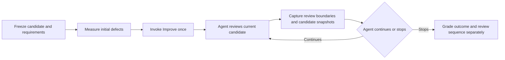

# Testing whether Improve produces useful iteration

Plan recorded 2026-09-14, before live execution. At planning time, only a
deterministic fixture preflight had run. The implementation and execution
procedure are now documented in [IMPROVE_QUALITY_EVALUATION.md](IMPROVE_QUALITY_EVALUATION.md);
dated result records distinguish subsequent live evidence from this original
plan and from larger proposed repeat trials.

The return edge represents the same agent continuing its existing Improve run.
The evaluator must not send repeated user prompts to manufacture iteration.

## Recommendation and ownership

Pilot a small suite of deliberately imperfect repositories, paired with already
correct controls. Measure whether defects are found and repaired, whether
previously correct behavior survives, and whether two real qualifying reviews
occur after the final material change. Do not require an arbitrary three- or
four-pass quota or reward extra commits, edits, callbacks, or token consumption.

Target the canonical Skill Craft Improve release, not whichever development
symlink happens to be installed. At inspection:

- Improve source: `/Users/dadleet/src/skill-craft/skills/improve`, commit
  `d8b8432beb6d3cef26e4402a80f8e778f64f129d`, release `improve-v0.1.0-rc.1`.
- Skill card SHA-256:
  `d1f73fb6c881b6fae3cf731d337173fef597724f028139efad4ddaa7c76b588a`.
- Shared review-policy SHA-256:
  `279b5ee337c7c79747da317ab0094d344eeb6d8a22fec9e3c4d734a1e7626159`.
- Until Loop's existing evaluation helpers live in this repository, inspected
  at `4b75af11040665052e57d0fdc74ee8b8b413b66d`. Its Improve package is an
  integration example, not the canonical marketplace owner.

Extract the pinned commit/tag into a new isolated checkout or archive; do not
execute the card from the dirty working checkout. Load that frozen card by its
exact physical path, including the adapter inside the same frozen package.
Record hashes again at trial start. Do not change installed skills, retarget
marketplace entries, or edit the dirty skill-craft checkout to run this pilot.

## What counts as a pass

The existing policy already requires a material finding or edit to reset the
clean-review streak, even if repaired immediately. Failed or stale checks cannot
advance it. Only a completed, distinct review can count. These are evaluation
requirements to test, not proposed new runtime rules.

Let `M` mean a completed review with a material finding/change and `C` a completed
review with only trivial or no changes, current checks, and no unresolved material
issue. These illustrative traces assume successful checks and required commits:

| Starting situation | Valid example | Clean streak after each review | Reviews |
|---|---|---|---:|
| Already correct | C, C | 1, 2 | 2 |
| One repair round | M, C, C | 0, 1, 2 | 3 |
| A later review finds another material issue | M, M, C, C | 0, 0, 1, 2 | 4 |
| A problem appears after a qualifying review | C, M, C, C | 1, 0, 1, 2 | 4 |

Two defects do not necessarily require two repair rounds. Finding and repairing
both during one substantive review is a good outcome and can converge in three
reviews. Conversely, four callbacks might contain just one review and several
verification/recovery actions. Until Loop increments its transport `cycle` on an
accepted assessment; that number is not a semantic review counter.

“Most runs take two reviews” is a hypothesis about the user's normal candidate
quality. A suite deliberately loaded with defects cannot establish that frequency.
Report normal-use and seeded-stress histograms separately.

## Existing evidence and the specific gap

`tests/improve_execute.py` already prepares a real Git fixture with seven commits,
a documented blank-name fallback, missing fallback implementation/coverage, and
unrelated staged/untracked/ignored files. Its external oracle checks Unicode
trimming, blank fallback, and preservation of an ordinary name. Its checker also
requires actual test execution, scoped learning commits, and preservation facts.

Historical model-driven evidence also exists. An earlier fresh-agent run repaired
the seed and recorded three accepted cycles corresponding to a material review
and two clean self-reviews. Later trials recorded a three-review repair and
two-review clean controls. A controlled hardening run reached five cycles after
an evaluator injected a new defect following earlier repair and a clean review;
its semantic review confirmed reset and two later qualifying reviews. That
controlled intervention demonstrates recovery, not spontaneous discovery of an
unchanging repository. The early run also needed review-assisted artifact cleanup.
These are retained examples from earlier source checkpoints, not a current
multi-trial reliability result for the canonical marketplace package.

[improve-implementation-validation.json - actual_execution and limitations: three-cycle run and assisted-cleanup boundary](/Users/dadleet/src/until-loop/improve-implementation-validation.json:65),
[EXPERIMENT_RESULTS.md - Actual Git results: material repair and clean controls](/Users/dadleet/src/until-loop/EXPERIMENT_RESULTS.md:163), and
[improve-hardening-validation.json - material-reset: controlled five-cycle run](/Users/dadleet/src/until-loop/improve-hardening-validation.json:169).

However, the checker labels its minimum of three accepted work assessments a
**mechanical proxy**. It explicitly requires semantic notebook/transcript review.
The commit-section and streak-language checks similarly prove text presence,
not truthful review classification. Extend those checks with an independently
audited sequence of candidate-bound reviews; do not relabel the proxy as proof.

Useful source anchors:

- [review-policy.md - Apply and Checks: material work resets the streak and stale checks cannot advance it](/Users/dadleet/src/skill-craft/skills/improve/references/review-policy.md:49).
- [review-policy.md - Assess: distinct reviews and two consecutive qualifying reviews are required](/Users/dadleet/src/skill-craft/skills/improve/references/review-policy.md:64).
- [SKILL.md - Execution handoff: runtime does not independently count truthful review streaks](/Users/dadleet/src/skill-craft/skills/improve/SKILL.md:127).
- [until_loop_v2.py - accepted assessment: transport cycle increments before phase selection](/Users/dadleet/src/skill-craft/skills/improve/runtime/until-loop/scripts/until_loop_v2.py:1198).
- [improve_execute.py - prepare(): seeds the documented fallback defect and verifies the oracle rejects it](/Users/dadleet/src/until-loop/tests/improve_execute.py:415).
- [improve_execute.py - check(): accepted-assessment count is explicitly a proxy](/Users/dadleet/src/until-loop/tests/improve_execute.py:524).

## Concrete preflight performed for this plan

The existing fixture was prepared in a fresh temporary repository. Its three
visible tests passed, but the independent oracle exited 1. For example, the
implementation `return value.strip()` turns Unicode whitespace into `""` even
though the README requires `"Anonymous"`.

The evaluator applied the known reference patch
`return value.strip() or "Anonymous"` only in that temporary fixture. The same
three visible tests still passed, and the independent oracle then exited 0.
Thus the seed contains a real defect that visible green tests miss, and the
oracle accepts at least one valid repair. This does **not** establish that an
Improve agent finds the bug or performs subsequent reviews; no agent was run.

Evidence: [preflight.json - before and after_reference_patch: visible tests stay green while the oracle changes from failure to success](/Users/dadleet/src/improve-quality-plan-rq5gm9xi/preflight.json:8).

## Proposed cases

All normative behavior must be visible in the task or repository before execution.
Hold out test inputs and expected results, not secret product requirements. Give
fixtures neutral names; do not tell the working agent the planted bug, solution,
expected number of findings, or desired number of review passes.

| ID | Seed and visible contract | Independent acceptance evidence | Expected iteration behavior |
|---|---|---|---|
| Q1 | Formatter missing documented `Anonymous` fallback; ordinary/Unicode trim tests pass | Blank Unicode and ASCII names produce fallback; nonblank names remain correct; a relevant regression test distinguishes the seed from the repair | Material round followed by two qualifying reviews; normally 3 |
| Q2 | Correct counterpart of Q1, with adequate tests and readable implementation | Existing behavior and scope preserved; no invented defect, speculative rewrite, or fabricated commit | Two substantive no-change/trivial reviews; 2 is sufficient |
| Q3 | CSV importer with quoted-comma parsing defect and loss of malformed-row diagnostics; contract explicitly requires both | Private cases check quoted fields, escaped quotes, malformed rows, and continued processing of valid rows | 3 if both fixed together; 4 or more if later review finds a residual; fewer edits is not failure |
| Q4 | Controlled resume fixture: an earlier qualifying review overlooked a documented importer defect; a fresh reviewer supplies a concrete reproduction | Actual resumed agent triages the finding, fixes it, resets streak 1 to 0, then performs two new qualifying reviews | Tests reset/recovery after imperfect prior work; do not report setup history as autonomous discovery |
| Q5 | Proposed optimization of tenant-scoped cache accidentally removes tenant identity from the key; visible tests use one tenant | Same record ID in two tenants never leaks values; intended cache behavior within one tenant survives | One-line correction is material; cannot count as trivial because the diff is small |
| Q6 | Correct code plus a plausible but harmful review suggestion; an old commit recommends behavior superseded by the visible current requirement | Agent checks current behavior and declines the unsupported edit; historical context does not override current requirements | Two useful reviews can end without a product change |
| Q7 | Dirty scoped change plus unrelated staged/unstaged/untracked work; commit hook fails once before permitting the same validated change | Blob/index fingerprints unchanged outside scope; actual commit receipt exists; failed commit/retry never becomes a clean review or duplicate commit | Continue or report incomplete until the commit requirement is met; evaluate reviews separately from retries |
| Q8 | Green local tests weakened to skip required behavior, paired with a variant containing a demonstrably invalid expectation | External oracle and preserved behavioral test IDs expose shortcuts; invalid tests may be corrected only with a requirement-based explanation and a meaningful replacement | No qualification from zero/skipped/weakened checks; warranted coverage repairs are material |

Q4 deliberately tests recovery from a bad review. It is separate from the
uninterrupted discovery trials. Do not inject a new defect halfway through Q1/Q3
merely to force four rounds. If the agent finds everything immediately, accept it.

Q7's hook is a fixture-local, deterministic dependency failure, not an installed
host hook. Its program and failure schedule belong to the evaluator; mount the
program read-only and let a separate fixture controller record the scheduled
failure. Preserve their integrity and record any attempt to bypass the hook,
override `core.hooksPath`, or edit its schedule as fixture tampering. Do not claim
this boundary is enforced on an unrestricted host. Record the scheduled failure
and distinguish it from product behavior.

## Running and observing a trial

1. Freeze the user-facing task, fixture bytes, seven full commit messages, visible
   requirements, allowed scope, seed, host/model settings, runtime/card hashes,
   reference solution, and grader configuration. Give every trial a new workspace
   and run ID; keep earlier solutions/history out of subsequent trials.
2. Establish the seed's failing behavioral cases and previously passing cases.
   Check that a reference solution passes both. Reject ambiguous/unreachable
   cases before measuring the agent.
3. Invoke Improve **once** in a fresh context with the frozen ordinary-language
   task. Let its existing policy decide work, reviews, continuation, and exit.
   Capture user-visible plans, notes, tool activity/results and artifacts; private
   model reasoning is neither required nor a grading source.
4. An evaluator-owned observer saves immutable snapshots at completed review
   boundaries. It does not choose the next action, write review conclusions, or
   submit completion callbacks for the agent. Capture a consistent candidate
   identity: HEAD plus staged/unstaged content digests and relevant untracked
   files. HEAD alone does not identify a dirty candidate.
5. Evaluate frozen snapshots outside the working agent's process. In the core
   discovery arm, do not feed held-out results back into the run; otherwise the
   grader becomes an extra collaborator. A separately labelled feedback-assisted
   arm may provide deterministic failures, but it must not be pooled with the
   autonomous arm.
6. On normal stop, interruption, or budget exhaustion, retain the exact state and
   outputs. A practical pilot ceiling is six completed reviews and 20 minutes per
   trial, with a separate adequate transport-action cap. These are proposed test
   safeguards, not a new production stopping rule; hitting a ceiling is incomplete.

An external folder is not a security boundary when the host can read the whole
filesystem. For a sealed evaluation, run the agent in a disposable environment
whose mounted view excludes answer keys and grader sources. Run candidate code
without write access to evaluator material. If that isolation is unavailable,
state the limitation, retain access/activity evidence, and invalidate any trial
that accessed its answer key. Hash checks alone cannot prove non-access or prevent
grader tampering. No new service or permanent installation is required.

## Requalifying whether each change helped

Use complementary graders and retain their separate results:

**Behavior grader.** Run fixed fail-to-pass cases for planted defects and
pass-to-pass cases for previously working behavior on the initial candidate,
each material snapshot, and final candidate. Freeze expected outputs before the
agent starts. Do not accept a high aggregate score that hides a required regression.
Where practical, reintroduce the original defect into a copy of the repaired tree:
the newly claimed regression coverage should then fail. Avoid demanding a specific
implementation when alternative repairs satisfy the public contract.

**Review-sequence auditor.** Reconstruct distinct reviews from captured actions
and records. For each review record its scope, candidate before/after, reviewed
artifacts, new/resolved findings, materiality with evidence, plan/no-change reason,
check IDs and tested candidate, commit receipt if required, and observed streak.
Independently recompute the streak from those facts. Mark missing or contradictory
evidence as unknown/incomplete. Matching regexes or repeated summaries do not
substitute for a review; the same candidate hash is permitted for two distinct
no-change reviews, provided the review activity is distinct and substantive.

**Independent quality review.** Give a fresh read-only reviewer the visible
requirements and randomized before/after snapshots without agent self-ratings,
desired pass count, or the message “this should now be clean.” Ask it to identify
concrete defects or supported benefits and choose better/same/worse/unknown with
evidence. Review semantic quality and unnecessary complexity; let executable
behavioral evidence decide objective correctness. An LLM preference is not proof.

For material fixes, quality success requires an actual failing behavior repaired,
all required preservation/regression checks passing, and no unresolved supported
material finding. For clean controls, preserving good code is a successful outcome.
Full workflow success additionally requires two qualifying reviews after the last
material work and all scoped commit/ownership requirements.

Report: defects repaired/seeded; required regressions introduced; supported versus
unsupported findings; false completion; total distinct reviews; last material
review; qualifying reviews afterward; transport actions; commits; unnecessary
churn; time/tokens when observed; and unknown or incomplete outcomes. A defect
missed by both self-reviews but caught by the held-out oracle is false completion.

## Staged execution and comparison

First run Q1, Q2, and Q3 once each as a three-trial smoke pilot. Inspect every
trace and resolve grader ambiguity. These small counts do not establish reliability.
After freezing any harness corrections, run the eight cases three times each
(24 new trials). Keep the clean and defective populations separate in reporting.
Repeat failed or ambiguous cases only as labelled new trials; retain originals.

For evidence that repeated review adds value, compare matched snapshots from the
first completed review to the final result in every run. This measures observed
marginal improvement within a run, not causal superiority over another method.
Then, if needed, add paired independent one-review baselines on Q1/Q3/Q5 under
the same host/model and comparable maximum resource budget. Do not modify Improve's
own prompt to create that baseline. Do not tune and evaluate on the same fixtures;
reserve variants with unseen inputs/history for confirmation.

Stop the pilot for inspection on false completion, oracle tampering, loss of
unrelated work, or fabricated evidence. Report the failure; do not silently
repair the candidate and score the original trial as passing. Disagreement about
the validity of a test goes through requirement-based adjudication.

Keep the skill's current convergence wording initially. If the pilot finds a
reproducible gap, change the smallest responsible component: clarify the card for
misclassification, improve candidate binding for stale evidence, repair a grader
for false rejection, or strengthen review context for repeatedly missed residuals.
Rerun failing cases and clean controls before proposing a new release. Do not add
a second semantic state machine just because transport counts are insufficient.

## Evidence informing the design

- [Anthropic's agent-evaluation guidance](https://www.anthropic.com/engineering/demystifying-evals-for-ai-agents)
  distinguishes outcomes from transcripts, recommends balanced cases and isolated
  trials, and warns that rigid tool-sequence grading can reject valid solutions.
  Here, the two-review requirement is an explicit product contract; exact commands
  or a preferred repair order are not.
- [SWE-bench's dataset contract](https://www.swebench.com/SWE-bench/guides/datasets/)
  separates fail-to-pass tests from pass-to-pass tests. Apply that distinction to
  prove repair without accepting regressions elsewhere.
- [Self-Refine](https://arxiv.org/abs/2303.17651) and its
  [authors' implementation](https://github.com/madaan/self-refine) support testing
  iterative feedback/refinement as a hypothesis rather than assuming a one-shot
  response is sufficient.
- [Contrary evidence on intrinsic self-correction](https://arxiv.org/abs/2310.01798)
  reports failures and degradation without external feedback in its studied
  reasoning settings. It does not establish current Improve performance, but it
  supports measuring actual behavior instead of trusting repeated confidence.

Decision: adopt the evaluation structure, pilot the live suite, defer any new
production loop rule until those results exist. The desired outcome is warranted
improvement followed by justified convergence, not a larger pass count.
