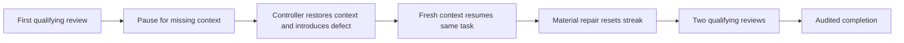
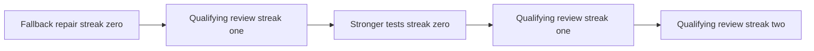

# Improve repeat study — protocol, results and evaluator improvements

**Status: completed on 2026-09-14.** All 24 autonomous and three controlled rows
have retained terminal grades, external requalification and fresh semantic
audits. The [validation artifact](../improve-repeat-validation.json) records the
schedule, original judgments and grades, evidence hashes, comparisons, token
receipts, environment checks and inspected failures. The frozen protocol below
was established before these results; supplementary procedures are labeled.
This study changes the evaluator, not Improve, Until Loop, installed skills or
marketplace entries.

```mermaid
flowchart LR
    Freeze[Freeze source and harness] --> Prepare[Prepare isolated trial]
    Prepare --> Execute[One fresh agent invocation]
    Execute --> Capture[Capture stable snapshots and events]
    Capture --> Requalify[Run oracle and mutation checks]
    Requalify --> Audit[Fresh read-only semantic audit]
    Audit --> Grade[Retain pass fail or incomplete]
    Grade --> Compare[Compare first reviewed snapshot to final]
```



The same agent may make several decisions within one Improve invocation. The
diagram's execution step is therefore one host invocation, not one review. A
callback, command retry, verifier action, or transport cycle is evidence to
inspect; it never creates a completed review by itself.

## Autonomous results — 24 completed trials

All 24 final autonomous candidates passed their external behavior and protected
user-work checks. The original workflow grades are **16 pass, 4 fail and
4 incomplete**. Those are different measurements: correct final code does not
establish that every required source read and distinct review has corroborating
evidence. The original grades remain unchanged throughout this report.

`M` means a material review; `Q` means a qualifying trivial/no-change review;
`I` means a claimed review for which completion was not supported. Counts below
are supported **completed reviews**, not commands or runtime callbacks.

| Fixture | Repetition 1 | Repetition 2 | Repetition 3 |
|---|---|---|---|
| `blank_fallback` | 001: incomplete; M,I,Q; 2 | 009: fail; M,Q,M,Q,Q; 5 | 017: pass; M,Q,Q; 3 |
| `clean_control` | 002: pass; Q,Q; 2 | 010: pass; Q,Q; 2 | 018: pass; Q,Q; 2 |
| `csv_contract` | 003: pass; M,Q,Q; 3 | 011: fail; M,Q,Q; 3 | 019: pass; M,Q,Q; 3 |
| `tenant_cache` | 004: pass; M,Q,Q; 3 | 012: pass; M,Q,Q; 3 | 020: pass; M,Q,Q; 3 |
| `decline_suggestion` | 005: pass; Q,Q; 2 | 013: incomplete; Q,I; 1 | 021: incomplete; Q,I; 1 |
| `commit_retry` | 006: pass; M,Q,Q; 3 | 014: pass; M,Q,Q; 3 | 022: fail; M,Q,Q; 3 |
| `weak_tests` | 007: pass; M,Q,Q; 3 | 015: pass; M,Q,Q; 3 | 023: fail; M,Q,Q; 3 |
| `invalid_test` | 008: incomplete; M*,Q,Q; 2 | 016: pass; M,Q,Q; 3 | 024: pass; M,Q,Q; 3 |

For 008, `M*` is the auditor's material classification on an unstable snapshot;
the deterministic grader does not count it as a completed review. This explains
why the row shows three classifications but only two completed reviews.

The distribution across all 24 rows is: two rows with one supported completed
review, six with two, fifteen with three, and one with five. Restricting attention
to the 16 workflow passes gives four clean runs with two reviews and twelve
defective runs with three. The remaining eight rows stay in the denominator;
their failures cannot be hidden by reporting only the successful sequences.

This answers the iteration question within the exercised fixtures: a passing
repair generally consisted of material work followed by two actual qualifying
reviews. It does **not** establish a required three-review minimum. Correct
candidates can finish after two qualifying reviews, and a later material finding
resets the streak and may require more reviews. The five-review example below
shows that reset and an observed improvement in test sensitivity.

### What failed, and what the evidence can establish

| Original result | Rows | Decisive observation | Interpretation |
|---|---|---|---|
| Fail | 009, 011, 022, 023 | Frozen source-read detector rejects relative or computed command paths; complete file contents and unchanged package hashes remain in evidence | A detector limitation, not an observed behavioral failure; original fail stays intact |
| Incomplete | 001, 013, 021 | Parent-authored review reports lack sufficient retained child exchange | Missing review provenance; cannot conclude whether a child actually ran |
| Incomplete | 008 | One intermediate snapshot changed during capture | Missing stable intermediate evidence; green final checks cannot repair the gap |

The study's response is to improve evidence retention and diagnostics, retain
all scheduled outcomes, and separate behavioral improvement from workflow proof.
It does not weaken convergence or silently reinterpret the frozen grades.

### Matched comparisons and independent quality judgments

There are **22 usable first-completed-review to final comparisons**. None adds a
newly passing held-out behavior assertion after that first completed review;
none regresses one. Trial 009 changes `tests/test_formatter.py` and supplies the
exploratory test-sensitivity improvement described below. The other 21 usable
pairs have identical scoped files at those two observation points. Trials 013
and 021 remain incomparable because the selected grades do not bind their final
candidates. An empty list of newly passing assertions in an incomparable row
does not mean that a valid no-change comparison was made.

The separate blinded initial-to-final static reviews preferred the final version
in all 18 defective trials. Four clean comparisons were `same`, and two were
unavailable because of missing final binding. Thus the full qualitative
denominator is 24: **18 final, 4 same, 2 unavailable**. These are fresh reviewers'
judgments of retained code and tests; they do not replace the workflow grades or
establish that the reviewers ran tests. The comparison protocol was selected
after the first four audits and remains supplementary.

### Observed autonomous execution time and tokens

Across the 24 primary Improve invocations, observed host elapsed time ranges
from **443.46 to 981.76 seconds**, with a median of **648.845 seconds** and a sum
of **15,485.10 seconds**. The sum is accumulated invocation time across concurrent
workers, not end-to-end study duration. It excludes the separate auditors and
static reviewers.

All 24 primary hosts expose one top-level usage receipt. Their recorded fields
sum to 40,611,279 input tokens, 38,077,312 cached input tokens, 438,602 output
tokens, zero cache-write input tokens, and 69,872 reasoning output tokens. These
are the provider's observed fields; they are not mutually additive cost buckets.
The report neither adds cached input to input nor reasoning output to output to
invent a total. Child, auditor and comparison-reviewer usage may be absent, so
these figures are not total system cost and are not a quality metric.

## Controlled-resume results — three passes



All three controlled trials passed with four supported completed reviews:
**Q,M,Q,Q**, producing streaks **1,0,1,2**. Each combined record verifies two
invocations, the initial pause, the controller's preserved state/history, the
repair, final behavior and preservation, and final candidate binding. These
three passes are a separate recovery cohort, not additions to the 16 autonomous
workflow passes.

| Trial | Initial invocation seconds | Continuation seconds | Combined observed seconds | Reviews | Original grade |
|---|---:|---:|---:|---|---|
| 025 | 327.55 | 607.58 | 935.13 | Q,M,Q,Q | pass |
| 026 | 359.11 | 572.23 | 931.34 | Q,M,Q,Q | pass |
| 027 | 302.22 | 609.37 | 911.59 | Q,M,Q,Q | pass |

For an actual trace, trial 025's first review binds `initial-0002`, where the
formatter satisfies the public blank-value fallback. After the recorded pause,
the controller restores the public review context as an untracked dependency.
Its scoped commit `e5cd609335fd24c1777be9800011c59b07556baa` deliberately
removes the fallback from `formatter.py`. Snapshots `continuation-0000`
through `continuation-0002` fail
the behavior oracle. The fresh agent repairs the formatter in commit
`eb766a57cae65d8584c4319397ca09316520b67f`, then completes two qualifying
reviews. The auditor binds completion to stable snapshot `continuation-0006`.

The final scoped product files equal the original clean files. That does not
mean no work occurred: the retained intermediate failing snapshots, controller
commit and agent repair commit show the regression and recovery. Comparing only
the two passing endpoints would conceal that sequence. Conversely, labeling
those intermediate failures as agent-created regressions would incorrectly
attribute the evaluator's intervention to Improve.

The six primary-host usage receipts for this separate cohort record 8,530,903
input tokens, 7,989,632 cached input tokens, 82,700 output tokens, zero
cache-write input tokens and 11,387 reasoning output tokens. The same exclusions
and non-additivity boundaries apply as in the autonomous cohort.

### Final environment and preservation checks

The final check matches the prelaunch batch manifest, saved runner, full frozen
harness tree and all five separately recorded harness module hashes. All 27
frozen source-package inventories are unchanged. All 30 primary host records
are retained: 24 autonomous plus two invocations for each of the three controls.
The observed configured model/effort and CLI version also match the prelaunch
record; this is a configuration observation, not authenticated server identity.

All 27 final candidates pass protected user-work checks. All six autonomous
clean candidates retain identical scoped files and no commits after their
baseline. Two of those six still lack sufficient semantic final-review binding;
mechanical file preservation does not repair that missing proof.

Full raw transcripts, snapshots, original grades and reproducer scripts remain
local under `/Users/dadleet/src/until-loop-quality-validation/repeated-20260914`.
The committed JSON is a compact evidence record with hashes and original
judgments, not a publication of those full raw directories. The independent
static assessments, exploratory mutation probe, and four confounded setup
starts remain separately labeled within it.

## Scope and study matrix

This is the remaining repeated-study phase of the accepted plan. It schedules
**24 new autonomous trials**: each of the eight implemented fixture IDs runs
three times in a fresh root. It also schedules **three separate controlled-resume
trials** that preserve the original Q4 recovery coverage. The controlled results
are never added to the autonomous cohort or used as autonomous discovery
evidence.

| Population | Fixture or protocol | Repetitions | Trial roots | Invocation rule |
|---|---|---:|---:|---|
| Autonomous clean | `clean_control`, `decline_suggestion` | 3 each | 6 | One fresh Improve invocation per root |
| Autonomous defective | `blank_fallback`, `csv_contract`, `tenant_cache`, `commit_retry`, `weak_tests`, `invalid_test` | 3 each | 18 | One fresh Improve invocation per root |
| Controlled recovery | Q4 controlled-resume on `clean_control` | 3 | 3 | Two verified invocations per combined result |

The scheduled total is 27 new trial roots. Only the 24 autonomous roots form
the repeated autonomous study. A controlled root has two actual agent
invocations, but neither that fact nor controller activity turns it into two
autonomous trials.

### Mapping the original Q1–Q8 plan to the implemented fixtures

| Original plan item | Repeat-study implementation | Population | Reason for treatment |
|---|---|---|---|
| Q1 | `blank_fallback` | Defective autonomous | Missing documented fallback with visible green tests |
| Q2 | `clean_control` | Clean autonomous | Correct counterpart requiring real no-change reviews |
| Q3 | `csv_contract` | Defective autonomous | Quoted parsing, diagnostics, and continuation behavior |
| Q4 | Controlled-resume protocol on `clean_control` | Separate controlled | Tests a pause, evaluator intervention, fresh continuation, and streak reset; it is not autonomous discovery |
| Q5 | `tenant_cache` | Defective autonomous | Tenant identity is missing from the cache key |
| Q6 | `decline_suggestion` | Clean autonomous | Current requirements must outweigh a harmful suggestion |
| Q7 | `commit_retry` | Defective autonomous | One fixture-local commit-hook failure and normal retry remain evidence within one review |
| Q8 | `weak_tests` and `invalid_test` | Defective autonomous | The original paired Q8 branches are separate implemented fixtures: skipped required coverage and a contradictory expectation |

The Q8 split is why the autonomous matrix has eight fixture IDs even though the
older plan numbered Q1–Q8 and gave Q4 a controlled role. Keep the two Q8 variants
separate in every report; they test different failure modes.

## Frozen inputs and environment record

The study freeze records the intended host settings, and every trial binds the
frozen harness and package through its batch and trial manifests. The existing
observer also records the CLI version during execution. Host invocations inherit
the configured model and reasoning effort; they do not pass a model override.
The coordinator's `freeze.json` and `orchestrator-freeze-neutral.json` retain the
observed configuration separately from the batch manifest. Those receipts and
the end-of-study configuration check are hashed in the final validation record.
They establish observed configuration, not per-invocation model-server identity
or a hermetic environment. A detected mismatch requires inspection and must not
be silently normalized to the current checkout; the current deterministic grader
does not itself validate model/effort telemetry.

| Input | Frozen value or rule |
|---|---|
| Harness | `whichguy/until-loop` commit `ee8f373c3c799d18ae6233b1f40f59e2fe073ddc` |
| Improve source | `whichguy/skill-craft` commit `d8b8432beb6d3cef26e4402a80f8e778f64f129d`, extracted from `skills/improve` |
| Model configuration | `gpt-6-astra` with `ultra` reasoning effort |
| CLI | Codex CLI `0.154.0` |
| Fixture and grader | Record fixture bytes, request, seven-message history, source-card/policy/package hashes, runner/grader hashes, and configured limits |
| Host record | Record the command configuration, CLI version output, platform, start/end times, and any available token accounting |

The configured model and CLI are study conditions, not a comparison with another
model, a claim that the model is universally reliable, or a claim that a token
total measures quality. If a token field is unavailable, record it as unknown;
do not infer or estimate it.

Freeze Improve from the pinned source archive or checkout, not a development
symlink or an installed copy. Each candidate and evidence directory receives a
new root. The frozen package may be read by the working agent; the evaluator's
answer keys and held-out checks are not part of the agent's intended prompt.

## Dispatch and isolation discipline

Create the complete 27-row dispatch manifest before starting work. Give every
row a stable ID such as `auto-r01-blank_fallback` or
`controlled-r02-clean_control`, its repetition number, population, frozen
hashes, and a unique candidate/evidence root.

Descriptive IDs belong only in evaluator metadata. Physical paths visible to
the working agent use opaque names such as `autonomous/trial-001`; they must
not contain fixture IDs, planted-defect names, solutions or expected counts.

Run at most **four trial workers concurrently**. A worker owns exactly one root
and may not share a candidate checkout, `.until-loop` state, evidence directory,
or auditor directory with another worker. The scheduler may launch a replacement
only after a worker's current row reaches a retained terminal study status.

For an autonomous row:

1. Prepare the fresh fixture and verify the initial behavior oracle, protected
   user-work inventory, source package, and reference preflight.
2. Invoke Improve once in a fresh context with its ordinary-language request.
   Do not tell it the planted defect, the reference repair, a desired review
   count, a prior trial's finding, or the expected classification.
3. Let the selected package choose work, checks, continuation, and exit. Do not
   send a follow-up user prompt to manufacture iteration or coach a repair.
4. Retain user-visible output, command events, durable notes, Git facts, and
   stable snapshots. The observer does not submit an assessment for the agent
   or write a review conclusion.

The existing safety ceilings remain evaluation ceilings, not new Improve policy:
budget exhaustion, an action cap, or a review ceiling produces `incomplete`.
It does not justify a synthetic completion record.

## Running the repeated study

The batch launcher is opt-in. The deterministic test suite never starts the
live model. These arguments configure the evaluator; they do not replace the
natural-language Improve request or decide its continuation condition.

First extract the pinned harness into a new directory. The batch stores its
complete tree digest and checks that digest before each dispatch session. Run
these commands from the current evaluator checkout containing the new batch and
analysis scripts; those orchestration scripts are not present in the older
frozen harness archive:

```bash
cd /path/to/until-loop
mkdir -p /path/to/study/frozen-harness
git archive ee8f373c3c799d18ae6233b1f40f59e2fe073ddc | tar -x -C /path/to/study/frozen-harness
python3 tests/improve_quality_batch.py prepare \
  --root /path/to/study/batch \
  --harness-root /path/to/study/frozen-harness \
  --source-repo /path/to/skill-craft \
  --revision d8b8432beb6d3cef26e4402a80f8e778f64f129d \
  --repetitions 3 --controlled-repetitions 3
python3 tests/improve_quality_batch.py run \
  --root /path/to/study/batch --concurrency 4
```

`prepare_batch()` writes `batch.json` and its SHA-256 freeze record before
preparing all 24 autonomous candidates. Preparation failure retains the manifest and any roots already
created. `run_batch()` refuses missing autonomous candidates, a changed frozen
harness, a changed manifest, invalid cohort/path entries or malformed terminal
receipts. Controlled roots are prepared later by their existing `run-all`
wrapper, which owns both phases.

`run_batch()` holds a process lock while it dispatches workers. Before launching
a row it appends a `launched` receipt to `attempts.jsonl`; the final receipt records
`pass`, `fail` or `incomplete`. A previous `launched` receipt prevents that root
from ever being launched again, including after an orchestrator crash. Missing
finished evidence remains visible as unfinished.

A non-pass stops new dispatch. To pause new work manually, create
`STOP_DISPATCH` in the batch root. In-flight workers retain their evidence and
finish; the marker does not kill them. Inspect the cause and write a separate
inspection record before removing a manual marker or continuing past a non-pass:

```bash
python3 tests/improve_quality_batch.py run \
  --root /path/to/study/batch --concurrency 4 --continue-after-inspection
python3 tests/improve_quality_analysis.py \
  --batch /path/to/study/batch --output /path/to/study/analysis-01.json
```

The continuation flag permits only unattempted scheduled roots. It does not
retry a completed judgment or rewrite a failed candidate. The analyzer reads the
entire schedule, including queued controlled rows, so unprepared trials cannot
disappear from the denominator. Choose a new analysis output filename each time;
exclusive creation prevents overwriting a prior report or judgment.

The analyzer validates the same frozen manifest before importing any scheduled
row. It also requires trial case/mode agreement and contained evidence/audit
paths. A structurally malformed claimed pass remains an explicit integrity
incomplete, not a passing result from a sibling directory. These checks detect
accidental drift and mismatched data; the freeze file is not a cryptographic
signer or an operating-system boundary against a process able to rewrite both
it and the manifest.

This particular study began before the separate `batch-freeze.json` admission
check was added. Its manifest hash was already recorded in
`orchestrator-freeze-neutral.json` before launch. Analyze such an older batch by
supplying that previously recorded digest explicitly:

```bash
python3 tests/improve_quality_analysis.py \
  --batch /path/to/study/batch-neutral \
  --manifest-sha256 72e6c18a67e987fa313c5524d49ecdcca10355870d8efd191e784ba4e451b5c9 \
  --output /path/to/study/analysis-02.json
```

Do not compute and accept a replacement hash from a suspect current manifest.
The new guard was tested deterministically; the live cohort continues using its
separately saved original runner and prelaunch freeze record. Later diagnostic
and admission changes do not retroactively change the frozen trial outcomes.

For example, if `trial-003` fails while `trial-001`, `trial-002` and `trial-004`
are running, the scheduler stops refilling those slots and preserves all four
outcomes. After inspection, continuing selects `trial-005` onward. It cannot
turn the existing `trial-003` result into a success by invoking it again.

## Per-trial qualification and semantic audit

Each completed run, including each controlled combined result, receives all of
the following before it can be reported as a pass:

1. **Independent behavior requalification.** Check held-out public behavior on
   the final candidate and applicable stable material snapshots, including
   previously valid behavior.
2. **Test-sensitivity requalification.** Run the baseline suite and a meaningful
   restored-defect mutation in disposable copies. A mutation timeout, loader
   error, or surviving mutant is incomplete or failed evidence, not a passing
   test result.
3. **Preservation and provenance checks.** Verify protected content, index and
   pending status; verify frozen source/card/policy reads and the final candidate
   binding. A copied byte sequence alone does not prove preservation.
4. **Fresh semantic audit.** Start a separate read-only auditor with the actual
   snapshot catalog and retained record. It receives no desired result count,
   fixture answer key, reference solution, host streak claim, or prior auditor
   conclusion. It must classify review-cycle candidates, cite real evidence,
   distinguish unknown/incomplete from qualifying evidence, and bind the final
   qualifying review to the final observed candidate.
5. **Deterministic grade.** Recompute the streak from the auditor's cited
   records. Material work resets it; incomplete or unknown evidence cannot
   advance it; two qualifying reviews after the final material work are needed
   for convergence. A retry or callback remains supporting evidence, not a row
   in the review sequence.

A valid completed semantic judgment is immutable for that trial even when it is
unfavorable. An audit transport failure before any judgment may receive a
separately named retry directory, with the original retained. Do not reroll a
completed auditor verdict, replace a bad result with a preferred answer, or feed
an audit finding back to the working agent.

## Controlled-resume protocol

Each of the three Q4 trials starts from the clean-control fixture and follows the
existing controlled-resume wrapper. The first fresh agent must complete a real
review and reach the requested dependency pause. Only after that durable pause
is observed may the evaluator restore the public context and inject the visible
regression in its own scoped commit. A second fresh agent then resumes the same
task.

The controller must never write Until Loop state/history or synthesize review
receipts. The combined audit must record `execution_mode: controlled_resume`,
`invocation_count: 2`, and verified pause/intervention provenance. It must
separately reconstruct the initial review, post-intervention material review,
and later qualifying reviews. Controller actions, the pause, and the resume are
not reviews. A combined result with incomplete provenance remains incomplete and
is preserved rather than moved into either autonomous cohort.

The final study artifact separately binds the initial, continuation and combined
observations, both host records, their trial manifests, and the controller's
`intervention.json` and `condition-observed.json`. These appear under
`controlled_resume_evidence`, with file hashes, recorded phase facts and explicit
missing paths. This additional compilation step matters because the general
analyzer's combined-grade hashes and elapsed fields alone do not bind every
underlying phase record. A missing phase remains unknown; a combined summary is
not used to invent it.

## Failure handling and dispatch pause

Pause new dispatch immediately when any row has a host/fixture error, behavior
failure, mutation failure or inconclusive mutation, preservation failure, source
integrity failure, missing stable evidence, audit/grade failure, or incomplete
result. Already-running workers finish and retain their evidence; the dispatcher
does not refill those slots while the triggering record awaits inspection.

The inspection record must identify whether the issue is a product outcome,
fixture defect, harness defect, infrastructure failure, or ambiguous evidence.
Keep the original root, events, snapshots, audit attempts, and status. A later
retry is a new labelled row, never a replacement for the original. Do not patch
the candidate and count the repaired state as the original trial's pass.

## Matched comparison and reporting

For every terminal row, retain a matched comparison from the **first stable
snapshot cited by a completed review** to the final observed snapshot. Record at
least: both snapshot IDs and candidate digests, classifications in between,
behavior-oracle results, test-sensitivity result, protected-state result,
commits, completed-review sequence, qualifying streak, elapsed host time, and
token count when available. If there is no usable first reviewed snapshot or no
final stable snapshot, report the comparison as incomplete.

The comparison describes observed change within that trial. It does not prove
that repeated review caused the change or is superior to a one-review approach.
Keep the following populations separate:

| Report group | Required treatment |
|---|---|
| Clean autonomous | Report all 6 rows, including no-change outcomes and unnecessary churn |
| Defective autonomous | Report all 18 rows, including repairs, regressions, and incomplete outcomes |
| Controlled resume | Report all 3 combined results separately, with both invocation records and controller provenance |
| Infrastructure and audit attempts | Retain failures and transport retries outside a replacement-success count |

Report counts, sequences, elapsed times, and observed token fields when present.
Do not convert these small, same-host repetitions into a reliability percentage,
a general production success claim, or a required universal number of reviews.

### What the comparison actually establishes

`analyze_trial()` selects the first review marked completed in the retained
semantic grade. `bound_snapshot_comparison()` then requires both snapshot IDs,
stable snapshot flags and matching candidate digests from that selected grade's
observation catalog. Each behavior result comes from `snapshot-oracles.json`
under the corresponding snapshot ID. An older base `final-oracle.json` cannot
stand in for a missing selected final snapshot.

The analyzer reports named assertions that newly pass, regress or remain
unknown, alongside changes to scoped paths. An incomplete comparison cannot
contribute to the aggregate counts for additional repairs or regressions. A
trial may have a comparable candidate pair and still have an incomplete review
sequence: product behavior evidence and proof of distinct reviews answer
different questions.

For a concrete observed example, the first repeated CSV trial starts with a
failing behavior oracle. Its first supported completed review is material and
binds snapshot `s0002`; the final review binds `s0005`. Both snapshots pass the
held-out behavior assertions and have identical scoped files. The auditor
accepts three completed reviews, but the comparison records no assertion newly
passing after the first completed review. This is evidence of repair followed
by confirmation, not evidence that those later passes repaired another defect.

In a controlled-resume trial, the evaluator deliberately changes the candidate
after the first review. A failing post-first snapshot in that cohort is labeled
as an observed evaluator-intervention cohort result. It cannot be counted as an
autonomous regression caused by Improve. Likewise, observed primary-host token
receipts are not total system cost: child usage may be missing, and cached input
is retained as a separate field rather than added to new-input or money totals.

## Supplementary independent code-quality comparisons

The original plan also calls for independent quality review. Its concrete
blinding procedure was specified after the first four repeated audits, so these
comparisons are supplementary qualitative observations, not a prospectively
frozen primary endpoint.

Each autonomous trial supplies its initial and final stable scoped files to a
fresh read-only reviewer. Copies use opaque `pair-NNN/left` and `right` paths;
a deterministic shuffle chooses orientation. The orientation key, trial identity,
audit result and evaluation metadata stay outside those input directories. The
reviewer sees the README requirements, product code and tests, but neither the
fixture label nor an expected winner. It is asked for `left`, `right`, `same` or
`unknown`, with reasons, residual findings and source references. It cannot run
candidate code, inspect the evaluator, or modify a candidate.

The reusable preparation command verifies initial/final snapshot identity,
stability, recorded purpose and each copied file's hash and length before
creating new inputs:

```bash
python3 tests/improve_quality_pairs.py prepare \
  --trial /path/to/study/batch-neutral/autonomous/trial-001 \
  --output /path/to/study/quality-comparisons/pair-001 --seed 20260915
```

It creates only `left/` and `right/` inside the pair directory. The sibling
`pair-001-orientation.json` is evaluator-only metadata. Existing outputs,
sibling-trial evidence pointers, unstable snapshots, metadata paths, symlinks
and mismatched retained snapshot purposes are rejected. An incomplete semantic
grade may still yield a static pair when its initial/final candidate bindings
are valid; the original status remains recorded and is never promoted to pass.

These reviewers run as fresh collaboration `review-skeptic` agents, separate
from the frozen headless Improve and sequence-auditor invocations. Their original
returned assessments are retained with agent identity; the coordinator decodes
orientation only afterward. No completed answer is rerolled and no finding is
fed back to an original Improve invocation.

A preference is not a test result or a replacement for the original grade.
Missing test cases, unspecified input types and speculative enhancements remain
observations to adjudicate against current requirements. For example, a note
about non-string input does not establish a defect in a string-typed formatter
whose public contract specifies strings. Likewise, identical clean-control
snapshots may validly receive `same` even when a reviewer can imagine additional
coverage. Keep such observations visible without manufacturing edits to extend
the loop.

For this execution, the coordinator retains each actual fresh-agent answer in
`quality-comparisons/pair-NNN-assessment.json`, with format
`improve-independent-pair-review/v1`, the agent identity, a provenance statement,
and the original JSON assessment. Its fields are `pair_id`, `preferred`
(`left`, `right`, `same`, or `unknown`), `confidence`, `reasons`,
`residual_findings`, and `evidence`. The coordinator copies the returned answer
without changing its substance; this is a retained manual collection step, not
an automatic model-grading engine. The first four pairs use the shared
`orientation-first-four.json` key; subsequent pairs use their individual
`pair-NNN-orientation.json` sidecars. The final validation artifact records the
decoded preference, original answer and orientation hashes, and all scheduled
rows, including any unavailable comparison.

## Improvements prompted by observed failures

These changes affect future evaluator runs. The repeated cohort keeps its
original frozen observer and grader, and none of the new diagnostics can turn an
original failure or incomplete result into a pass.

### Separate capture failure from candidate quality

An intermediate snapshot in `autonomous/trial-008` changed during capture. Its
final candidate passed the behavioral checks, but the frozen observer correctly
kept the trial incomplete. The older record cannot identify which paths or Git
facts changed. A green final snapshot cannot reconstruct that missing evidence.

The updated `capture()` now records the changed inventory paths, before/after
inventory hashes, HEAD values, and index hashes. The stable predicate is still
the conjunction of equal inventory, equal HEAD and equal index. For example,
the deterministic drift test changes only the observed `formatter.py` digest:
the snapshot reports `inventory_changed_paths: ["formatter.py"]`, stable HEAD
and index, and `stable: false`. The diagnostic identifies the observed
difference without guessing who caused it.

A copy exception is different from a completed but unstable snapshot. The
previous exception branch deleted its partial directory despite a comment
claiming retention. `capture_attempt()` now moves partial bytes into a unique
`capture-attempts/aNNNN/partial-snapshot` directory and writes `attempt.json`
with the reason, error, intended successful snapshot ID and evidence reference.
The next successful observation may use that successful snapshot ID, but the
failed attempt retains its own ID and still makes the run incomplete. Tests
inject a mid-copy failure and verify that its bytes survive, the final capture
does not contain those bytes, and no successful review is invented.

### Separate source bytes from source-read receipts

Four observed failures illustrate why a combined boolean needs its contributing
facts. Trials `009` and `022` read policy and adapter through relative `cat` paths. Trial
`011` resolved the selected package directory and read those files through a
Python loop; trial `023` used Python expressions relative to the resolved card's
parent. The frozen command-text detector did not recognize these forms.
All four retain the complete policy and adapter output; independent inspection also
found the frozen package files unchanged. Their original grades remain `fail`.

The new observer records `frozen_source_digest_matches`,
`read_receipts_complete`, the individual receipt flags, and
`forbidden_access_observed`. The combined `source_integrity` condition still
requires unchanged source, recognized reads and no observed forbidden access.
An audit recheck has its own diagnostic field and cannot erase an earlier
combined failure. This change explains rejection; it does not relax the parser,
authenticate every physical read path, or prove filesystem isolation.

### A concrete observed benefit of a later review



Trial `009` has five auditor-supported completed reviews: material, qualifying,
material, qualifying, qualifying. The first material review repaired the blank
fallback. The later material review strengthened coverage for preserving
internal Unicode whitespace, resetting the qualifying streak to zero. Its
final product behavior was already correct after the first repair; this later
change improved test sensitivity.

An exploratory check compared first-review snapshot `s0002` with final snapshot
`s0007`. In separate disposable copies, the evaluator appended a wrapper that
incorrectly deletes internal NBSP (`U+00A0`) and EM SPACE (`U+2003`) characters.
Both original suites passed. The first-review suite also passed the mutant;
the final suite rejected it with an assertion failure and no test-loader error.
Both suites still contained five test methods: the difference was the inputs
and expectation inside an existing test, not a larger test count. The original
snapshots and failed grade were unchanged.

This probe was selected after observing the later test change. It is an
exploratory example, not a held-out endpoint, another product repair, or proof
that additional reviews generally improve quality. The retained result is
`residual-mutation-009.json`; its reproducer and original grade hashes are
recorded there. A failed setup script attempt is retained separately and ran no
candidate tests before its missing-helper error.

### A remaining gap in independent-review provenance

Trials `001`, `013` and `021` retained parent-written descriptions of an independent
review without enough retained reviewer exchange to support all claimed review
cycles. The fresh auditors marked those records incomplete. This establishes
missing evidence; it does not establish that the reviewers never ran. The
frozen host uses ephemeral execution, and its retained command stream is not a
complete transcript of every possible child-agent interaction.

Trial `013` illustrates the consequence: its first review qualifies, but the
claimed second review is incomplete. The computed streak becomes zero and
`final_candidate_bound` remains null even though current behavior and protected
user work pass. The blinded-pair helper rejects that missing binding, and
`pair-013-unavailable.json` records the rejection rather than manufacturing a
reviewer answer. Trial `021` has the same missing-binding outcome, retained in
`pair-021-unavailable.json`. Both remain unavailable comparisons in the 24-row
denominator.

The existing skill already asks for honest reviewer identity and permits a
labeled self-review when an independent reviewer is unavailable. Repeating that
instruction is not proof that a particular child exchange was captured. A
future host-level provenance experiment should retain actual child exchanges
and test their association with the candidate; this study leaves missing proof
as incomplete and does not change production convergence wording on that basis.

A focused read-only investigation compared the frozen and updated
`read_events()` functions: their source is identical, and both retain every JSON
object except reasoning items. Neither removes collaboration event types,
recipients or returned results. Trial `013` has no collaboration event in its
retained stdout; trial `021` has only a `wait` item with empty recipients and
agent states. Its host-authored report cannot supply the missing transport
provenance. The recorded feature warning in trial `013` is not evidence of a
dispatch failure. These facts rule out the suspected collector filtering loss
in these traces, but cannot distinguish a child that never ran from an exchange
the host did not expose. Ephemeral execution is observed, not established as the
cause. `provenance-investigation.json` retains the function and event hashes.

The smallest discriminating follow-up is a separately labeled disposable run
with one named child, an explicit wait, byte-for-byte raw stdout capture, and a
returned-text receipt tied to the actual child ID. Compare raw non-reasoning
events to the collector output before changing collection or skill instructions.
That additional host experiment was not run as part of this frozen cohort.

## Deterministic regression coverage

The final evaluator changes passed **265 Python tests** on Python 3.14.7 and
Python 3.9, plus **126 shell checks with zero failures**. This is 59 more Python
tests than the frozen 206-test baseline. The suite does not launch live models;
its purpose is to challenge the evaluator's mechanical assumptions independently
of the semantic trials above. Generated plugin-view checks also pass.

| Exercised failure or boundary | Responsible test file | Observable requirement |
|---|---|---|
| Changed manifest, harness drift, overlapping runner, orphaned launch | `tests/test_improve_quality_batch.py` | Refuse dispatch or retain unfinished state; never relaunch a used root |
| A neighboring trial's asserted pass, malformed grade, unsafe path | `tests/test_improve_quality_batch.py`, `tests/test_improve_quality_analysis.py` | Reject the foreign evidence; keep the affected scheduled row visible |
| Missing assertion, unstable snapshot, digest mismatch, stale base oracle | `tests/test_improve_quality_analysis.py` | Report incomplete/unknown comparison rather than an additional repair |
| Controlled intervention and missing phase elapsed time | `tests/test_improve_quality_analysis.py` | Keep controlled observations separate; do not infer a two-phase duration |
| Tampered comparison copy, missing final binding, existing output | `tests/test_improve_quality_pairs.py` | Reject pair preparation without overwriting retained output |
| Inventory/HEAD/index drift and a mid-copy exception | `tests/test_improve_quality.py` | Retain the changed fact or partial bytes; do not invent a stable snapshot |
| A later audit with apparently complete source-read receipts | `tests/test_improve_quality.py` | Preserve an earlier combined source-integrity failure |

For example, `test_missing_assertions_are_unknown_not_repairs` supplies an
assertion present only in one oracle. `compare_oracles()` places it in `unknown`
instead of treating absence as a failure that later became a pass. This matters
because counting that transition as improvement would reward missing baseline
evidence. The separate snapshot-binding tests establish which actual candidate
each oracle describes before any such comparison is admitted.

### Decisions from this study

| Decision | Change or follow-up | Evidence and boundary |
|---|---|---|
| Implemented | Bounded repeat launcher with opaque roots and immutable dispatch history | The first setup leaked fixture labels; all four aborted starts remain retained |
| Implemented | Digest-bound, read-only analysis retaining every scheduled outcome | Missing or foreign evidence must not improve aggregate outcomes |
| Implemented | Blinded static-pair preparation with candidate/file binding | Two missing final bindings become explicit unavailable comparisons |
| Implemented | Capture-failure retention and separate source predicates | Observed drift and command-text parser rejection otherwise collapsed into unexplained failure |
| Keep current policy | Two consecutive qualifying reviews; reset on material work | Clean Q,Q, repair M,Q,Q, and observed M,Q,M,Q,Q all have useful interpretations |
| Defer to a separately frozen experiment | Support more valid source-read command forms | Four complete reads were rejected; widening the detector must also test printed markers, comments, unreachable reads and wrong roots |
| Defer to a host provenance experiment | Capture actual child identity and returned review text | Three incomplete records lack corroborating child exchange; collector filtering was ruled out for the inspected traces |
| Defer causal claims | Compare separately randomized one-review and convergence policies | Within-run snapshots and the exploratory Unicode probe do not establish a causal advantage |

No fixed three- or four-review quota is introduced. No production skill wording
or marketplace revision is changed by this evaluator study. A future source-read
or host-provenance experiment must start with a separately labeled cohort; it
must not overwrite these original outcomes.

## Evidence boundary and result-entry gate

These are unsealed same-host trials. Separate directories, prompts, digests, and
trace checks can support a claim of no *observed* answer-key access; they do not
provide an operating-system read boundary or protect against arbitrary absolute
path, network, or hostile-process access. Any result must retain that limitation.

Every scheduled row remains in the study results. Before a row can be reported
as passing, its record must include the frozen
environment, retained evidence paths and digests, final oracle and mutation
outcomes, preservation/provenance status, auditor judgment, deterministic grade,
matched snapshot comparison, and the terminal status `pass`. An incomplete row
names unavailable evidence explicitly; a coordinator failure without an auditor
judgment remains a coordinator incomplete, not an invented semantic verdict.
The final outcome table is populated only from retained terminal records.

## Retained setup abort — 2026-09-14

The first batch used descriptive fixture IDs in physical paths. Those names
were visible in the agent's working directory and could disclose the test's
intended defect. Four hosts had started when the coordinator found the leak.
The coordinator stopped those hosts, preserved their roots and transcripts,
and recorded an evaluator setup abort. Each observer retained `returncode: -15`
and `trial_status: incomplete`.

These four roots belong to the confounded setup cohort. They are neither valid
repeat-study rows nor evidence that Improve failed. The original batch's
`attempts.jsonl` still contains the four launch receipts; the coordinator did not
invent finished receipts after killing its dispatcher. `evaluator-abort.json`
records why that batch was abandoned.

The replacement batch uses `autonomous/trial-001` and similarly opaque paths.
A deterministic scheduling test checks every physical root against every case
ID. All 24 autonomous roots were recreated and preflighted, and the corrected
launcher and manifest were hashed before the replacement hosts started. The
frozen Improve package and original fixture/grader code stayed at their pinned
revisions. The original evidence remains under `repeated-20260914/batch`; the
replacement schedule is under `repeated-20260914/batch-neutral`.
