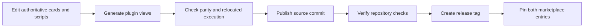

# Publishing Until Loop and Improve



This standalone repository owns Until Loop and Improve. `skill-craft-market`
contains the catalog entries and release references; it does not copy their
skill bodies into the marketplace or the skill-craft monorepo. The initial
release is `v0.3.0-rc.3`, retaining the candidate status of the tested source.

## Source and distribution layout

```text
SKILL.md, agents/, scripts/, references/ authoritative Until Loop resources
examples/improve/                       authoritative Improve package
plugins/
  until-loop/
    .claude-plugin/plugin.json
    .codex-plugin/plugin.json
    skills/until-loop/                  generated Until Loop runtime resources
  improve/
    .claude-plugin/plugin.json
    .codex-plugin/plugin.json
    SKILL.md, scripts/, references/      generated bundled Until Loop resources
    skills/improve/                     generated Improve package
```

The Improve card's `../../SKILL.md` resolves to its plugin's bundled Until Loop
card. Its collector resolves the matching runtime three directories above its
own script. For example, after a host installs the plugin into an arbitrary
cache, `skills/improve/scripts/capture_evidence.py` still finds the same package's
`scripts/until_loop_v2.py`. No host home directory, sibling plugin, installation
order or network download is part of that binding.

Views contain real generated files rather than escaping symlinks. This follows
[Claude's self-contained plugin/cache boundary](https://code.claude.com/docs/en/plugins-reference)
and supplies the [Codex plugin manifest](https://developers.openai.com/plugins/build/plugins).
The tradeoff is duplicated runtime bytes between two installable packages;
deterministic generation and parity checks keep those copies aligned with the
single maintained source. A shared installed runtime would save those bytes but
introduce installation-order and version-coupling requirements.

Marketplace artifacts contain runtime resources, not the experiment workspaces
or full development suite. Validation logs and source hashes in the older
experiment reports describe their original checkpoint and local environment;
publishing does not make those local evidence paths downloadable. The committed
tests and case generators allow new verification from this repository.

## Build and verify

```sh
python3 scripts/sync_plugin_views.py
python3 scripts/sync_plugin_views.py --check
PYTHONDONTWRITEBYTECODE=1 python3 -m unittest discover -s tests -p 'test_plugin_packaging.py'
PYTHONDONTWRITEBYTECODE=1 bash tests/until-loop.test.sh
claude plugin validate plugins/until-loop
claude plugin validate plugins/improve
```

The packaging tests copy each package alone to a fresh location, invoke its
runtime there, and exercise Improve's collector with a separate fixture
repository. This verifies the path that marketplace consumers actually use.
It does not replace the fresh-context semantic experiments or prove that every
model will interpret every request correctly.

### Invocation policy and the Codex validator boundary

Until Loop retains `disable-model-invocation: true` in its canonical card for
Claude's explicit-invocation policy. Its `agents/openai.yaml` supplies Codex's
native `policy.allow_implicit_invocation: false`. Both files are copied unchanged
into the Until Loop plugin. Installing the plugin makes the entrypoint available;
these settings require an explicit request to use the skill.

The bundled Codex `plugin-creator/scripts/validate_plugin.py` inspected during
publication rejects a true `disable-model-invocation` value, even when native
Codex policy is present. Improve passes that validator; Until Loop has this one
known rejection. Do not remove the explicit-invocation policy to silence it.

An actual smoke test with `codex-cli 0.154.0` successfully installed the generated
Until Loop package at `0.3.0-rc.3`. An app-server `skills/list` request then returned
the enabled `until-loop:until-loop` skill from its plugin cache, with its display
metadata and owning plugin ID. The temporary plugin and marketplace were removed
afterward. This verifies installation and discovery in that host version; the
response does not expose invocation policy, and no model execution was used to
measure automatic-selection behavior. Recheck this boundary when upgrading the
host or validator.

Edit source resources, then regenerate views; do not patch generated copies.
Repository CI checks view parity and the full deterministic suite on macOS and
Linux with Python 3.9 and 3.14. A configured matrix describes required checks;
only a completed green run establishes their result for a particular commit.

## Release and catalog update

1. Validate changed source and plugin views, commit them, and push `main`.
2. Check CI on the producing commit before tagging it. Keep plugin names,
   versions and the source skill version consistent.
3. Create and push an unused release tag; never move an existing published tag.
4. In skill-craft-market, append or update only these package entries. Use
   `source: git-subdir`, repository `https://github.com/whichguy/until-loop.git`,
   paths `plugins/until-loop` and `plugins/improve`, and the release tag.
5. Read both manifests back from the published tag, verify their versions,
   validate the catalog, and verify host discovery after publishing the catalog.

The two entries use `AVAILABLE` installation and `ON_INSTALL` authentication
policy with the `Productivity` category. They add no app connectors, MCP servers,
hooks or credential configuration. Installation exposes a skill; execution and
local commits follow the user's later request and the skill's existing contract.
