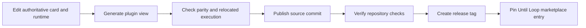

# Publishing Until Loop



This standalone repository owns Until Loop. `skill-craft-market` contains its
catalog entry and release reference without copying the skill body. Improve is
owned and released by [skill-craft](https://github.com/whichguy/skill-craft),
which vendors this repository's callback runtime byte-for-byte under
`skills/improve/runtime/until-loop/`. A runtime change here therefore needs a
matching re-vendor there.

## One runtime

Version `0.5.0` ships exactly one runtime: `scripts/until_loop_ephemeral.py`
with one private temporary file per run, described by
`references/runtime-ephemeral.md`. Every contract carries `context` and every
report carries `handoff`; saved state or reports without them are refused. A
workspace `.until-loop` directory from an earlier release is never read,
continued or migrated.

A source commit/merge does not update an immutable release, marketplace pin,
Skill Craft's vendored copy, or local installed-skill links. Publish those under
their own release scope.

## Source and distribution layout

```text
SKILL.md, agents/, scripts/, references/ authoritative Until Loop resources
plugins/
  until-loop/
    .claude-plugin/plugin.json
    .codex-plugin/plugin.json
    skills/until-loop/                  generated Until Loop runtime resources
```

The view contains real generated files rather than escaping symlinks. This follows
[Claude's self-contained plugin/cache boundary](https://code.claude.com/docs/en/plugins-reference)
and supplies the [Codex plugin manifest](https://developers.openai.com/plugins/build/plugins).
Deterministic generation and the parity check keep the copy aligned with the
single maintained source. The package contains runtime resources, not the
development test suite.

### Local Codex checkout link

When exposing a checkout through `~/.codex/skills`, link the Until Loop entry to
`plugins/until-loop/skills/until-loop`, not the repository or plugin root. Codex
recursively finds cards beneath that entry, so the generated card directory keeps
the local installation to one card and its colocated runtime. Regenerate the view
first, then update only that link:

```sh
python3 scripts/sync_plugin_views.py
mkdir -p "$HOME/.codex/skills"
codex_skill_link="$HOME/.codex/skills/until-loop"
if [ ! -e "$codex_skill_link" ] || [ -L "$codex_skill_link" ]; then
  ln -sfn "$PWD/plugins/until-loop/skills/until-loop" "$codex_skill_link"
else
  printf '%s\n' "Refusing to replace non-symlink: $codex_skill_link" >&2
  false
fi
```

If the guard refuses the existing Until Loop path, inspect and resolve that
user-owned file or directory manually.

## Build and verify

```sh
python3 scripts/sync_plugin_views.py
python3 scripts/sync_plugin_views.py --check
PYTHONDONTWRITEBYTECODE=1 bash tests/until-loop.test.sh
claude plugin validate plugins/until-loop
```

The packaging tests copy the package alone to a fresh location and execute its
callback runtime there. This verifies the path that marketplace consumers
actually use. It does not prove that every model will interpret every request
correctly.

### Invocation policy and the Codex validator boundary

Until Loop retains `disable-model-invocation: true` in its canonical card for
Claude's explicit-invocation policy. Its `agents/openai.yaml` supplies Codex's
native `policy.allow_implicit_invocation: false`. Both files are copied unchanged
into the plugin. Installing the plugin makes the entrypoint available; these
settings require an explicit request to use the skill.

The bundled Codex `plugin-creator/scripts/validate_plugin.py` rejects a true
`disable-model-invocation` value, even when native Codex policy is present. Do
not remove the explicit-invocation policy to silence it.

Edit source resources, then regenerate the view; do not patch generated copies.
Repository CI checks view parity and the deterministic suite on macOS and Linux
with Python 3.9 and 3.14. Only a completed green run establishes their result
for a particular commit.

## Release and catalog update

1. Validate changed source and the plugin view, commit them, and push `main`.
2. Check CI on the producing commit before tagging it. Keep the plugin version
   and the source skill version consistent.
3. Create and push an unused release tag; never move an existing published tag.
4. In skill-craft-market, update only the Until Loop entry: `source: git-subdir`,
   repository `https://github.com/whichguy/until-loop.git`, path
   `plugins/until-loop`, the release tag, and the manifest description.
5. Read the Claude and Codex manifests back from the published tag, verify their
   versions, validate the catalog, and verify host discovery after publishing.
6. Re-vendor the changed runtime files into Skill Craft's Improve package.

The Until Loop entry uses `AVAILABLE` installation and `ON_INSTALL` authentication
policy with the `Productivity` category. It adds no app connectors, MCP servers,
hooks or credential configuration.
