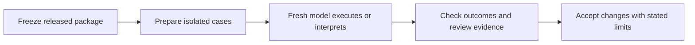

# Release validation and installation follow-ups

## Plan and acceptance criteria



This change keeps the one-file ephemeral runtime, model-owned semantic judgment,
script-owned transitions, and two consecutive qualifying review rule. It improves
installation discovery, release evidence, and CI scheduling without changing the
loop protocol.

The release under test is canonical Improve from Skill Craft commit
`2003cfd5fa33eb8d57a95ed977b09b7c5257c13d`, currently installed at
`/Users/dadleet/src/skill-craft-installed/skills/improve`. The harness extracts
that immutable Git revision and freezes a complete file manifest before fixture
setup. Its bundled Until Loop provenance identifies upstream commit
`458f40ac35c8254906898890c25a784a6e3eb39c` (`0.4.0-rc.2`); the ephemeral runtime
SHA-256 is `6a4131f8a70b56a361556fbc61e924f060ebf1ba5d5f1387a6d6d735e89b4212`.
The frozen complete package must match the selected installed package, and any
later package drift invalidates the probe. Newer Skill Craft main changes are
the base for the CI edit, not a silent substitution of the package under test.

1. **Discovery:** install the public Until Loop leaf, not its whole source
   repository. Exercise a disposable installation with canonical Improve beside
   it. Recursive discovery must find exactly one card for each skill, and the
   installed Until Loop runtime must work from an unrelated working directory.
   Only after this passes, replace the existing local Codex Until Loop symlink;
   preserve all other installed entries and verify card/runtime byte parity.
2. **Release experiments:** reuse existing fixture builders, independent behavior
   checks, source freezing, and model transport. Freeze the exact released
   canonical Improve package and its bundled Until Loop. Preserve old study
   results and old v2 harness behavior. New callbacks use the ephemeral contract.
3. **CI:** run the unchanged complete hermetic matrix on pull requests and main
   pushes, with an explicit manual trigger. Cancel superseded PR runs only.
   Keep the aggregate required check and prevent a skipped/failed shard from
   being accepted. Tags must not start redundant full suites.

## Experiment matrix

| Case | Setup and execution | Evidence needed |
| --- | --- | --- |
| Material repair | Existing blank-fallback seed with narrow green tests; fresh executor per cycle | Actual fix; independent behavior checks; material classification; then two distinct qualifying reviews |
| Clean control | Existing correct seed | Two distinct qualifying reviews, no invented edits or empty commits |
| Later regression | Existing clean seed; controller injects a known defect after the first qualifying review | Fresh executor detects changed candidate; material report resets streak; two later qualifying reviews |
| Global stop | Signed source absent; request explicitly stops all work | Interpretation preserves the global stop instead of performing independent edits |
| Partial blocker | Address source lacks postal code; independent spelling fix remains | Interpretation permits independent work, preserves missing exit evidence, and does not invent data |
| Weak verifier | Narrow test can pass while documentation clause remains unmet | Interpretation preserves the separate documentation requirement and evidence needed for exit |
| Cold active packet | Fresh context receives only the last full packet and transport instructions | Uses exact read-only refresh and callback; retains scope, authority, baseline, and useful findings |
| Terminal packet | Fresh context receives only the final successful receipt | No callback replay or replacement run; completion context remains usable after state deletion |

Repeat the three interpretation cases with independent contexts. The three
semantic scenarios are targeted release probes, not a statistical estimate of
success rate. Retain every attempted outcome; a timeout, missing transcript, or
malformed receipt is incomplete evidence, never a passed review.

## Isolation and grading

- Setup uses new disposable Git repositories, no remotes, exactly seven seed
  commits, protected staged/unstaged/untracked user work, and a separately frozen
  package. No real product repository is an experiment target.
- Oracle definitions and expected sequences stay outside worker prompts and
  workspaces. This is procedural isolation on one host, not an OS-enforced secret
  boundary. Do not describe the oracle as inaccessible.
- Give later executors the actual previous JSON receipt, not a reconstructed
  account or a desired classification. Capture actual stdout and parse it.
- The controller records package hashes and candidate snapshots between cycles,
  when no executor is writing. Protected-work checks and external behavior
  results are independent of the model's report.
- The regression intervention records before/after product hashes and an
  independently failing oracle, while preserving protected work and runtime
  state. It is an uncommitted candidate change: HEAD and the original scope
  baseline remain unchanged until the executing model makes an authorized
  repair commit. A skipped intervention cannot count as this scenario.
- Mechanical packet checks cannot establish that a real review occurred. Retain
  review/check/history records and actual model transcripts for independent
  assessment. Report behavior, protocol, and review-evidence grades separately.
- Receipts are evaluator artifacts, not a new runtime state store. Terminal state
  remains deleted; lost terminal stdout does not gain automatic recovery.
- Keep experiment evidence outside source trees. Deterministic tests use temporary
  directories with cleanup; live experiment evidence is retained for audit.
Model runs are opt-in and excluded from hermetic CI.

## Run a release probe

Use a new opaque directory name so a worker does not learn the intended scenario
from its filesystem path. The explicit revision selects the package under test;
the harness remains reusable for future releases and never silently substitutes
an installed or ambient runtime.

```sh
PYTHONDONTWRITEBYTECODE=1 python3 tests/release_validation.py prepare \
  --source-repo /path/to/skill-craft \
  --revision 2003cfd5fa33eb8d57a95ed977b09b7c5257c13d \
  --root /tmp/improve-probe-a --case repair
```

`prepare` freezes the complete package, seeds the Git fixture, and starts one
real ephemeral runtime with a controller-supplied review contract. It does not
launch a model. This deliberately separates execution/convergence testing from
the natural-language interpretation probes; it does not claim that a model
created this initial contract.

Give a fresh executor only the printed worker prompt. Have the host retain the
actual tool transcript (for example, `codex exec --json` output), and capture the
runtime's raw callback stdout at the printed receipt location. After that one
action the executor stops; the experiment controller dispatches the returned
action to a new context. This is an experimental handoff boundary, not a new
production stop rule.

```sh
PYTHONDONTWRITEBYTECODE=1 python3 tests/release_validation.py checkpoint \
  --root /tmp/improve-probe-a \
  --receipt /actual/printed/done-stdout.raw.json \
  --transcript /actual/host/events.jsonl
PYTHONDONTWRITEBYTECODE=1 python3 tests/release_validation.py packet \
  --root /tmp/improve-probe-a
```

Always use the paths printed for the current attempt. A checkpoint records
protocol and external outcome facts; `recorded` is not a semantic pass. A
separate reviewer reads the captured snapshots and transcript, then supplies an
assessment with a judgment and concrete basis for every recorded cycle. The
`assess` command retains that account separately. The regression case permits
`inject-regression` only after its first qualifying review is independently
assessed. Injection revalidates that assessment against all currently recorded
cycles before changing the candidate. An assessment of cycle one cannot authorize
injection after a later unassessed cycle. Neither the controller nor its oracle
supplies the worker's report.

For read-only interpretation probes, `prepare-nl --root ... --repetitions 2`
uses an already prepared root and creates cases without calling a model. Only the explicit
`run-nl --root ... --run-id first --timeout 600` command launches fresh read-only
hosts. Their output uses `contract_json` containing the actual ephemeral
contract, plus separate explanations of work, continuation, completion and
early stops. Structural acceptance alone does not establish semantic fidelity.

Use `python3 -B` or `PYTHONDONTWRITEBYTECODE=1` for controller inspections as well
as workers. Importing a frozen Python package without that setting can create
bytecode and invalidate a source-integrity comparison even when source code is
unchanged. Retain invalidated attempts and run a separate fresh attempt after
correcting the evaluator setup.

An assessment uses the following shape; include every recorded cycle, preserving
previous judgments. The example is a format illustration, not evidence:

```json
{
  "format": "until-loop-release-validation-assessment/v1",
  "reviews": [
    {"cycle": 1, "judgment": "material", "basis": "Actual transcript and snapshot evidence goes here."},
    {"cycle": 2, "judgment": "qualifying", "basis": "Evidence of a distinct full review goes here."}
  ],
  "unresolved_material_findings": false
}
```

Run `assess --root ... --assessment /path/to/review.json` after independent
inspection. Missing cycles, revised earlier judgments, altered historical raw
callbacks, or classification/streak contradictions fail validation. Raw attempts
and assessment revisions are retained separately; a retry does not overwrite an
earlier incomplete attempt. Snapshot ordinals remain unique across both reviews
and injected candidate changes.

When `packet` reports `complete` or `stopped`, its prompt, receipt, transcript,
and executor-directory fields are null. Do not launch a successor or replay
`done`; the final raw packet remains the evidence and recovery context. This
test controller is not a scheduler, runtime journal, or replacement for the
skill's instructions.

## Verification and delivery

Run focused discovery, release-harness, callback-runtime, and CI-routing tests
first. Then run the complete Until Loop deterministic suite and affected Skill
Craft core checks. Confirm generated package parity and no changes to runtime
bytes or unrelated installed skills. Independently review the final diff and
experiment evidence. Record measured results and limitations below before delivery.

## Results

Validation date: **2026-09-18**. Raw local evidence is retained under
`/Users/dadleet/tmp/until-loop-release-validation-20260918`; this directory is
not part of the published package. Tests and fixtures committed here allow new
runs. No skill card, callback adapter, runtime, review policy, release version,
or marketplace pin changed in this follow-up.

### Installation and deterministic checks

- The disposable discovery regression detects the duplicate cards exposed by a
  whole-repository link, verifies one public Until Loop card beside canonical
  Improve, and executes the callback runtime through that link from another cwd.
- The actual local link now targets
  `/Users/dadleet/src/until-loop/plugins/until-loop/skills/until-loop`.
  Before/after inventories show every other installed entry unchanged. Codex's
  actual `skills/list` with `forceReload` reports exactly one enabled Improve
  and one enabled Until Loop. Codex names the latter `until-loop:until-loop`;
  a namespace prefix is not a duplicate or missing installation.
- The complete Until Loop suite passed **312 Python tests and 126 shell
  assertions**. The 12 new release-harness tests also passed on Python 3.9 and
  3.14. Generated-package parity and whitespace checks passed.
- Skill Craft's core group and 15 group/routing tests passed locally. Its
  unchanged four-group remote matrix and fail-closed `hermetic` aggregate passed
  on [PR 3](https://github.com/whichguy/skill-craft/pull/3), merged as
  `08fb3cac2fa2f7847c80d70c3667b6b40f897a63`. The observed feature branch created
  one PR workflow, without a duplicate push workflow. A later main push remains
  intentionally eligible for the complete suite.

### Fresh-context execution

`M` means independently substantiated material work; `Q` means an independently
substantiated full review with only trivial or no changes. Each completed action
ran in a separate ephemeral Codex CLI context with the actual prior packet.

| Scenario | Observed reviews | Result |
| --- | --- | --- |
| Seeded material repair | M, Q, Q | Repaired the blank-fallback defect, added red-to-green tests, made one scoped learning commit, then completed without cosmetic edits |
| Clean control | Q, Q | Completed two distinct reviews with no edits or empty commits |
| Regression after first qualifying review | Q, M, M, Q, Q | Detected and repaired the injected defect; added independently warranted internal-whitespace coverage in the next review; each material cycle reset the streak before the final two qualifying reviews |

All **10 completed reviews** passed independent semantic assessment and the
separate callback-chain, package-integrity, protected-work, stable-snapshot,
behavior-oracle and test-quality checks. All three runs completed with streak
two, no unresolved material finding, and their ephemeral state files deleted.
The incomplete pre-injection attempt described below is additional to these ten.
The final local evidence index is `final-results.json`.

The clean terminal receipt also passed a separate cold-context probe: the model
reported completion and issued no callback or new work. The state file was gone,
the receipt retained its completion context, and the test controller returned
null executor material.

### Natural-language interpretation

The six eligible probes passed independent semantic and runtime-schema review:
two fresh contexts each for global stop, partial blocker with independent work,
and weak verifier with an unmet documentation clause. All preserved work versus
exit versus continuation, the two-review gate, exact request context, and the
explicit no-commit/no-push/no-publication/no-contact authority. No product work
was executed by these interpretation probes.

There were **eight attempts**, not six: two original attempts were invalidated
when a controller import created Python bytecode in the frozen source tree.
Their source text was unchanged and their interpretations were sound, but they
are not counted as full passes. Both were repeated in new contexts with bytecode
disabled; all six eligible attempts show unchanged package and fixture trees.
Original outputs, integrity failures, and replacements remain retained.

### Lessons and evidence limits

1. **Classify findings, not diff size.** The injected defect was repaired exactly
   back to HEAD. The executor still correctly reported material work and reset
   the streak without inventing an empty commit. A later review proved that the
   tests missed internal-whitespace preservation, added regression coverage,
   and correctly reported that test-only improvement as material. A desired
   fixed number of cycles must not override either finding.
2. **Callbacks establish transitions; reviews establish meaning.** Independent
   assessment used retained source snapshots, full commit messages, actual test
   output, and Codex JSONL. A successful `done` response alone did not earn a
   qualifying verdict. Protected staged, unstaged, untracked and ignored user
   content remained intact. One repair changed raw index bytes for an unknown
   metadata reason; complete index entries and protected contents were equal,
   and this discrepancy remains disclosed in its assessment.
3. **Test the evaluator too.** Pilot use exposed snapshot-number collisions,
   incomplete or rewritable assessments, overwritten failed attempts, missing
   historical-receipt digest binding, and terminal packets that could generate
   another worker prompt. The test-only harness now rejects or preserves these
   cases, with regressions. The production loop needed no new state machinery.
4. **Retain failed attempts honestly.** One executor was stopped before `done`
   after a controller mistakenly dispatched it despite a rejected assessment.
   It produced no callback, advanced no state, and is retained as incomplete;
   the actual regression run used a separate attempt. Five early pilot receipts
   and one incomplete checkpoint predated the digest guard. Receipt metadata was
   reconciled against separately
   retained original stdout, with original metadata backed up. Those hashes
   were measured retrospectively, not at the original checkpoint boundary;
   `pilot-digest-reconciliation.json` records that limitation. Later checkpoints
   use the final digest guard directly.
5. **Keep conclusions bounded.** These are small targeted release probes on one
   host and one frozen package, not a statistical reliability claim, live
   automatic-compaction event, or cross-host certification. Execution fixtures
   used controller-supplied contracts; separate interpretation probes checked
   natural-language expansion. The evaluator evolved during the pilots, while
   the production package stayed frozen. Final deterministic tests cover the
   resulting evaluator; no claim is made that every pilot began with that final
   harness version. Historical study verdicts remain unchanged.

## Follow-up review: 2026-09-19

The follow-up includes Skill Craft source at
`49c7a41e79d294bcfe4d5ce07f54c6a0bafdf950`. Compared with the September 18 frozen
package, canonical Improve's only source change is its version from
`0.2.0-rc.1` to `0.2.0-rc.2`; its bundled Until Loop runtime, adapter and policy
are unchanged. Recent ShipLoop changes keep model execution in the invoking
conversation, remove the package's model-launch transports, and route applicable
coding and project guidance through existing packets. Its standalone Improve
binding still owns its child review loop and returns through the explicit parent
callback. The review preserves those already-adopted contracts and the later
smoke/full CI selection rather than treating September 18's CI policy as current.
No installed checkout, marketplace pin or production loop protocol is changed.

Independent review reproduced a controller bug: assess cycle one as qualifying,
record a later material cycle, then inject a regression without refreshing the
assessment. The old helper accepted that stale boundary. It now uses the existing
assessment validator immediately before injection; the regression verifies
rejection before candidate, runtime, snapshot or manifest mutation. Its failing
pre-fix result is retained with the review evidence.

A new deterministic integration test freezes the real ephemeral runtime into
the fixture package, invokes its exact callbacks, and checkpoints actual stdout
through qualifying, material, qualifying, qualifying reports. It checks the
streak reset, terminal deletion, and absence of a successor prompt. Those inputs
remain synthetic: the controller must leave their semantic reviews unassessed.
This complements the synthetic packet tests without launching a model or
reinterpreting the earlier live study's findings.

Follow-up checks passed: **314 Python tests and 126 shell assertions** in the
complete Until Loop suite, including all 14 release-controller tests on Python
3.9 and 3.14. Current Skill Craft checks passed: Improve package relocation and
plugin parity, seven real CLI composition tests with synthetic judgments, six
model-launch boundary tests, 21 v3 guidance tests, and 19 test-group/CI checks.
This is compatibility evidence for the recent source, not a new live model
study or an installation update.
