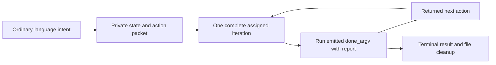

# Until Loop

Until Loop turns an ordinary-language task into one assigned iteration, a
continuation condition, and an evidence-based exit condition. For a new run it
uses one private JSON state file to carry the current callback between agent
turns. The script enforces protocol transitions; the agent still judges what
work is useful and whether the evidence establishes the requested outcome.



The installed card derives the work, continuation, and exit conditions from
the user's request. Its bundled callback runtime creates a unique, mode-600
state file and returns a packet containing the exact `done_argv` for that
file. Perform the packet's full assigned iteration, then send one structured
report to that exact command. The command returns the next packet or a terminal
result. Its returned instruction owns the next action; do not substitute a
different state file, choose a successor yourself, or privately run extra
iterations to satisfy a review gate. Terminal completion or stop removes the
private state file.

## Use after installation

Start a new host conversation and invoke the installed skill explicitly. For
example:

- `Use $until-loop to finish the importer and verify malformed rows.`
- `Dry-run $until-loop on this proposal; show the work and stopping conditions without changing files.`
- `Use $until-loop to reconcile the remaining reports. Stop when all are accounted for or a required source is missing.`

The card intentionally disables implicit model invocation. A parent skill may
load the card and pass ordinary-language intent, but the parent must not issue
the runtime commands itself or inject another loop driver.

A dry run interprets the requested work and conditions without creating a
state file or performing work. A normal run may continue while useful,
authorized work remains and the exit evidence is incomplete. It ends only when
the callback reports a satisfied exit and any configured review gate is met,
or when the callback reports a real block or explicit cancellation.

## Local Codex checkout link

For a local source checkout, link the Codex `until-loop` entry to this generated
card directory rather than the checkout or plugin root. Codex recursively finds
cards below each local skill entry; this target exposes one `SKILL.md` and its
colocated runtime.

From the checkout root, regenerate the view and update the Until Loop link:

```sh
python3 scripts/sync_plugin_views.py
mkdir -p "$HOME/.codex/skills"
codex_skill_link="$HOME/.codex/skills/until-loop"
if [ ! -e "$codex_skill_link" ] || [ -L "$codex_skill_link" ]; then
  ln -sfn "$PWD/plugins/until-loop/skills/until-loop" "$codex_skill_link"
else
  printf '%s\n' "Refusing to replace non-symlink: $codex_skill_link" >&2
  false
fi
```

This link does not install or replace Improve. Keep
`~/.codex/skills/improve` as the separately installed canonical Skill Craft
Improve card; this repository's bundled Improve package is an integration fixture.
If the guard refuses the existing Until Loop path, inspect and resolve that
user-owned file or directory manually.

## Continue through compaction

New runs keep a frozen request/scope/authority/environment/resource context and a
rolling handoff in the same private file. Every successful callback returns them,
the current action/streak and exact commands. Preserve the whole latest response;
a fresh executor uses its read-only `next_argv` to refresh before executing work.
Do not replay the previous `done` invocation. Terminal output remains the receipt
after deletion; losing both that output and state cannot be recovered automatically.

## Bundled runtime and compatibility

The installed card is `skills/until-loop/SKILL.md`. New runs use the colocated
`scripts/until_loop_ephemeral.py` callback runtime. Bind it to the selected
installed card's directory; do not resolve it from the current working
directory, an author checkout, another installed skill, or `PATH`. The package
is self-contained and needs Python 3.9 or later for the callback runtime.
Workspace tools used by the assigned work, such as Git or a test runner, remain
the workspace's own requirements.

The callback file is not shared `.until-loop` state. It can coexist with other
callback runs, including in the same workspace, but concurrent agents still
need to coordinate edits to the same product files and Git index. Existing
version-1 and version-2 durable runs remain available only through their
explicit legacy continuation path. A new callback run neither reads nor
overwrites `<workspace>/.until-loop`; it does not migrate saved runs.

## Package and marketplace state

The package contains runtime resources, not the development test suite or
historical audit workspaces. Its generated files are regular copies, so an
installed Until Loop or bundled Improve package works from an arbitrary cache
without a sibling checkout, symlink, or download.

Pushing a source commit to `whichguy/until-loop` makes that source revision
available for review, but it does not by itself publish this version to the
Skill Craft marketplace. Marketplace consumers receive it only after a new
immutable release tag is created and the Until Loop catalog entry is pinned to
that tag. Improve's canonical marketplace entry remains owned and released by
`whichguy/skill-craft`; this repository's bundled Improve package is the
tested Until Loop integration distribution.

## Development verification

The marketplace package includes the runtime resources needed to operate, not
the development test suite. In a checkout of the matching source revision, run:

```sh
python3 scripts/sync_plugin_views.py
python3 scripts/sync_plugin_views.py --check
PYTHONDONTWRITEBYTECODE=1 python3 -m unittest discover -s tests -p 'test_plugin_packaging.py'
PYTHONDONTWRITEBYTECODE=1 bash tests/until-loop.test.sh
```

The packaging checks copy each package alone to a fresh location. They exercise
the legacy durable adapter and collector for compatibility, then execute the
new callback runtime through its emitted arguments with independent state
files. These checks establish packaged path binding and protocol behavior; they
do not prove that every model will interpret every request correctly.
