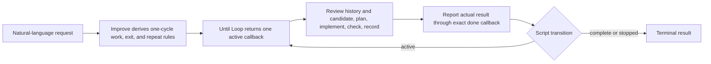
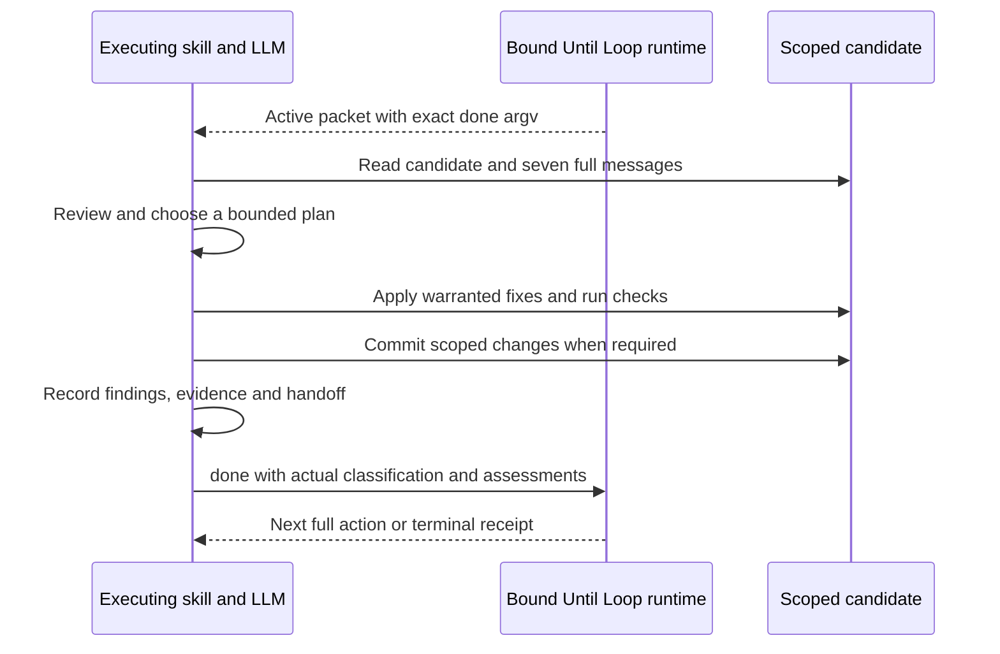
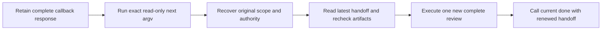

# Improve



Suppose a formatter is meant to return `Anonymous` for a blank display name.
It trims ordinary names correctly, and the tests are green, but blank input
returns an empty string. You ask Improve to review the candidate, make worthwhile
changes, and keep going until two consecutive complete reviews find only trivial
or no changes. This guide follows that illustrative request through the loop.

The first review may need only a one-line repair. That is still material: it
changes behavior. Improve checks the repair and commits it when authorized, but
does not finish just because the tests now pass. Two later distinct qualifying
reviews must still examine the resulting candidate. The script owns that count;
the LLM owns the work and semantic assessment behind each report.

This card is the standalone Improve parent bundled with Until Loop. It leaves
the user-facing interface in natural language. The bound Until Loop card owns
the internal script calls and returns an action packet; Improve carries out the
packet's assigned complete review cycle and reports what actually happened.

## Start with a normal request

Open the repository you want reviewed, then use a request such as:

```text
Dry-run $improve on these changes. Show the scope and stopping conditions without writing files.
Use $improve on the parser changes, preserving its public API.
Use $improve on formatter.py and its tests. Do not stage or commit anything.
Use $improve on these changes and make an audit commit for every completed iteration, including no-change reviews.
```

For the formatter story, a precise request is:

```text
Use $improve on formatter.py and its tests. Preserve the public API and unrelated
work. Review the last seven full Git messages, plan worthwhile improvements,
implement them and run meaningful checks. Continue until two consecutive full
reviews find only trivial or no changes. Commit changed iterations with the
validation and key learnings. Do not push.
```

The file list establishes the edit scope; the history window supplies context.
If an earlier commit explains why whitespace is trimmed, that intent helps the
review. It does not make the last seven commits the diff range or authorize
undoing their decisions. The original baseline remains fixed after this run
makes its own commit.

The request supplies the work and constraints. It does not require runtime
flags, JSON, a state-file path, or a manually managed counter. The bound Until
Loop card interprets it into three distinct pieces:

| Contract piece | What it means for Improve |
|---|---|
| Execution condition | One complete review cycle: read history and candidate, plan worthwhile work, implement authorized fixes, run applicable checks, retain evidence, and make any authorized commit. |
| Exit condition | Current evidence establishes the scoped objective, no unresolved material finding remains, all other requested conditions hold, and two distinct qualifying trivial/no-change reviews have completed. |
| Continuation condition | Another full cycle is allowed while useful authorized work or an evidence gap remains. A real blocker or triggered user stop ends incomplete; it does not turn into success. |

The runtime's numeric gate is two for this standalone skill. It does not turn a
request to run a test thirty times into thirty trivial reviews, and a passing
test suite does not replace the two-review requirement.

## What happens in one callback



An active packet is one assigned iteration, not the entire loop. Execute all of
its work before submitting the exact callback supplied by the script:

1. Read the current candidate and the latest seven reachable commit messages in
   full, or every available message if fewer exist.
2. Review the scoped behavior and adjacent consumers that are needed to assess
   it. Treat history and suggestions as context, not permission to change
   unrelated work.
3. Form a bounded plan. An empty plan is valid only after a substantive review
   finds no worthwhile change.
4. Apply an authorized fix when warranted and run meaningful, current checks.
   Do not stop after review or planning if implementation and checks are part of
   the work.
5. Retain the candidate, findings, plan, actual changes, commands and results,
   lessons, and any commit receipt in the host-visible task record. Make an
   authorized commit after applicable checks pass.
6. Send an honest result through the packet's exact `done_argv`, then consume
   the whole returned packet. If it is `active`, execute its new instruction;
   do not stop merely because a test passed or a review was trivial.

The internal report is not user input. It tells the script what the completed
cycle found. This example describes a hypothetical completed repair,
not evidence that these commands or commits actually occurred:

```json
{
  "classification": "non-trivial",
  "exit_assessment": "unsatisfied",
  "continuation_assessment": "allowed",
  "evidence": "Illustrative only: fixed the blank-name fallback, added a failing-then-passing regression, checked the scoped candidate and committed it as def456. Two qualifying reviews remain.",
  "handoff": "Illustrative only: retain the original baseline and exclusions in context.scope. Current HEAD def456 already contains the fallback repair; recheck it without repeating the edit or commit. Focused checks passed on that candidate. Preserve unrelated user work. Two distinct qualifying reviews remain, and no push is authorized. Detailed observations remain in the retained task record."
}
```

For current context-bearing runs, all five fields are required. The accepted
classification values are `trivial`, `non-trivial`, and `unresolved`; exit values
are `satisfied`, `unsatisfied`, and `unknown`; continuation values are `allowed`,
`blocked`, and `cancelled`. Both evidence strings must be nonblank. `evidence`
describes the current iteration, while `handoff` is a complete compact replacement
for continuity facts, including still-relevant earlier observations.

`trivial` means a distinct complete review found only trivial or no changes,
with applicable current checks and no material finding. `non-trivial` means a
material finding or behavioral change occurred, even if the same cycle fixed
it. `unresolved` means required work, evidence, checks, or assessment is
incomplete. A callback, retry, diagnostic command, or repeated test is never a
separate review.

## State, evidence, and discernment

| Responsibility | Owner | Observable result |
|---|---|---|
| Interpret scope, natural-language conditions, and semantic materiality | Executing LLM | A stated contract and evidence-based assessment |
| Execute the current returned instruction | Improve/LLM | One complete review cycle before the callback |
| Preserve current work, conditions, latest report, and trivial streak | One private temporary state file | An active packet can be rehydrated while its file exists |
| Validate action identity, update the count, and select the successor | Until Loop script | An `active`, `complete`, or `stopped` packet |
| Retain detailed review evidence | Host-visible task record and ordinary command output | Candidate, checks, commit, and lessons available for recheck |

New standalone runs deliberately do **not** call the old collector or create
`.until-loop/working.md` or `.until-loop/evidence/`. The temporary state file
holds the contract, current action identity, streak, and latest report/handoff;
it is not proof
that a command ran or that a review judgment is sound. The host record carries
the detailed observations. See [callback-evidence.md — required host record and
truthful callback summary](references/callback-evidence.md) for the exact
recording rule and examples.

Now follow the formatter beyond its first successful repair:

| Review cycle | Actual outcome | Classification | Streak after `done` |
|---|---|---:|---:|
| 1 | Finds the broken behavior, fixes it, adds a relevant regression, and checks it | `non-trivial` | 0 |
| 2 | Completes a new review with no material finding and current checks | `trivial` | 1 |
| 3 | Completes another distinct review with no material finding and current checks | `trivial` | 2, then terminal if the full exit condition is satisfied |

The script chooses the successor after each row. It does not trust a report as
proof, decide whether a test was adequate, or let an agent privately count
several reviews in one callback.

If review three discovers another material issue, its report resets the streak
to zero even when the issue is fixed immediately. If the original candidate is
already sound, two qualifying reviews can suffice. There is no minimum number
of edits, no requirement to reach three or four passes, and no benefit in
manufacturing cosmetic work.

This is also why an unrun test cannot be treated as a pass, or a callback retry
as a second review. A known missing requirement makes the exit unsatisfied;
unknown behavior stays unknown until the evidence is available. A required
commit that failed leaves the cycle unresolved rather than qualifying.

## Scope, commits, and completion

| Question | Default behavior |
|---|---|
| What gets reviewed? | An explicit file list, branch range, or baseline takes precedence. Otherwise freeze initial HEAD and review initial staged, unstaged, and relevant untracked work together with this run's later edits. In a clean tree, disclose the latest commit's change as the default unless context specifies another candidate. |
| What do the seven messages mean? | Read their IDs, subjects, and bodies every cycle. They inform the plan but do not define the diff range, prove current truth, or authorize unrelated changes. |
| What is material? | Behavior fixes, public-contract changes, security or data-integrity corrections, and missing required regression coverage are material. Non-semantic spelling, formatting, or explanatory polish can be trivial only with evidence behavior is unchanged. Investigate uncertainty. |
| When are commits made? | After applicable checks pass, commit authorized changed work with Review, Plan, Changes, Validation, Key learnings, and Remaining work in the body. Preserve unrelated staged and unstaged hunks, including in scoped files. |
| What if a review changes nothing? | Keep an honest host record. Do not manufacture an edit or empty commit. An explicit audit-commit-every-iteration request permits an identified no-change audit commit without unrelated staged content. |
| Can I prohibit commits? | Yes. An explicit no-commit request overrides the default while retaining the review record. Pushing or publishing needs separate authorization. |
| When is it done? | The exit condition, current relevant checks, and every other requested condition are satisfied, with two distinct consecutive qualifying trivial/no-change reviews and no unresolved material finding. Only the runtime accepts the terminal transition. |

If an explicit user stop is triggered, report `cancelled`. If an obstacle blocks
the assigned work without a triggered user stop, report `blocked`. Both outcomes
are incomplete. If required evidence is missing, use `unresolved` rather than
calling the cycle trivial just to advance the count.

## Preview, interruption, and concurrency

“Dry run,” “preview,” “show how you interpret this,” and “do not execute” show
the proposed scope, history window, one-cycle work, exit rule, continuation
rule, incomplete stops, assumptions, evidence needed, and first action. Preview
does not start or resume a run, create the temporary state file, write loop
notes, edit files, execute task checks, stage, or commit. A later execution
request rechecks the current context.

Every new logical run has its own private temporary state file. Separate runs
can therefore have separate callbacks at the same time. They do not coordinate
project edits, test outputs, Git index changes, or commits within one checkout;
use separate worktrees or deliberate coordination for shared repository work.
One file has one caller at a time. If it is missing or corrupt after an
interruption, the new runtime does not reconstruct it or replay work.

An existing durable v1/v2 Improve run is a separate compatibility path. Continue
it only when explicitly selected, using [legacy-standalone.md — old collector
and checked-record binding](references/legacy-standalone.md) and [legacy-skill.md
— matching durable Until Loop adapter](../../references/legacy-skill.md). New
runs do not migrate into or out of that state.

## Context clearing between iterations



Imagine that context is cleared after review two. The repair is committed and
the worktree is clean. Without the original baseline, the new executor might
select a different candidate; without the latest handoff, it might repeat the
repair or forget which checks ran. The packet carries both kinds of information.

The original scope/base, action authority, environment and exact resource locators
are frozen into the loop contract's `context`. Each report also supplies a complete
rolling `handoff` with candidate/commit identity, applied work, current checks,
still-relevant decisions and gaps. Both come back in the latest `done` response.
A fresh executor therefore keeps reviewing the original candidate after HEAD moves;
it does not infer a new scope or repeat the prior fix/commit.

Retain that full response through compaction. Run its exact read-only `next_argv`
to refresh active state, inspect the returned context/resources and current artifacts,
and then perform the next complete review before the fresh `done_argv`. A previously
executed callback is never a resume command. The bound Until Loop card covers stale
packets, missing state and errors; the same single temporary file owns continuity.

The last report remains data to verify, not authority to widen scope or push.
Keep actual stdout or use a JSON library to serialize it; a manually reconstructed
packet can lose the exact command or damage escaping. At completion the script
deletes the state and returns a terminal receipt with context and the final
report, but no next/done callback. Losing both that receipt and state cannot
establish what happened. Context continuity does not promise recovery of an
abandoned host session.

See [compaction validation — fresh-agent continuation experiment](../../docs/COMPACTION_VALIDATION.md)
for execution evidence and remaining boundaries.

## Installation, release, and verification

This repository bundles Improve as a tested integration example with Until
Loop. Its package-relative card loads the bound `../../SKILL.md`, references,
and scripts, so copying only `SKILL.md` is insufficient. The canonical
`improve@skill-craft-market` package is maintained separately in
[skill-craft](https://github.com/whichguy/skill-craft/tree/main/skills/improve);
updating this repository does not itself publish that marketplace package.

The installed package contains execution resources, not the development tests.
From this repository's source root, run:

```bash
PYTHONDONTWRITEBYTECODE=1 python3 -B -m unittest discover -s tests -p 'test_improve_policy.py'
PYTHONDONTWRITEBYTECODE=1 python3 -B -m unittest discover -s tests -p 'test_release_validation.py'
```

The focused test checks the standalone binding and its policy dependency. The
repository's full deterministic suite additionally checks package generation,
the callback protocol, compatibility adapters, and their isolated consumers. It
does not establish universal model judgment or prove a particular user's
repository has been improved.

The release-validation controller exercises the evidence boundary as well as
the loop. Its real-runtime test consumes actual emitted callbacks across a
material streak reset and terminal cleanup; its supplied judgments remain
synthetic and semantically unassessed. A separate regression rejects a stale
assessment before a controlled defect can be injected into a later candidate.
The [release-validation report — layered checks and recorded experiments](../../docs/RELEASE_VALIDATION.md)
distinguishes those deterministic checks from fresh-model work and independent
behavioral assessment.

The story is finished only when the required work and evidence are complete,
two distinct consecutive reviews qualify, and the runtime accepts completion.
The final response can explain the changes, checks and remaining limitations
after the temporary state has been removed.

- [SKILL.md — standalone binding: full cycle and exact callback](SKILL.md)
- [review-policy.md — reusable review obligations and convergence](references/review-policy.md)
- [callback-evidence.md — host record and callback evidence limits](references/callback-evidence.md)
- [legacy-standalone.md — explicit durable-run compatibility](references/legacy-standalone.md)
- [README.md — Until Loop runtime and release details](../../README.md)
