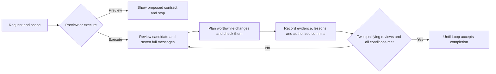

# Improve



This guide describes the Improve integration example maintained with Until Loop.
The `improve@skill-craft-market` package is maintained separately in
[skill-craft](https://github.com/whichguy/skill-craft/blob/improve-v0.1.0-rc.1/skills/improve/README.md).
Use that release's guide for its installation paths and package contract.

Improve reviews a repository candidate, makes worthwhile changes, checks the
result, and continues until two distinct consecutive reviews find only trivial
issues or no changes. It uses the last seven full commit messages as context.
A material finding or fix resets the review count, even if it is a one-line fix.

This skill is a parent of the bundled Until Loop runtime. The agent decides
what work is useful and whether the evidence satisfies the request; Until Loop
records and validates the execution contract and its transitions. The runtime
does not independently judge review quality or count truthful review passes.

## Start with a normal request

Open the repository you want reviewed, then use one of these requests:

```text
Dry-run $improve on these changes. Show the scope and stopping conditions without writing files.
Use $improve on the parser changes, preserving its public API.
Use $improve on formatter.py and its tests. Do not stage or commit anything.
Use $improve on these changes and make an audit commit for every completed iteration, including no-change reviews.
```

Preview inspects permitted context and shows a proposed contract. It does not
initialize or resume a run, edit files, execute task tests, or commit. A later
execution request is needed to perform the proposed work. You do not need to
supply runtime flags, JSON, or a prewritten list of internal steps.

Execution requires a host with filesystem and command access, Git for repository
history and commits, Python 3 for the bundled runtime, and whatever tools the
project's checks require. The recorded compatibility checks include Python 3.9
and 3.14 on macOS; see the [package validation discussion](../../README.md#testing-and-promotion)
for the measured scope. This page does not claim every host or Python release
has been tested.

If the repository has no commits, the agent must disclose the absent history.
An execution that requires commits remains incomplete until that constraint
is resolved; a no-commit request still preserves the other review obligations.

## Scope, commits and completion

| Question | Default behavior |
|---|---|
| What gets reviewed? | An explicit file list, branch range or baseline takes precedence. Otherwise freeze initial HEAD and review the initial staged, unstaged and relevant untracked candidate plus the run's later edits. In a clean tree, disclose the latest commit's change as the default unless context specifies another candidate. |
| What do the seven messages mean? | Read the latest seven reachable messages in full at each review, or all available if fewer exist. They inform the plan; they do not define the diff range or authorize unrelated changes. |
| What is trivial? | Non-semantic spelling, formatting or explanatory polish with evidence that behavior is unchanged. Behavior fixes, contract changes and missing required regression coverage are material. Investigate uncertain impact. |
| When are commits made? | After applicable checks pass, commit authorized changed work with Review, Plan, Changes, Validation, Key learnings and Remaining work in the body. Preserve unrelated staged and unstaged hunks, including those in scoped files. |
| What if a review changes nothing? | Record a distinct substantive review in `.until-loop/working.md`; do not manufacture an edit or empty commit. An explicit audit-commit-every-iteration request also commits an identified no-change audit record. |
| Can I prohibit commits? | Yes. An explicit no-commit request overrides the default. Pushing or publishing requires task authorization beyond the default local commit policy. |
| When is it done? | Two distinct, fully completed consecutive trivial-only or no-change reviews, no unresolved material finding, current relevant checks, and every other contract obligation satisfied. Only the Until Loop adapter accepts the whole run's completion. |
| What does not count as another review? | A repeated test command, callback, retry, recovery step or repeated claim. A blocker, failed required commit, explicit stop or exhausted budget remains incomplete. |

For example, suppose `format_name("   ")` returns an empty string while the
documented behavior requires `Anonymous`. Review 1 finds and fixes the behavior,
adds a meaningful regression, checks the candidate and records a material
iteration: the count is zero. Review 2 finds no remaining worthwhile change and
records current evidence: the count is one. A separate qualifying review 3
reaches two; completion still requires the rest of the contract to hold. This
is an illustration, not a report of a new test run.

## Evidence, interruptions and ownership

Each review retains the candidate identity, findings, plan or no-change reason,
checks, lessons, commit receipt when required, and count before and after in
checked `.until-loop/working.md`. The factual collector keeps candidate and
history records under `.until-loop/evidence/`. It checks declared associations;
it does not prove that a claimed check ran, a reviewer read the evidence, or a
judgment is correct. A material edit invalidates affected evidence. An unchanged
candidate may reuse applicable checks after their relevance is rechecked.

Use a fresh read-only independent reviewer when one is available for a
meaningful second pass. If one is unavailable, disclose the self-review
limitation. Neither a second reviewer nor the collector automatically proves
that a finding is valid; the executing agent still evaluates the evidence.

After an interruption, reconcile actual files, commits, checks and notes with
the pending runtime action. Do not duplicate an already verified commit or
invent a missing review. Resume from durable state in the same workspace; the
agent follows the adapter for the saved state version. Existing version-1 runs
keep their original adapter, and version 2 does not automatically migrate them.

A dependency pause can resume when its recorded conditions are restored under
existing authorization. An explicit user stop retains its specified resume
condition. Neither kind of pause is success. The final inventory preserves
preexisting work and checks unexpected generated files, including ignored test
outputs; cleanup removes only artifacts established as disposable outputs of
the current run.

## Installation and release status

The verified installation is a **local Codex pilot** using this maintained
working checkout. Codex's `improve` entry points to `examples/improve`, and its
`until-loop` entry points to the package root. Keep the package together: the
Improve card resolves its physical path and loads `../../SKILL.md` plus its
references and scripts. Copying only `SKILL.md` is insufficient.

In the local Codex pilot, if skill discovery has not refreshed, verify that the
installed `improve/SKILL.md` resolves to this package and ask Codex to load that
card explicitly. Other hosts need a separately verified package binding. The
installation paths and the installed-path preview check are recorded in the
[activation report](../../IMPROVE_IMPLEMENTATION.md#use-it).

The Grok 0.2.1 baseline is separate. This candidate's cross-host rollout and
stable release promotion are not established by the Codex pilot or by publishing
its source. ClaudeCraft also has a separate older skill named Improve; its
command and behavior should not be treated as this parent skill.

## Verify and read further

From the package root, run:

```bash
bash tests/until-loop.test.sh
```

This deterministic suite runs the runtime and Improve regressions without
network access. It tests packaging, preview isolation, evidence handling and
recovery mechanics; it does not establish model judgment or universal workflow
reliability. Live trials and retained failures are reported separately.

- [SKILL.md - Standalone contract: scope, overrides and adapter handoff](SKILL.md).
- [review-policy.md - Review obligations: ordered work and convergence](references/review-policy.md).
- [evidence-capture.md - Collector boundaries: observed facts and declared claims](references/evidence-capture.md).
- [README.md - Package guide: runtime mechanics and validation history](../../README.md).
- [IMPROVE_IMPLEMENTATION.md - Activation: local binding and execution trial](../../IMPROVE_IMPLEMENTATION.md).
- [IMPROVE_HARDENING.md - Recovery trials: results and limitations](../../IMPROVE_HARDENING.md).
- [EXPERIMENT_RESULTS.md - Later trials: decision probes, repository work and runtime scenarios](../../EXPERIMENT_RESULTS.md).

Other workflows may reuse the shared review policy only with their own explicit
owner binding. They use their owner's phases and finalization authority, not
this standalone parent's Until Loop adapter.
