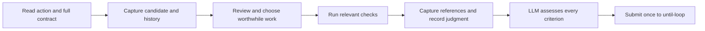

# Factual evidence capture for the standalone Improve binding



The user still supplies natural language. The bundled `scripts/capture_evidence.py`
is an internal evidence collector, not a prompt parser or another runtime. It
does not decide materiality, count review passes, run project checks, commit,
or submit an assessment. This reference applies to the standalone owner only;
another consumer chooses its own evidence system and binding.

## Before reviewing

Resolve the helper relative to this Improve package. Capture a snapshot with
the bound repository, owner `standalone-improve`, history window seven, and
each explicit in-scope file. Supply file paths, not a broad directory shorthand.
The helper returns the path of a new JSON record under `.until-loop/evidence/`.
Read that record and the complete messages referenced by its history catalogue.
Capturing messages does not establish that the LLM considered their lessons.

The internal transport looks like this; the user need not supply any of it:

```text
python3 <improve>/scripts/capture_evidence.py snapshot --repo <workspace> --owner standalone-improve --history-window 7 --scope formatter.py --scope test_formatter.py --scope README.md
```

The record separates these facts:

- `tool_facts.runtime`: validated runtime kind, action ID and contract revision.
- `candidate`: HEAD and the scoped working-tree/index identity used to bind
  evidence; runtime action provenance is recorded separately.
- `tool_facts.history`: this review's exact window and a reusable catalogue of
  full messages keyed by commit ID. Repeated windows reuse message entries.
- `host_claims.reviewer`: the declared reviewer identity and role. Use
  `self-review` for the same host's distinct reviews. Separate reviewers remain
  observations to evaluate, not an automatic quality guarantee.

Keep the initial ownership inventory as well. An in-scope file can contain
user-owned staged and unstaged hunks. A digest can reveal change; it cannot
decide who owns the change or authorize staging the whole file.

## After work and checks, before assessment

Record actual command, environment relevant to the check, exit status, output
and the candidate observed for the check in a safe durable artifact. A snapshot
before the check supplies a digest; capture again afterward to detect drift.
If work, a commit, or relevant inputs changed, establish which evidence remains
applicable. Do not replace an old digest with a new one and pretend a check ran
against the new candidate. A digest covers the declared scope; separately
assess dependency, environment and unscoped input changes.

Pass the actual check artifact to `capture` with a serialized check claim:

```json
{"candidate":{"digest":"<digest observed for this check>"},"returncode":0}
```

Use `--check <path>` and `--check-claim <serialized JSON>` for each check, plus
`--reviewer-identity <host identity>` and `--reviewer-role <actual role>`.
Optional `--reference`/`--reference-claim` associate review notes; `--prior-record`
compares against an earlier helper snapshot. Use structured subprocess arguments
or safe literal quoting. These are host-to-helper parameters, never a user form.

Both the return code and the asserted check-to-candidate association are
**host-declared**. The helper observes the artifact's bytes and compares the
declared digest; it does not independently prove that the command ran or that
its assertions establish the requirement. A missing artifact stays missing;
a present artifact without a usable binding stays unbound; a mismatched
candidate stays stale. A current binding can still contain a failing check.

Write the review's short findings, plan/no-change reason, changes, relevant
checks, lessons, commit receipt, and streak before/after in checked `working.md`.
Link the factual record before submitting the corresponding assessment. If
reconstructing earlier work, label it retrospective. Never backdate it or claim
an unobserved review took place.

## Discernment and boundaries

For example, a check passes on candidate A. A behavior edit produces B. Capture
finds the old check's declared digest differs from B: its binding is stale. The
LLM leaves the affected testing criterion unknown and chooses a relevant check
on B while other proven criteria can stay satisfied. An actual failing result
on B makes that check criterion unsatisfied. A passing result may satisfy it,
but cannot establish two completed reviews or the full contract by itself.

An unchanged candidate may reuse applicable evidence across protocol actions;
a new action ID alone is not a material edit or another review. A revised
contract still needs a separate relevance assessment even if artifact identity
is unchanged. The collector preserves both identities for that reason.

If capture fails, inspect its reported cause and current files; do not invent a
successful record. Useful authorized work may continue using directly observed,
clearly recorded evidence while the collection problem is investigated. Do not
hide the failure or treat mere collector success as semantic completion. The
runtime adapter remains the sole authority for accepting a transition.

The collector is a local factual aid. It cannot authenticate a reviewer, make
concurrent filesystem writes transactional, prove evidence was read, or protect
against arbitrary hostile code running with the same privileges. Preserve
these limits when assessing the actual evidence.
